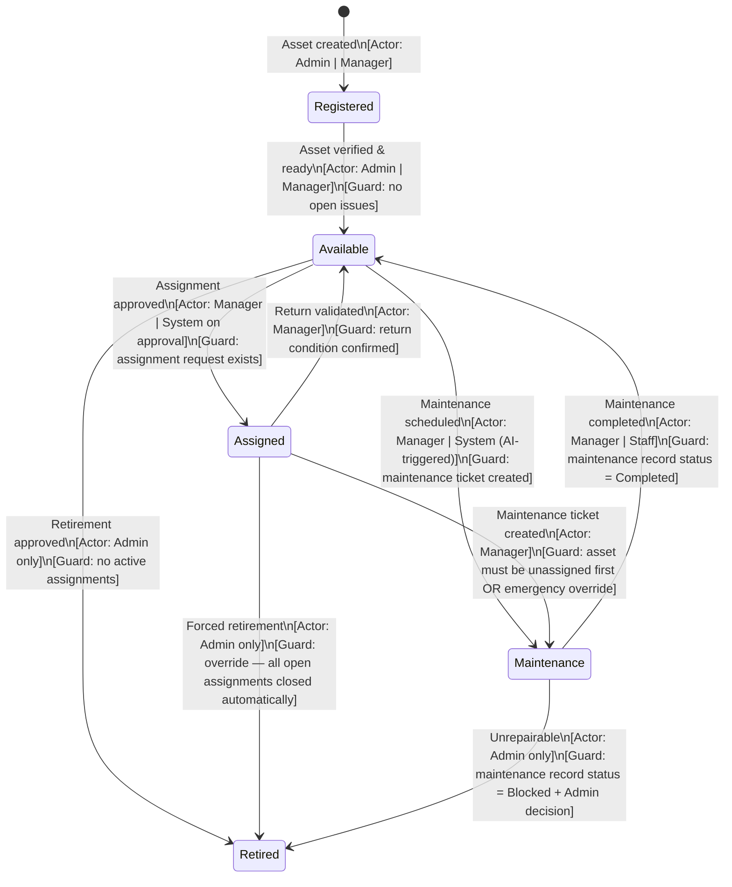
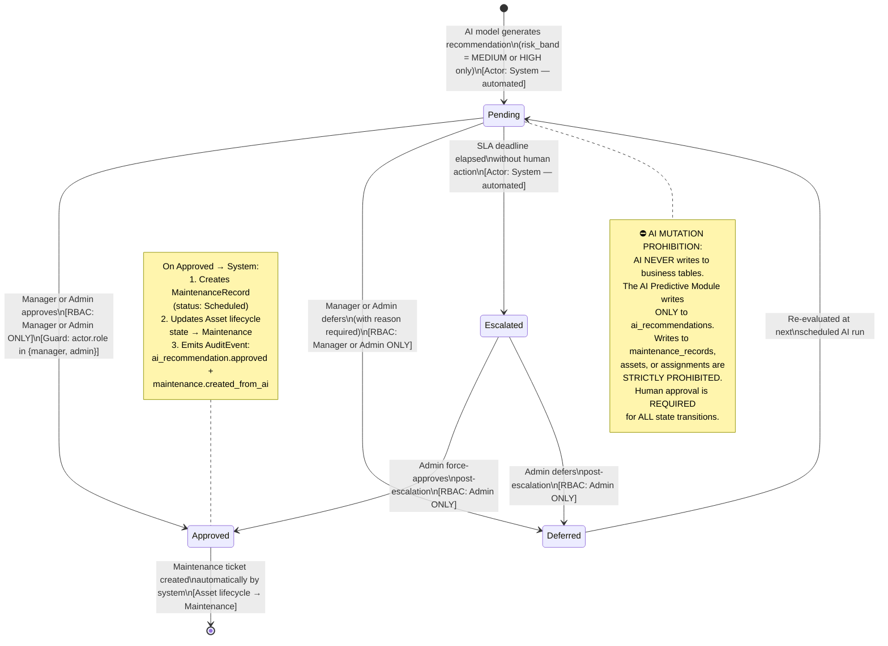
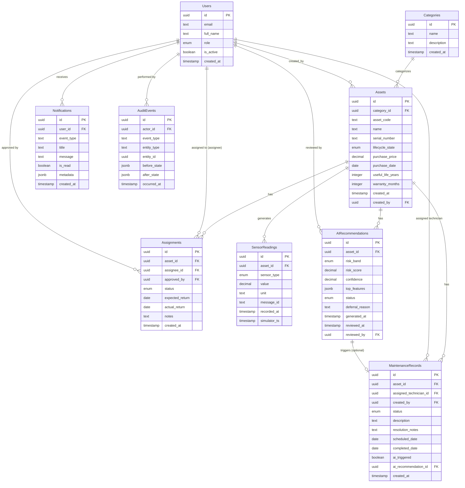

<objective>
Write §2 Business Domain Model of the Software Design Document (SDD.md) covering all six domain requirements: Permission Matrix, Asset Lifecycle State Machine, Maintenance Lifecycle, AI Recommendation State Machine, Conceptual ER Diagram, and Sensor Category Mapping.

Purpose: Define the authoritative business rules, RBAC contracts, entity relationships, and IoT sensor configuration that implementers use as a binding spec for v1.2 backend and frontend development.

Output: §2 Business Domain Model appended to the existing `.planning/phases/14-system-architecture-domain-model/SDD.md` produced in Plan 01. The completed SDD.md is the Phase 14 deliverable.
</objective>

<execution_context>
@$HOME/.claude/gsd-core/workflows/execute-plan.md
@$HOME/.claude/gsd-core/templates/summary.md
</execution_context>

<context>
@.planning/PROJECT.md
@.planning/ROADMAP.md
@.planning/STATE.md
@.planning/research/ARCHITECTURE.md
@.planning/phases/14-system-architecture-domain-model/14-RESEARCH.md
@.planning/phases/14-system-architecture-domain-model/14-01-SUMMARY.md
</context>

<tasks>

<task type="auto">
  <name>Task 1: Write §2.1 Permission Matrix + §2.2 Asset Lifecycle State Machine (DOMAIN-01, DOMAIN-02)</name>
  <files>.planning/phases/14-system-architecture-domain-model/SDD.md</files>
  <action>
Append §2 Business Domain Model opening, §2.1, and §2.2 to SDD.md.

**§2 opening:**
Brief prose (2–3 sentences) explaining this section defines the business actors, lifecycle contracts, and domain model that back-end RBAC middleware and front-end visibility rules implement.

**§2.1 Business Actors & Permissions (DOMAIN-01):**
Write a Markdown table with:
- Columns: Module | Administrator | Manager | Staff
- Minimum 12 rows covering ALL modules (use the exact permission level notation: `Full`, `Read`, `Own records only`, `Approve only`, `—`):

| Module | Administrator | Manager | Staff |
|--------|--------------|---------|-------|
| Asset Registry — view | Full | Full | Read |
| Asset Registry — create / edit | Full | Full | — |
| Asset Registry — retire | Admin only | — | — |
| Assignment — create request | Full | Full | Own records only |
| Assignment — approve / reject | Full | Full | — |
| Maintenance — view | Full | Full | Read |
| Maintenance — create / update | Full | Full | Own records only (submit request) |
| IoT Monitoring — view telemetry | Full | Full | Read |
| AI Recommendations — view | Full | Full | — |
| AI Recommendations — approve / defer | Full | Manager only | — |
| Notifications — view own | Full | Full | Own records only |
| User Management | Admin only | — | — |
| Audit Log — view | Full | Asset & Maintenance events | Own actions only |
| Reporting | Full | Full | — |

(If you find additional modules during SDD.md review, add them as additional rows. Table must not have empty/blank cells — use `—` for no access.)

Below the table, add a **RBAC Enforcement Rules** prose block:
- Authentication: JWT token, 15-minute expiry (configurable), refresh token pattern
- Authorization: role claim from JWT, checked at FastAPI route middleware before handler executes
- Frontend visibility: UI elements hidden by role, but backend enforces independently (security boundary is at the API, not the UI)
- Critical rule: "AI Recommendation approval is Manager or Administrator only. Staff cannot access AI Recommendations at all."

**§2.2 Asset Lifecycle State Machine (DOMAIN-02):**
Write as Mermaid `stateDiagram-v2`. Include all 5 states and all valid transitions with guard conditions annotated as `[condition]` after the transition label:



Follow immediately with a **Transition Table** (this is the implementer's contract):

| From | To | Actor | Guard / Condition | Side Effect |
|------|----|-------|-------------------|-------------|
| — | Registered | Admin / Manager | Asset form submitted with valid data | AuditEvent: asset.created |
| Registered | Available | Admin / Manager | Asset verified in system (no open issues) | AuditEvent: asset.verified |
| Available | Assigned | System (on Manager approval of assignment request) | Active assignment request exists; asset not already assigned | AuditEvent: asset.assigned; Assignment.status → active |
| Assigned | Available | Manager | Return validated; physical condition confirmed | Assignment.status → closed; AuditEvent: asset.returned |
| Available | Maintenance | Manager (manual) or System (AI-triggered after approval) | Maintenance ticket exists in Scheduled state | AuditEvent: maintenance.started |
| Assigned | Maintenance | Manager | Asset unassigned first (or emergency override) | Assignment closed; AuditEvent: asset.sent_to_maintenance |
| Maintenance | Available | Manager / Staff | MaintenanceRecord.status = Completed | AuditEvent: asset.maintenance_completed |
| Available | Retired | Admin only | No active assignments | All open assignments closed; AuditEvent: asset.retired |
| Assigned | Retired | Admin only (override) | Admin confirms forced retirement | All open assignments closed automatically; AuditEvent: asset.force_retired |
| Maintenance | Retired | Admin only | Maintenance record Blocked + Admin decision | AuditEvent: asset.retired_unrepairable |

Add a note: "State transitions are enforced server-side by the Asset Lifecycle Module API. The frontend reflects state only — it cannot transition state without a valid API call."
  </action>
  <verify>
    <automated>grep -c "## 2\. Business Domain Model\|### 2\.1\|Permission Matrix\|stateDiagram-v2" .planning/phases/14-system-architecture-domain-model/SDD.md</automated>
  </verify>
  <done>
§2.1 permission matrix table has ≥ 12 rows, 3 role columns, no blank cells; RBAC enforcement rules present. §2.2 Mermaid stateDiagram-v2 shows all 5 states and all valid transitions with guard annotations; companion transition table present with Actor, Guard/Condition, and Side Effect columns for all 10 transitions.
  </done>
</task>

<task type="auto">
  <name>Task 2: Write §2.3 Maintenance Lifecycle + §2.4 AI Recommendation State Machine (DOMAIN-03, DOMAIN-04)</name>
  <files>.planning/phases/14-system-architecture-domain-model/SDD.md</files>
  <action>
Append §2.3 and §2.4 to SDD.md.

**§2.3 Maintenance Lifecycle State Machine (DOMAIN-03):**
Write as Mermaid `stateDiagram-v2`. The diagram MUST show the Blocked state and MUST show the AI-generated ticket creation path as a distinct entry point (not identical to the manual creation path):

```mermaid
stateDiagram-v2
    [*] --> Scheduled : Manual ticket created\n[Actor: Manager]\n[Asset state → Maintenance]

    [*] --> Scheduled : AI-generated path:\nai_recommendations(APPROVED)\n→ ticket auto-created\n[Actor: System on Manager approval]

    Scheduled --> InProgress : Technician starts work\n[Actor: Staff | Manager]
    InProgress --> Completed : Work finished & verified\n[Actor: Staff | Manager]
    InProgress --> Blocked : External dependency /\npart unavailable\n[Actor: Staff]
    Blocked --> InProgress : Dependency resolved\n[Actor: Manager]
    Completed --> [*] : Maintenance record closed;\nasset lifecycle → Available

    note right of Scheduled
        Two creation paths:
        1. Manual: Manager creates ticket
        2. AI path: Manager approves
           ai_recommendation →
           System creates ticket automatically
        Both paths create the SAME
        MaintenanceRecord structure.
    end note

    note right of Blocked
        Blocked = external dependency only
        (waiting for part / vendor / approval)
        NOT for in-progress work pauses.
        Only Staff can move to Blocked.
        Only Manager can resolve Blocked.
    end note
```



Follow with a **Transition Table**:

| From | To | Actor | Guard / Condition | Side Effect |
|------|----|-------|-------------------|-------------|
| — | Scheduled (manual) | Manager | Asset in Available or Assigned state; maintenance form submitted | Asset lifecycle → Maintenance; AuditEvent: maintenance.created |
| — | Scheduled (AI-triggered) | System (on Manager approval of ai_recommendation) | ai_recommendation.status = APPROVED; recommendation has HIGH risk_band | Asset lifecycle → Maintenance; AuditEvent: maintenance.created_from_ai; ai_recommendations.status → APPROVED |
| Scheduled | In Progress | Staff / Manager | Technician assigned; work start confirmed | AuditEvent: maintenance.started |
| In Progress | Completed | Staff / Manager | Work finished; completion notes entered | MaintenanceRecord.status = Completed; Asset lifecycle → Available; AuditEvent: maintenance.completed |
| In Progress | Blocked | Staff | External dependency identified (part / vendor) | Blocked reason recorded; AuditEvent: maintenance.blocked; Manager notified via Notification Module |
| Blocked | In Progress | Manager | Dependency resolved; part received / vendor available | AuditEvent: maintenance.unblocked |

**§2.4 AI Recommendation State Machine (DOMAIN-04):**
This section has two mandatory design constraints:
1. The Manager-only RBAC guard on the Approved transition MUST be visible in the diagram (not only in prose)
2. The AI mutation prohibition MUST appear as a Mermaid `note` block inside the diagram (per the phase design decision — required in BOTH ARCH-04 diagram AND here in DOMAIN-04)

Write as Mermaid `stateDiagram-v2`:



Follow with a **Transition Table**:

| From | To | Actor | Guard / Condition | Side Effect |
|------|----|-------|-------------------|-------------|
| — | Pending | System (AI model) | risk_band is MEDIUM or HIGH; confidence ≥ threshold | ai_recommendations record created; Notification sent to Manager |
| Pending | Approved | Manager / Admin | Actor role = manager or admin; explicit approval action | MaintenanceRecord created (Scheduled); Asset → Maintenance; AuditEvent: ai_recommendation.approved |
| Pending | Deferred | Manager / Admin | Actor role = manager or admin; deferral reason entered | ai_recommendations.status = DEFERRED; deferral reason stored; AuditEvent: ai_recommendation.deferred |
| Pending | Escalated | System (automated) | SLA deadline elapsed with no Manager action | AuditEvent: ai_recommendation.escalated; escalation notification to Admin |
| Deferred | Pending | System | Next scheduled AI run re-evaluates asset sensor data | ai_recommendations re-scored; new Pending record if risk remains |
| Escalated | Approved | Admin only | Admin force-approves post-escalation | Same side effects as Pending → Approved |
| Escalated | Deferred | Admin only | Admin defers post-escalation | Same side effects as Pending → Deferred |

Add a standalone **AI Mutation Prohibition** callout (Markdown blockquote — second appearance of this rule per design decision):

> **⛔ AI Mutation Prohibition (DOMAIN-04 enforcement point)**
>
> This rule applies at the API layer (FastAPI route middleware) and is documented here as the domain model enforcement point:
> - The AI Predictive Module's database access is limited to: READ from `sensor_readings`, WRITE to `ai_recommendations`
> - The AI Predictive Module NEVER calls endpoints or executes queries that modify `maintenance_records`, `assets`, `assignments`, or any other business table
> - All business table mutations following an AI recommendation happen through the Maintenance & Warranty Module API, triggered by a Manager approval action
> - This boundary is enforced by RBAC middleware and module-level separation — the AI module has no reference to maintenance or asset write operations in its code
  </action>
  <verify>
    <automated>grep -c "note right of\|note left of\|AI NEVER\|MUTATION PROHIBITION\|RBAC.*Manager\|Manager.*ONLY" .planning/phases/14-system-architecture-domain-model/SDD.md</automated>
  </verify>
  <done>
§2.3 Mermaid stateDiagram-v2 shows Blocked state, both creation paths (manual + AI-triggered), and note blocks explaining path differences; companion transition table present. §2.4 Mermaid stateDiagram-v2 shows Manager-only RBAC guard on Approved transition, AI mutation prohibition note inside diagram, and Escalated state; companion transition table + standalone prohibition blockquote present.
  </done>
</task>

<task type="auto">
  <name>Task 3: Write §2.5 Conceptual ER Diagram + §2.6 Sensor Category Mapping (DOMAIN-05, DOMAIN-06)</name>
  <files>.planning/phases/14-system-architecture-domain-model/SDD.md</files>
  <action>
Append §2.5 and §2.6 to SDD.md, then add a closing SDD section.

**§2.5 Conceptual ER Diagram (DOMAIN-05):**
Write as Mermaid `erDiagram`. Use ONLY semantic field types (`uuid`, `text`, `timestamp`, `decimal`, `enum`, `boolean`, `jsonb`, `integer`, `date`) — NO SQL DDL syntax (`NOT NULL`, `VARCHAR`, `SERIAL`, `CREATE TABLE`, `UNIQUE INDEX`, `DEFAULT`, `CHECK`).

All 9 entities MUST appear with their primary key, foreign keys, and essential fields:



Add a disclaimer paragraph below the diagram:
> **Note:** This is a conceptual entity model. Column types, constraints (NOT NULL, UNIQUE, CHECK), indexes, and migration scripts are determined during implementation. Field names use snake_case as a convention for the implementation team.

Follow the ER diagram with a **Entity Summary Table** (9 rows): Entity Name / Primary Key / Key Foreign Keys / Cardinality Notes / Purpose. This table is the prose companion that explains non-obvious design choices (e.g., why `ai_recommendation_id` is nullable in MaintenanceRecords, why `message_id` exists in SensorReadings).

**§2.6 Sensor Category Mapping (DOMAIN-06):**
Write the mapping table using the 5 actual asset categories from the project's mock data (verified from `frontend/lib/data.ts`: Laptop, Monitor, Printer, Forklift, Office Equipment) against the 6 sensor types.

Use ✅ for active (sensor generates meaningful data for this category) and `—` for not applicable (sensor type makes no physical sense for this category):

| Asset Category | Temperature | Humidity | Power Consumption | Current | Vibration | Running Hours |
|----------------|-------------|----------|------------------|---------|-----------|---------------|
| Laptop | ✅ | ✅ | ✅ | ✅ | — | ✅ |
| Monitor | ✅ | — | ✅ | ✅ | — | ✅ |
| Printer | ✅ | — | ✅ | ✅ | ✅ | ✅ |
| Forklift | ✅ | ✅ | ✅ | ✅ | ✅ | ✅ |
| Office Equipment | ✅ | — | ✅ | ✅ | — | ✅ |

After the table, add a **Mapping Rationale** subsection explaining:
- Why Laptop/Monitor/Office Equipment have no vibration sensor: no moving mechanical parts that produce meaningful vibration data
- Why Forklift has humidity: outdoor/industrial environment monitoring is relevant
- Why all categories have running_hours: tracks cumulative operational time for maintenance scheduling regardless of asset type
- Why all categories have temperature: thermal management is universal across all electronic/mechanical assets
- Impact on AI feature engineering: "The feature vector for each asset is constructed using only the active sensor types for that category. An asset with no vibration sensor has vibration features excluded from its feature vector. This prevents the model from treating missing data as anomalous readings."

Add a **Sensor Type Reference** table (6 rows): Sensor Type / Unit / Typical Normal Range / Warning Threshold / Critical Threshold — sourced from the IoT Module threshold rules in ARCHITECTURE.md.

**SDD closing section:**
Add `## Document Change Log` as the final section with a Markdown table:

| Version | Date | Author | Changes |
|---------|------|--------|---------|
| 1.2.0 | [current date] | Phase 14 Plan 02 | Initial SDD created — §1 System Architecture + §2 Business Domain Model |

Add final line: `---\n*End of Software Design Document v1.2.0*`
  </action>
  <verify>
    <automated>grep -c "Users\|Categories\|Assets\|Assignments\|MaintenanceRecords\|SensorReadings\|AIRecommendations\|Notifications\|AuditEvents" .planning/phases/14-system-architecture-domain-model/SDD.md</automated>
  </verify>
  <done>
§2.5 erDiagram contains all 9 entities (Users, Categories, Assets, Assignments, MaintenanceRecords, SensorReadings, AIRecommendations, Notifications, AuditEvents) with PK/FK annotations and cardinality symbols; no SQL DDL syntax present; entity summary table present. §2.6 sensor category mapping table covers all 5 project categories (Laptop, Monitor, Printer, Forklift, Office Equipment) against all 6 sensor types; mapping rationale and AI feature engineering impact documented. SDD ends with change log and closing line.
  </done>
</task>

</tasks>

<threat_model>
## Trust Boundaries

| Boundary | Description |
|----------|-------------|
| SDD domain model → backend implementation | Permission matrix and state machine transition tables are the RBAC and lifecycle enforcement spec — gaps propagate to authorization bugs |
| SDD ER diagram → database schema | Conceptual model shapes the implementer's mental model; SQL DDL leaked here causes spec/implementation confusion |
| AI mutation prohibition note → DOMAIN-04 diagram | If the prohibition only appears in prose and not in the diagram, implementers may miss it when scanning diagram-first |

## STRIDE Threat Register

| Threat ID | Category | Component | Disposition | Mitigation Plan |
|-----------|----------|-----------|-------------|-----------------|
| T-14-06 | Elevation of Privilege | §2.1 Permission Matrix — missing AI Recommendation row | Mitigate | Matrix must have explicit AI Recommendations — approve/defer row with Manager only notation; no blank cells permitted |
| T-14-07 | Elevation of Privilege | §2.4 AI Recommendation State Machine — RBAC guard not visible in diagram | Mitigate | Manager-only guard annotated on Approved transition as `[RBAC: Manager or Admin ONLY]` in Mermaid syntax; verified by grep for "RBAC.*Manager" |
| T-14-08 | Tampering | §2.4 AI mutation prohibition — appears only in prose | Mitigate | Prohibition must be a Mermaid `note right of Pending` block inside the stateDiagram-v2 (not just a blockquote outside the diagram) |
| T-14-09 | Information Disclosure | §2.5 ER diagram — SQL DDL leaks implementation constraints | Mitigate | Post-write grep check: `grep -i "NOT NULL\|VARCHAR\|SERIAL\|CREATE TABLE" SDD.md` must return 0 matches inside erDiagram fence |
| T-14-10 | Information Disclosure | §2.6 Sensor mapping — wrong categories (not matching mock data) | Mitigate | Categories sourced from `frontend/lib/data.ts` CATEGORIES array (Laptop, Monitor, Printer, Forklift, Office Equipment) — verified before writing |
| T-14-SC | Tampering | npm/pip/cargo installs | Accept | No packages installed in this documentation-only phase |
</threat_model>

<verification>
After all three tasks complete, run these checks against SDD.md:

1. All 9 entities in ER diagram: `grep -c "Users\|Categories\b\|Assets\b\|Assignments\|MaintenanceRecords\|SensorReadings\|AIRecommendations\|Notifications\|AuditEvents" .planning/phases/14-system-architecture-domain-model/SDD.md` — expect ≥ 9
2. No SQL DDL leaked into ER section: `grep -n "NOT NULL\|VARCHAR\|SERIAL\|CREATE TABLE\|DEFAULT\|CHECK(" .planning/phases/14-system-architecture-domain-model/SDD.md` — must return 0 lines inside erDiagram fences
3. Permission matrix rows: `grep -c "Asset Registry\|Assignment\|Maintenance\|IoT Monitoring\|AI Recommendations\|Notifications\|User Management\|Audit Log\|Reporting" .planning/phases/14-system-architecture-domain-model/SDD.md` — expect ≥ 9
4. State machines count: `grep -c "stateDiagram-v2" .planning/phases/14-system-architecture-domain-model/SDD.md` — expect 3 (Asset, Maintenance, AI Recommendation)
5. RBAC enforcement in DOMAIN-04: `grep -i "Manager.*ONLY\|RBAC.*Manager\|Manager or Admin" .planning/phases/14-system-architecture-domain-model/SDD.md` — expect ≥ 3 matches
6. AI mutation prohibition in diagram: `grep "note right of\|AI NEVER\|MUTATION PROHIBITION" .planning/phases/14-system-architecture-domain-model/SDD.md` — expect ≥ 2 matches
7. Sensor categories match mock data: `grep -c "Laptop\|Monitor\|Printer\|Forklift\|Office Equipment" .planning/phases/14-system-architecture-domain-model/SDD.md` — expect ≥ 5
8. Total Mermaid diagram count (both plans combined): `grep -c '```mermaid' .planning/phases/14-system-architecture-domain-model/SDD.md` — expect ≥ 8 (5 from Plan 01 + 3 state machines + 1 ER = minimum 9)
</verification>

<success_criteria>
1. SDD.md §2 Business Domain Model is complete with subsections 2.1–2.6 appended after §1 System Architecture
2. §2.1 Permission Matrix covers all 3 roles and ≥ 12 module rows with explicit permission levels (no blank/ambiguous cells); RBAC enforcement rules present
3. §2.2 Asset lifecycle stateDiagram-v2 shows all 5 states with guard-annotated transitions; companion transition table covers all 10 transitions with Actor + Guard + Side Effect
4. §2.3 Maintenance Lifecycle stateDiagram-v2 shows the Blocked state, both creation paths (manual + AI-triggered), and companion transition table
5. §2.4 AI Recommendation stateDiagram-v2 contains a Mermaid `note` block stating the AI mutation prohibition AND a `[RBAC: Manager or Admin ONLY]` guard on the Approved transition
6. §2.5 erDiagram contains all 9 entities with PK/FK labels and cardinality; zero SQL DDL syntax present
7. §2.6 Sensor Category Mapping covers all 5 actual project categories (Laptop, Monitor, Printer, Forklift, Office Equipment) with rationale explaining sensor exclusions and AI feature engineering impact
</success_criteria>

<output>
Create `.planning/phases/14-system-architecture-domain-model/14-02-SUMMARY.md` when done.
</output>
