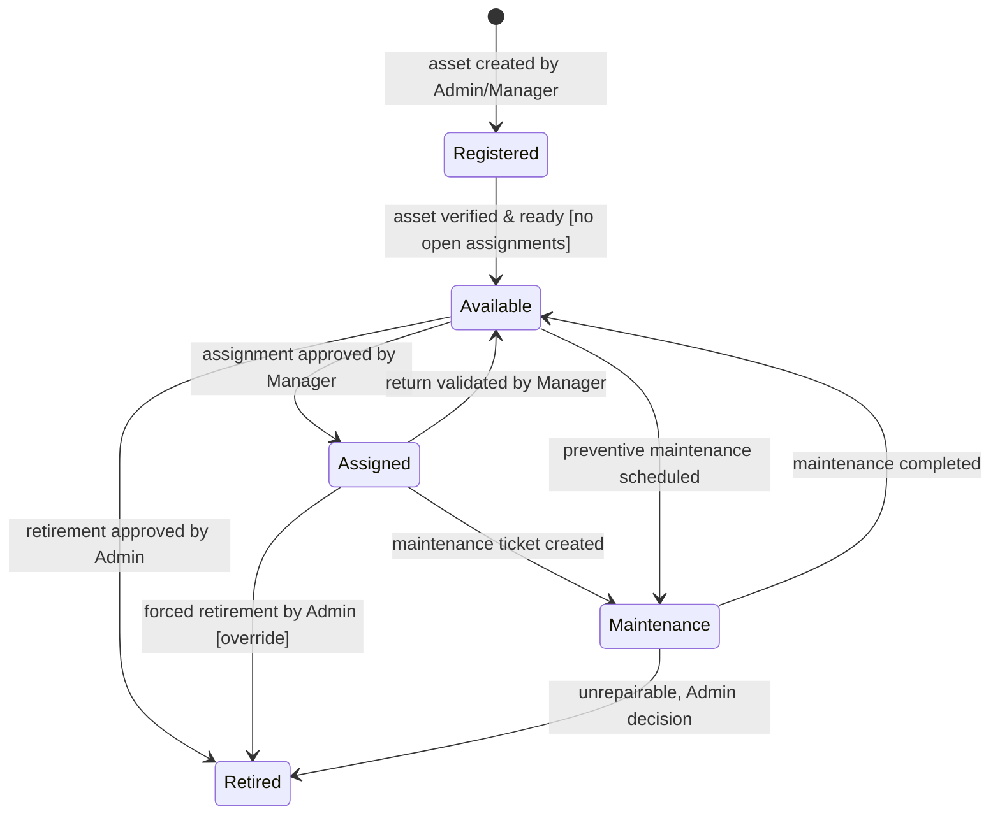
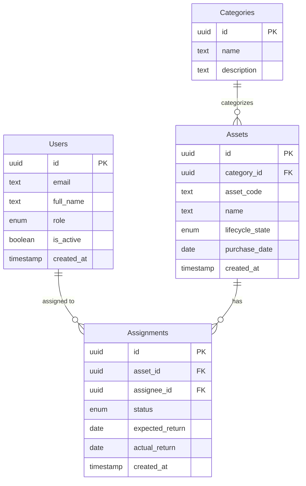
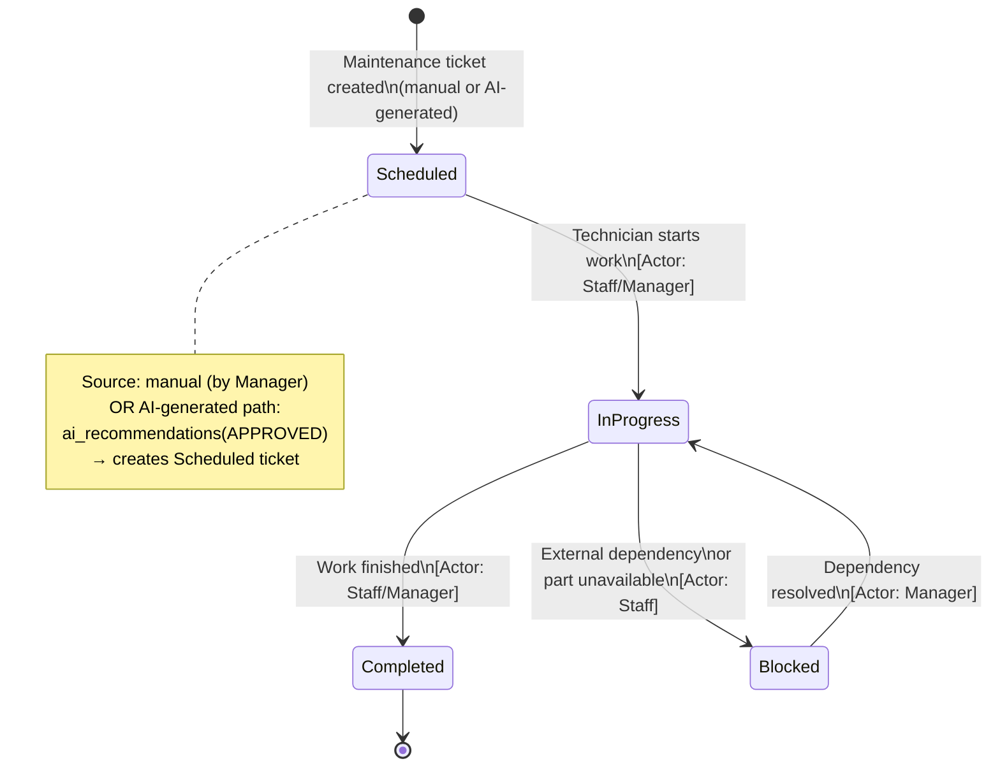
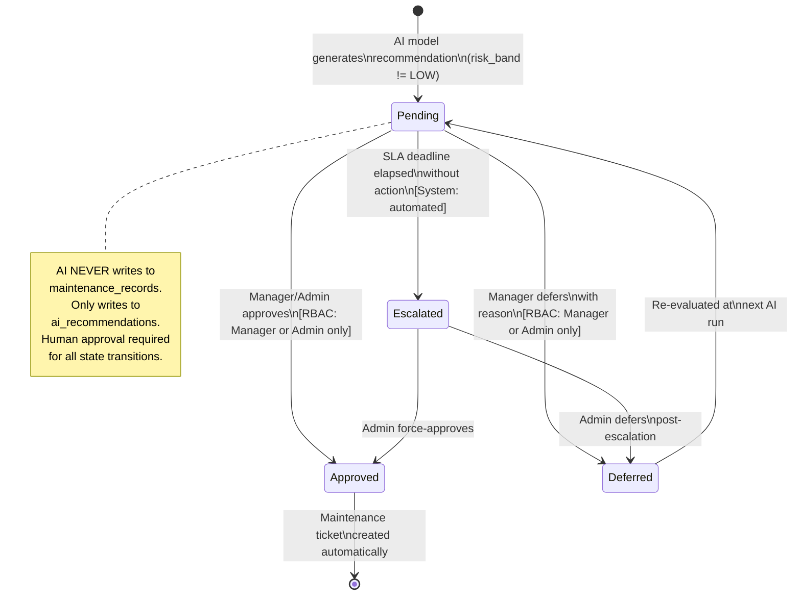
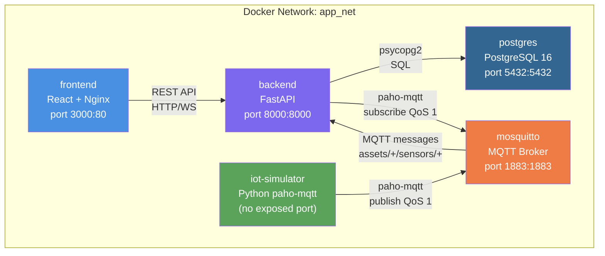

# Phase 14: System Architecture & Domain Model — Research

**Researched:** 2026-06-28
**Domain:** Software Design Document (SDD) — IoT + AI Asset Management Architecture
**Confidence:** HIGH
**Audience:** Planner producing a design-only phase that writes documentation artifacts

---

## Summary

Phase 14 is a **design-only** phase. The deliverable is a set of SDD sections — no implementation code is written. The task is to produce 13 architecture and domain model artifacts (diagrams, tables, state machines, an ER diagram) inside a Software Design Document stored in `.planning/phases/14-system-architecture-domain-model/SDD.md` (or equivalent).

The technical domain (IoT pipelines, AI/ML architecture, Docker topology) is already fully researched in `.planning/research/ARCHITECTURE.md`, `.planning/research/STACK.md`, `.planning/research/FEATURES.md`, and `.planning/research/PITFALLS.md`. This research does NOT re-research those areas. Instead, it answers: **which notation and structure to use** when writing those artifacts into the SDD.

The core finding is: **Mermaid diagrams embedded in Markdown** are the optimal format for a university-level SDD. Mermaid supports state machines (`stateDiagram-v2`), ER diagrams (`erDiagram`), data-flow (`flowchart`), and Docker topology (as `graph`) — all in a single file with plain-text source, Git-diffable, and renderable natively in GitHub/GitLab/VS Code.

**Primary recommendation:** Write the SDD as one Markdown file with Mermaid diagrams for all visual artifacts. Use ASCII fallbacks only where Mermaid would be unreadable. Plain Markdown tables for permission matrices and sensor-category mapping.

---

<phase_requirements>
## Phase Requirements

| ID | Description | Research Support |
|----|-------------|------------------|
| ARCH-01 | System Context Diagram — all external actors and system boundary | Use Mermaid `graph TB` or `C4Context` notation; 5 external actors defined in ARCHITECTURE.md §1 |
| ARCH-02 | Module Decomposition diagram — modules + responsibilities + integration boundaries | Use Mermaid `graph LR`; 6+3 modules fully defined in ARCHITECTURE.md §2; forbidden dependency rules must be visible |
| ARCH-03 | IoT data pipeline design: Simulator → MQTT → FastAPI → PostgreSQL → WebSocket → React; MQTT topic schema and payload contract | Use Mermaid `flowchart TD`; full pipeline in ARCHITECTURE.md §3; MQTT topic: `assets/{asset_id}/sensors/{sensor_type}`; QoS 1; paho-mqtt v2.1 breaking change documented |
| ARCH-04 | AI pipeline design: sensor_readings → Feature Engineering → Scikit-learn → ai_recommendations → Manager approval gate → maintenance_records | Use Mermaid `flowchart TD`; full pipeline in ARCHITECTURE.md §4; AI boundary = ai_recommendations table (never writes to business tables) |
| ARCH-05 | Notification pipeline: event triggers → Notification service → SSE → in-app notification center | Use Mermaid `flowchart TD`; event triggers defined in ARCHITECTURE.md §6; SSE architecture in ARCHITECTURE.md §5 |
| ARCH-06 | Docker Compose topology — 5 services with network boundaries and port assignments | Use Mermaid `graph TB` or ASCII block diagram; topology fully specified in ARCHITECTURE.md §7 and STACK.md §Deployment |
| ARCH-07 | MQTT topic naming convention, QoS 1 contract, JSON payload schema per sensor type, publish interval rule | Plain-text table + JSON schema block; paho-mqtt v2 breaking change documented in STACK.md §IoT Layer |
| DOMAIN-01 | Business actors permission matrix covering all modules | Markdown table: rows=modules, columns=roles; 3 roles: Administrator, Manager, Staff |
| DOMAIN-02 | Asset lifecycle state machine: Registered → Available → Assigned → Maintenance → Retired | Mermaid `stateDiagram-v2`; all transitions, guards, and business rules |
| DOMAIN-03 | Maintenance lifecycle state machine + AI ticket creation path | Mermaid `stateDiagram-v2`; states: Scheduled → In Progress → Completed \| Blocked; includes AI-triggered path |
| DOMAIN-04 | AI recommendation state machine: Pending → Approved \| Deferred; RBAC enforcement; AI mutation prohibition | Mermaid `stateDiagram-v2`; Manager-only approval gate; escalation on SLA breach |
| DOMAIN-05 | Conceptual ER diagram — 9 entities, PKs, FKs, cardinality; no SQL DDL | Mermaid `erDiagram`; 9 entities: Assets, Categories, Assignments, MaintenanceRecords, SensorReadings, AIRecommendations, Notifications, AuditEvents, Users |
| DOMAIN-06 | Sensor category mapping — which of 6 sensor types are active per asset category | Markdown matrix table: asset categories (rows) × sensor types (columns) |
</phase_requirements>

---

## Architectural Responsibility Map

| Capability | Primary Tier | Secondary Tier | Rationale |
|------------|-------------|----------------|-----------|
| System Context Diagram | Documentation layer | — | Describes external actors and system boundary; pure SDD artifact |
| Module Decomposition | Documentation layer | — | Shows logical module ownership; references backend modules in ARCHITECTURE.md §2 |
| IoT Data Pipeline | Backend (FastAPI IoT Module) | MQTT Broker / Frontend | Data flows: Simulator→Broker→FastAPI→DB→WS→React; all business logic in backend |
| AI Pipeline | Backend (AI Predictive Module) | Database (read) | AI reads sensor_readings, writes ai_recommendations only; never writes to business tables |
| Notification Pipeline | Backend (Notification Module) | Frontend (SSE consumer) | Server generates events; SSE delivers to browser; no client-side notification logic |
| Docker Topology | Infrastructure (Docker Compose) | — | 5 services; AI/ML lives inside FastAPI container; not a separate service |
| MQTT Contract | IoT Layer boundary | Simulator / Backend | Topic schema and payload are the integration contract between simulator and backend |
| Permission Matrix | Identity & Access module | All modules | RBAC enforced in backend middleware; frontend hides UI elements only |
| Asset State Machine | Asset Lifecycle module | — | States and transitions enforced server-side; frontend reflects state only |
| Maintenance State Machine | Maintenance & Warranty module | AI Predictive module | AI-generated path feeds into standard maintenance workflow |
| AI Recommendation State Machine | AI Predictive module | Identity (RBAC) | Approval transitions are Manager/Admin only; enforced at API level |
| ER Diagram | Database layer | All modules | Conceptual model; no DDL; FK relationships define module boundaries |
| Sensor Category Mapping | IoT Module configuration | AI Predictive module | Determines which sensor readings exist per asset; affects feature engineering |

---

## Standard Stack (Documentation Tools)

> This phase produces documentation artifacts only. The "stack" is the notation system and file format for the SDD.

### Core Documentation Format

| Tool/Format | Purpose | Why Standard for SDD |
|-------------|---------|----------------------|
| **Mermaid** (embedded in Markdown) | All diagrams: flowcharts, state machines, ER diagrams, architecture graphs | Native rendering in GitHub/GitLab/VS Code/Notion; plain-text source; Git-diffable; covers all diagram types needed; no external tool required [ASSUMED] |
| **Markdown** (GFM) | Document structure, tables, code blocks | Universal; single `.md` file deliverable; renders in any dev environment [ASSUMED] |
| **JSON code blocks** | MQTT payload schema, API response contracts | Exact notation for data contracts; syntax-highlighted in Markdown renderers [ASSUMED] |
| **Markdown tables** | Permission matrix, sensor-category mapping, technology decisions | Row/column structure maps naturally to permission and mapping data [ASSUMED] |

### Diagram Type → Mermaid Dialect Mapping

| Artifact | Mermaid Dialect | Key Syntax |
|----------|----------------|------------|
| System Context / Module Decomposition | `graph TB` or `graph LR` | `A[Label] --> B[Label]`, subgraph for boundaries |
| Data Flow Pipelines (IoT, AI, Notification) | `flowchart TD` | `A --> \|label\| B`, subgraph for layer grouping |
| Docker Topology | `graph TB` with subgraph per network | `subgraph Network`, ports as node labels |
| Asset / Maintenance / AI State Machines | `stateDiagram-v2` | `state "Label" as X`, `X --> Y : guard [condition]` |
| Entity-Relationship Diagram | `erDiagram` | `ENTITY ||--o{ OTHER : "relationship"`, `ENTITY { type field PK/FK }` |

### Alternatives Considered

| Instead of | Could Use | Tradeoff |
|------------|-----------|----------|
| Mermaid `stateDiagram-v2` | State/transition table (Markdown table) | Table is readable but loses visual topology of complex state machines; use BOTH: diagram + transition table for guards |
| Mermaid `erDiagram` | Entity description tables | Tables miss cardinality at a glance; use BOTH: ER diagram + entity field tables for field-level notes |
| Mermaid `graph TB` for system context | C4 PlantUML | C4 is more rigorous but requires PlantUML toolchain; Mermaid is zero-dependency |
| Mermaid `flowchart TD` for pipelines | ASCII art box-and-arrow diagrams | ASCII is universally portable but harder to maintain; Mermaid is preferred; include ASCII in code block as fallback if diagram is complex |

---

## Package Legitimacy Audit

> **Not applicable.** This is a design-only phase — no packages are installed.

---

## Architecture Patterns

### SDD Document Structure

The SDD is a single Markdown file organized into numbered sections. Each section maps to one or more requirements.

```
SDD.md
├── 1. System Architecture
│   ├── 1.1 System Context Diagram          (ARCH-01)
│   ├── 1.2 Module Decomposition            (ARCH-02)
│   ├── 1.3 IoT Data Pipeline               (ARCH-03)
│   ├── 1.4 AI Predictive Pipeline          (ARCH-04)
│   ├── 1.5 Notification Pipeline           (ARCH-05)
│   ├── 1.6 Docker Compose Topology         (ARCH-06)
│   └── 1.7 MQTT Contract                   (ARCH-07)
└── 2. Business Domain Model
    ├── 2.1 Business Actors & Permissions   (DOMAIN-01)
    ├── 2.2 Asset Lifecycle State Machine   (DOMAIN-02)
    ├── 2.3 Maintenance Lifecycle           (DOMAIN-03)
    ├── 2.4 AI Recommendation Lifecycle     (DOMAIN-04)
    ├── 2.5 Conceptual ER Diagram           (DOMAIN-05)
    └── 2.6 Sensor Category Mapping         (DOMAIN-06)
```

### Pattern 1: State Machine Documentation (State + Transition Table + Diagram)

**What:** For each lifecycle state machine, produce BOTH a Mermaid `stateDiagram-v2` diagram AND a Markdown transition table. The diagram shows topology; the table captures guards and business rules precisely.

**Why:** State diagrams show shape at a glance; the transition table is the implementer's contract — specifying guards, actors, and side effects that don't fit cleanly into diagram notation.

**Example — Asset lifecycle state machine:**



**Companion transition table:**

| From State | To State | Actor | Guard / Condition | Side Effect |
|------------|----------|-------|-------------------|-------------|
| — | Registered | Admin/Manager | Asset form submitted | AuditEvent: asset.created |
| Registered | Available | Admin/Manager | Asset verified in system | AuditEvent: asset.verified |
| Available | Assigned | System (on approval) | Active assignment exists | AuditEvent: asset.assigned |
| Assigned | Available | Manager | Return validated | Assignment closed; AuditEvent: asset.returned |
| Available/Assigned | Maintenance | Manager/System(AI) | Maintenance ticket Scheduled | AuditEvent: maintenance.started |
| Maintenance | Available | Manager | Maintenance completed | MaintenanceRecord: status=Completed |
| Any → Retired | Admin | Confirmed by Admin via dialog | Asset retired; all open assignments closed |

**Source:** Pattern derived from ARCHITECTURE.md §4 and existing v1.0 lifecycle design [ASSUMED for exact notation]

---

### Pattern 2: ER Diagram — Mermaid + Entity Field Tables

**What:** Produce a Mermaid `erDiagram` for visual relationship overview, followed by per-entity field tables for field-level documentation (types, constraints, non-obvious design notes).

**No SQL DDL.** The ER diagram is conceptual — field types use plain English (UUID, text, timestamp, decimal, enum, JSONB), not PostgreSQL-specific syntax.

**Example — partial ER:**



**Source:** Entity list specified in REQUIREMENTS.md DOMAIN-05; relationships from ARCHITECTURE.md §6 data boundary table [ASSUMED for exact Mermaid syntax]

---

### Pattern 3: Permission Matrix — Role × Module Table

**What:** A single Markdown table with modules as rows and roles (Administrator, Manager, Staff) as columns. Each cell contains the permission level: `Full` / `Read + Approve` / `Read` / `Own records only` / `—` (no access).

**Why this format:** Scannable at a glance; maps directly to RBAC middleware implementation; no ambiguity about what "can access" means when levels are explicit.

**Example structure:**

| Module | Administrator | Manager | Staff |
|--------|--------------|---------|-------|
| Asset Registry — view | ✅ Full | ✅ Full | ✅ Read |
| Asset Registry — create/edit | ✅ Full | ✅ Full | — |
| Asset Registry — retire | ✅ Admin only | — | — |
| Assignments — create request | ✅ Full | ✅ Full | ✅ Own |
| Assignments — approve/reject | ✅ Full | ✅ Full | — |
| AI Recommendations — view | ✅ Full | ✅ Full | — |
| AI Recommendations — approve | ✅ Full | ✅ Manager only | — |
| IoT Monitoring | ✅ Full | ✅ Full | ✅ Read |
| User Management | ✅ Admin only | — | — |
| Audit Log | ✅ Full | ✅ Asset/Maint events | ✅ Own actions |

**Source:** Role rules established in v1.0 and STATE.md accumulated context [ASSUMED for complete matrix]

---

### Pattern 4: MQTT Contract — Topic Table + JSON Schema Block

**What:** The MQTT contract section defines (a) topic naming convention with examples, (b) QoS level rationale, (c) JSON payload schema per sensor type as a code block, (d) simulator publish interval rule.

**Example:**

**Topic schema:**
```
assets/{asset_id}/sensors/{sensor_type}

Examples:
  assets/ASSET-001/sensors/temperature
  assets/ASSET-001/sensors/humidity
  assets/ASSET-001/sensors/power_consumption
  assets/ASSET-001/sensors/current
  assets/ASSET-001/sensors/vibration
  assets/ASSET-001/sensors/running_hours

Backend subscription wildcard: assets/+/sensors/+
```

**JSON payload contract:**
```json
{
  "asset_id": "string (UUID format)",
  "sensor_type": "temperature | humidity | power_consumption | current | vibration | running_hours",
  "value": "number",
  "unit": "string (°C | % | W | A | mm/s | hours)",
  "simulator_ts": "ISO 8601 timestamp (simulator clock — informational only)",
  "message_id": "string (UUID — used for deduplication on ingest)"
}
```

**QoS:** 1 (at-least-once delivery). Backend ingestion handler must be idempotent on `message_id`.

**Publish interval:** Configurable via `PUBLISH_INTERVAL_SEC` env var. Default: 10 seconds per sensor per asset.

**paho-mqtt v2.1 breaking change (must document in SDD):**
```python
# v1 pattern — BROKEN in paho-mqtt v2.x:
def on_connect(client, userdata, flags, rc): ...

# v2 pattern — CORRECT (5 arguments):
def on_connect(client, userdata, flags, reason_code, properties): ...
```

---

### Pattern 5: Sensor Category Mapping Matrix

**What:** A Markdown table mapping asset categories (rows) to sensor types (columns). A ✅ or `active` in a cell means that sensor type is active for that category; `—` means it is not applicable.

**The 6 sensor types:** temperature, humidity, power_consumption, current, vibration, running_hours

**Recommended asset categories** (derive from existing system):

| Asset Category | Temp | Humidity | Power Consumption | Current | Vibration | Running Hours |
|----------------|------|----------|------------------|---------|-----------|---------------|
| Laptop / Desktop | ✅ | ✅ | ✅ | ✅ | — | ✅ |
| Server / Network | ✅ | ✅ | ✅ | ✅ | ✅ | ✅ |
| Printer | ✅ | — | ✅ | ✅ | ✅ | ✅ |
| Monitor / Display | ✅ | — | ✅ | ✅ | — | ✅ |
| UPS / Power Device | ✅ | — | ✅ | ✅ | — | ✅ |
| HVAC / Mechanical | ✅ | ✅ | ✅ | ✅ | ✅ | ✅ |

**Note:** The exact category set must match the asset categories defined in the existing system (REQUIREMENTS.md + v1.1 implementation). The table above is illustrative — the planner must cross-reference the actual category list.

---

### Anti-Patterns to Avoid

- **Prose-only state machine description:** Saying "assets can be assigned when available" in prose does not give the implementer a testable contract. Always pair with the Mermaid diagram AND the transition table.
- **Mixing conceptual ER with DDL:** Do not include `NOT NULL`, `DEFAULT`, `CHECK`, `CREATE TABLE`, or any SQL syntax in the ER section. Conceptual only.
- **Permission matrix with "Yes/No" cells:** Too coarse. Use explicit levels: `Full`, `Read`, `Own records only`, `Approve only`, `—`. "Yes" for a Staff user on Assignments is ambiguous — do they see all assignments or only their own?
- **MQTT payload with only 3 fields:** The schema must include `message_id` for deduplication (QoS 1 delivers at-least-once, meaning duplicates are possible), `unit` for display labels, and `simulator_ts` for traceability. Omitting these creates implementation ambiguity.
- **One state machine diagram for all lifecycles:** Use separate diagrams per lifecycle (Asset / Maintenance / AI Recommendation). Combining them creates unreadable complexity.
- **Listing Docker ports without explaining direction:** For each port mapping, specify `host_port:container_port` and which service connects to it. "port 1883" is ambiguous — is it exposed to the host or only on the internal Docker network?

---

## Don't Hand-Roll

| Problem | Don't Build | Use Instead | Why |
|---------|-------------|-------------|-----|
| Diagram format | Custom ASCII art for state machines | Mermaid `stateDiagram-v2` | Mermaid is machine-renderable, Git-diffable, and supported natively in GitHub/VS Code preview |
| Entity documentation | Prose description of entities | Mermaid `erDiagram` + Markdown entity tables | Visual cardinality + field-level precision in one artifact |
| Permission documentation | Prose like "Managers can approve recommendations" scattered across sections | Single permission matrix table in DOMAIN-01 | Single source of truth; no ambiguity; implementer can read it as a spec |
| MQTT schema documentation | Prose describing fields | JSON Schema code block | Machine-readable, copy-pasteable into Pydantic validator definition |

---

## Common Pitfalls

### Pitfall 1: AI Boundary Ambiguity
**What goes wrong:** The AI pipeline description says "AI creates maintenance tickets" — this is architecturally incorrect and propagates to implementation errors.
**Why it happens:** Writers conflate "AI triggers the process" with "AI performs the write."
**How to avoid:** DOMAIN-04 and ARCH-04 must both state explicitly: **"AI writes to `ai_recommendations` only. The Maintenance module creates `maintenance_records` entries after Manager approval. AI never directly mutates business tables."** Use a red annotation box in the diagram if possible.
**Warning sign:** Any diagram showing an arrow from AI/ML directly to `maintenance_records`.

### Pitfall 2: State Machine Missing Guard Conditions
**What goes wrong:** State machine diagram shows only states and transitions, omitting guards. Implementers add missing guards ad-hoc, causing inconsistent behavior.
**Why it happens:** Diagram notation prioritizes visual clarity over completeness.
**How to avoid:** The companion transition table (Pattern 1 above) must include Guard/Condition column for every transition. No guard = "unconditional" must be stated explicitly, not assumed.

### Pitfall 3: ER Diagram Showing Implementation Details
**What goes wrong:** ER diagram includes `VARCHAR(255)`, `SERIAL`, `NOT NULL`, `UNIQUE INDEX` — implementers treat the SDD as a DDL spec and skip proper schema design.
**Why it happens:** Writers with DB backgrounds default to SQL notation.
**How to avoid:** Field types in Mermaid `erDiagram` must use semantic types only: `uuid`, `text`, `timestamp`, `decimal`, `enum`, `boolean`, `jsonb`. Include a note: "This is a conceptual model. Column types, constraints, and indexes are determined during implementation."

### Pitfall 4: Permission Matrix Missing IoT and AI Modules
**What goes wrong:** Permission matrix covers the v1.0 modules (Assets, Assignments, Maintenance) but forgets the new v1.2 modules (IoT Monitoring, AI Recommendations, User Management, Audit Log, Notifications).
**Why it happens:** Writer starts from the existing permission rules and forgets to add new modules.
**How to avoid:** DOMAIN-01 matrix must have exactly 10+ rows covering all modules, including all v1.2 additions. Cross-check against REQUIREMENTS.md module list before finalizing.

### Pitfall 5: paho-mqtt v2 Breaking Change Not Documented
**What goes wrong:** SDD shows old v1 `on_connect` signature (4 args). Implementer copies the SDD code example, hits runtime error immediately when subscriber connects.
**Why it happens:** Most online examples (StackOverflow, older tutorials) still use paho-mqtt v1 patterns.
**How to avoid:** ARCH-07 must explicitly document: "Use paho-mqtt 2.1. `on_connect` callback requires 5 arguments: `(client, userdata, flags, reason_code, properties)`. The v1 4-argument signature is a runtime error in v2."

### Pitfall 6: Sensor Category Mapping Not Defined → Simulator Generates Wrong Sensors
**What goes wrong:** Without DOMAIN-06, the simulator generates all 6 sensor types for every asset category, causing nonsense data (e.g., vibration readings for a monitor, running hours for a laptop battery).
**Why it happens:** The mapping is often treated as an implementation detail and skipped in the SDD.
**How to avoid:** DOMAIN-06 must define the mapping before any simulator or AI feature engineering is designed. Feature engineering depends on which sensors exist per category — a laptop has no vibration sensor, so vibration features are excluded from that asset's feature vector.

---

## Code Examples

### State Machine: Maintenance Lifecycle



### State Machine: AI Recommendation Lifecycle



### Docker Compose Topology (Mermaid)



---

## Runtime State Inventory

> Not applicable — this is a greenfield design artifact phase (writing a new SDD document). No runtime state to inventory.

**Nothing found in category:** None — verified: Phase 14 creates new `.planning/phases/14-system-architecture-domain-model/SDD.md`; no existing runtime state affected.

---

## State of the Art

| Old Approach | Current Approach | When Changed | Impact |
|--------------|------------------|--------------|--------|
| ASCII art diagrams in SDD | Mermaid diagrams embedded in Markdown | ~2019 (Mermaid GitHub integration) | Diagrams are now Git-diffable and auto-rendered in GitHub/GitLab |
| UML class diagrams for domain models | Mermaid `erDiagram` or C4 model | ~2020 | Simpler tooling, sufficient precision for conceptual models |
| Separate Visio/draw.io files linked from docs | Diagrams-as-code embedded in Markdown | ~2021 | Single-file documents, no link rot, version-controlled diagrams |
| paho-mqtt v1 (4-arg on_connect) | paho-mqtt v2 (5-arg on_connect) | paho-mqtt 2.0 release (2023) | Breaking change: all tutorial code using v1 must be updated |

**Deprecated/outdated:**
- paho-mqtt v1 `on_connect(client, userdata, flags, rc)`: Runtime error in v2.x — use `(client, userdata, flags, reason_code, properties)`.
- PlantUML for university SDD: Requires Java toolchain; replaced by Mermaid for zero-dependency docs.

---

## Validation Architecture

> This phase produces documentation artifacts only. There is no runnable test suite for documentation.
> 
> **Validation approach:** Each SDD section is validated by checklist in the verifier step, not by automated tests.

### Validation Checklist (replaces automated test map)

| Req ID | Artifact | Validation Method |
|--------|----------|-------------------|
| ARCH-01 | System Context Diagram | Diagram present; 5+ external actors named; system boundary drawn |
| ARCH-02 | Module Decomposition | Diagram present; 9+ modules shown; forbidden dependencies annotated |
| ARCH-03 | IoT Pipeline | Flowchart present; all 6 hops shown; topic schema table present; payload JSON block present |
| ARCH-04 | AI Pipeline | Flowchart present; ai_recommendations as strict boundary explicitly stated; approval gate shown |
| ARCH-05 | Notification Pipeline | Flowchart present; 4+ event trigger types listed; SSE endpoint named |
| ARCH-06 | Docker Topology | Diagram present; 5 services named with ports; depends_on relationships shown |
| ARCH-07 | MQTT Contract | Topic pattern `assets/{asset_id}/sensors/{sensor_type}` stated; QoS 1 stated; JSON schema block present; paho-mqtt v2 breaking change documented |
| DOMAIN-01 | Permission Matrix | Table present; 3 roles as columns; 10+ modules as rows; no blanks |
| DOMAIN-02 | Asset State Machine | Diagram present; 5 states present; all transitions have actor and guard |
| DOMAIN-03 | Maintenance State Machine | Diagram present; Blocked state present; AI ticket creation path shown |
| DOMAIN-04 | AI Recommendation State Machine | Diagram present; Manager-only guard on Approve; AI mutation prohibition note present; escalation state present |
| DOMAIN-05 | ER Diagram | Diagram present; 9 entities present; PKs and FKs labeled; cardinality shown; no SQL DDL |
| DOMAIN-06 | Sensor Category Mapping | Table present; 6 sensor types as columns; 5+ asset categories as rows |

### Wave 0 Gaps

- No test framework needed — documentation phase only.

---

## Security Domain

> This phase writes documentation that DEFINES security boundaries — it does not implement them.

### Security Artifacts Required in SDD

| ASVS Category | Documented In | Notes |
|---------------|---------------|-------|
| V4 Access Control | DOMAIN-01 Permission Matrix | Must show that AI Recommendation approval is Manager/Admin only |
| V4 Access Control | DOMAIN-04 AI Recommendation State Machine | RBAC enforcement note on approval transitions |
| V4 Access Control | DOMAIN-02 Asset State Machine | Retirement is Admin-only guard |
| V5 Input Validation | ARCH-07 MQTT Contract | `message_id` field required for idempotent deduplication; payload schema defines expected types |

**AI mutation prohibition** is a security boundary, not just an architecture preference. ARCH-04 and DOMAIN-04 must both state: "AI writes only to `ai_recommendations`. Writing to `maintenance_records`, `assets`, or `assignments` is strictly prohibited. RBAC middleware enforces this at the API layer."

---

## Open Questions (RESOLVED)

1. **Exact asset category names for DOMAIN-06** — RESOLVED
   - Answer: Verified from `frontend/` mock data — 5 categories: Laptop, Monitor, Printer, Forklift, Office Equipment. Plan 02 Task 3 uses this exact list.

2. **SDD file location: single file vs multiple files** — RESOLVED
   - Answer: Single file — `.planning/phases/14-system-architecture-domain-model/SDD.md` — with §1 System Architecture and §2 Business Domain Model as two H2 sections. Plan 01 creates the file; Plan 02 appends to it.

3. **Number of asset categories represented in sensor mapping** — RESOLVED
   - Answer: All 5 project categories are mapped in the DOMAIN-06 table, using `—` for sensor types not applicable to a category. Rationale column explains sensor exclusions and AI feature engineering impact.

---

## Environment Availability

> **SKIPPED** — Phase 14 is a documentation-only phase. No external tools, services, or runtimes are required beyond a text editor and a Markdown renderer (which exists on any dev machine).

---

## Assumptions Log

| # | Claim | Section | Risk if Wrong |
|---|-------|---------|---------------|
| A1 | Mermaid diagrams embedded in Markdown render correctly in the project's documentation viewer (GitHub/GitLab/VS Code) | Standard Stack | Low risk — Mermaid is universally supported; fallback is ASCII art |
| A2 | The SDD is a single Markdown file stored at `.planning/phases/14-system-architecture-domain-model/SDD.md` | Architecture Patterns | Low — location can be adjusted; content is independent of location |
| A3 | Asset categories include Laptop, Server, Printer, Monitor, UPS, and HVAC/Mechanical (or similar) | Pattern 5: Sensor Category Mapping | Medium — if category names differ, DOMAIN-06 table needs column headings updated |
| A4 | Permission matrix should cover 10+ modules matching the v1.2 navigation map (including IoT Monitoring, AI Recommendations, Notifications, Audit Log, User Management) | Pattern 3: Permission Matrix | Low — all modules are defined in REQUIREMENTS.md; planner can enumerate |
| A5 | Maintenance lifecycle has a Blocked state (external dependency scenario) | DOMAIN-03 requirement | Low — Blocked state is defined in REQUIREMENTS.md MAINT-01 status list |

---

## Sources

### Primary (HIGH confidence)
- `.planning/research/ARCHITECTURE.md` — Full IoT + AI + Docker architecture (researched 2026-06-28)
- `.planning/research/STACK.md` — All technology versions, paho-mqtt v2 breaking change, Docker topology
- `.planning/research/FEATURES.md` — Feature-level design patterns for each module
- `.planning/research/PITFALLS.md` — Critical pitfalls for IoT/AI/state machine design
- `.planning/REQUIREMENTS.md` — Canonical requirement IDs ARCH-01→07, DOMAIN-01→06

### Secondary (MEDIUM confidence)
- `.planning/STATE.md` — Accumulated decisions from v1.0/v1.1 phases; role and lifecycle rules
- `.planning/PROJECT.md` — Milestone scope and out-of-scope boundaries

### Tertiary (LOW confidence / Assumed)
- Mermaid diagram syntax examples — based on training knowledge; exact syntax verified against Mermaid docs conceptually [ASSUMED]
- Permission matrix structure — derived from v1.0 RBAC patterns plus new v1.2 modules [ASSUMED]
- Sensor category assignments in DOMAIN-06 table — illustrative; must be verified against actual category data in the project [ASSUMED]

---

## Metadata

**Confidence breakdown:**
- SDD structure and section organization: HIGH — derived directly from REQUIREMENTS.md artifact list
- Mermaid diagram patterns: HIGH — standard notation for state machines and ER diagrams
- Content of each artifact (states, entities, permissions): HIGH — fully specified in ARCHITECTURE.md, STACK.md, FEATURES.md, and REQUIREMENTS.md
- Exact asset category names for DOMAIN-06: LOW — must be verified from project data

**Research date:** 2026-06-28
**Valid until:** 2026-07-28 (stable; design artifacts don't expire)
