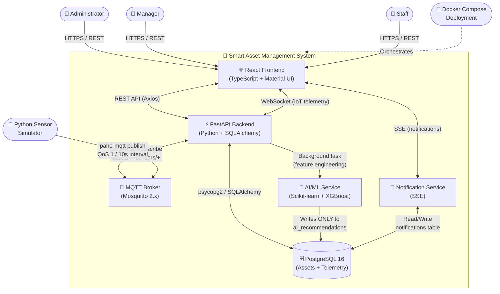
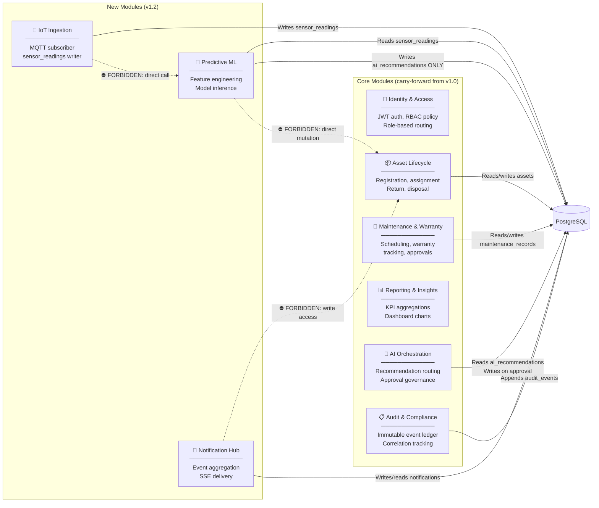
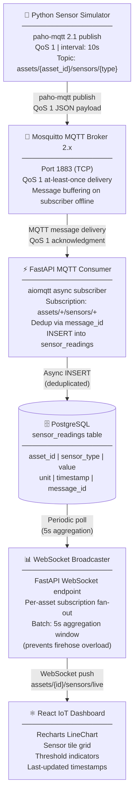
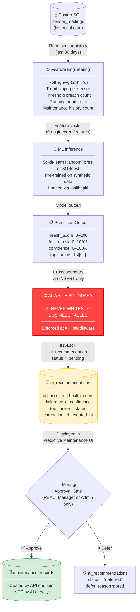
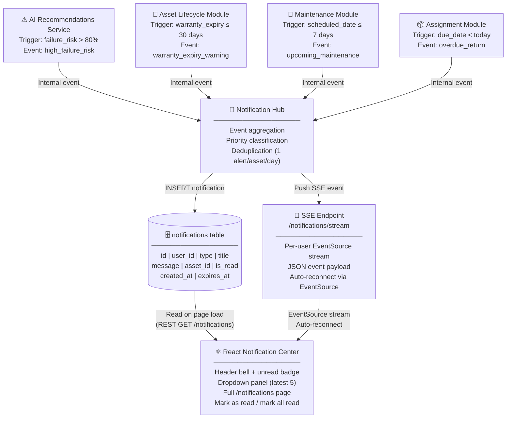
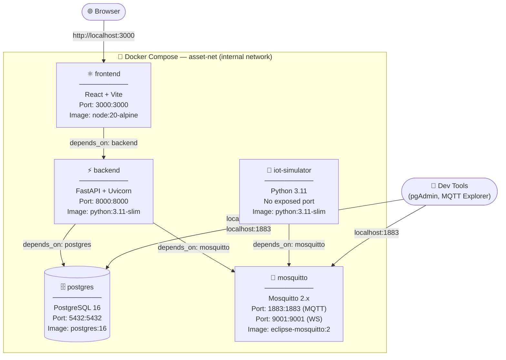
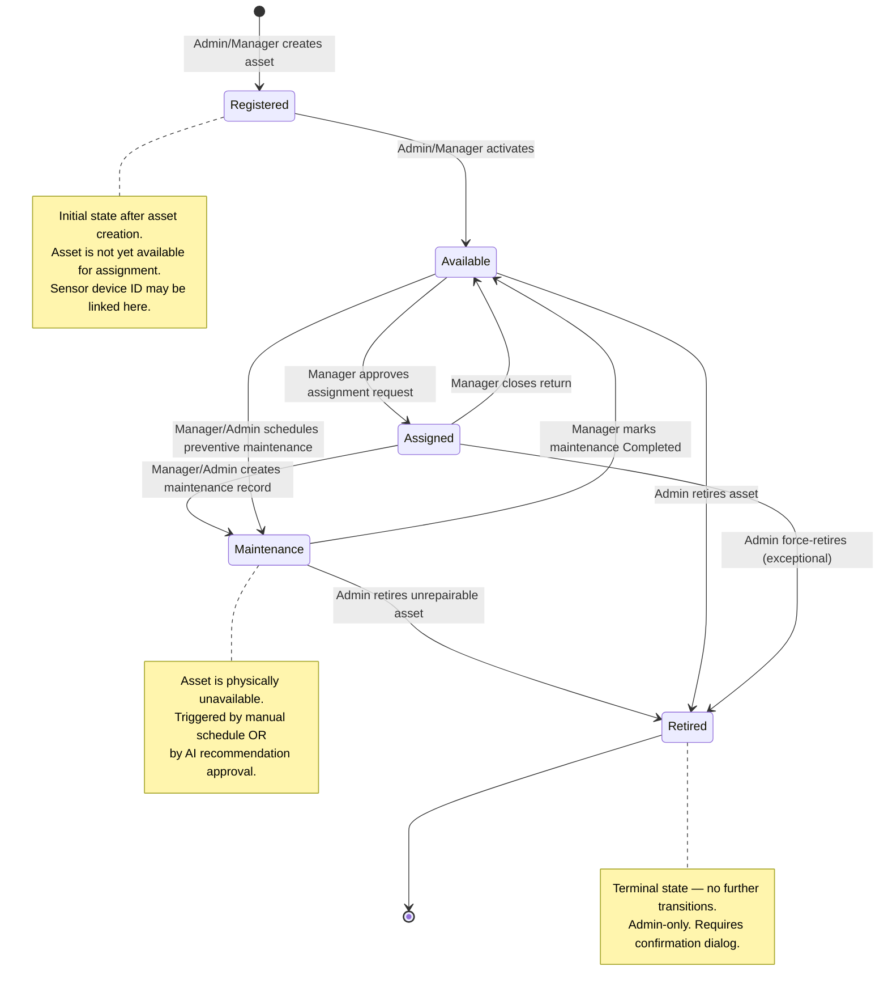
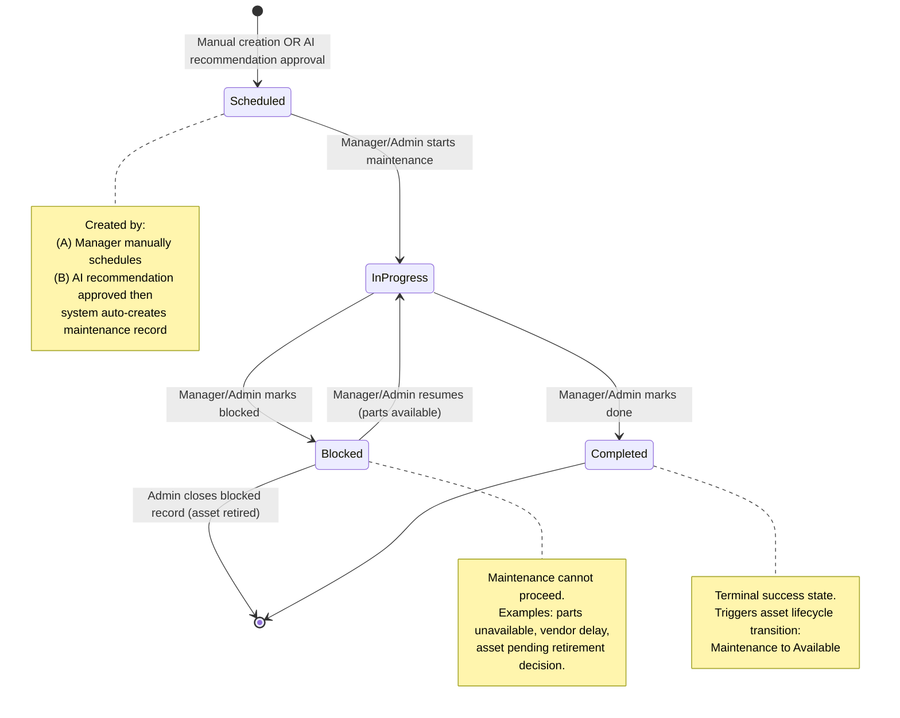
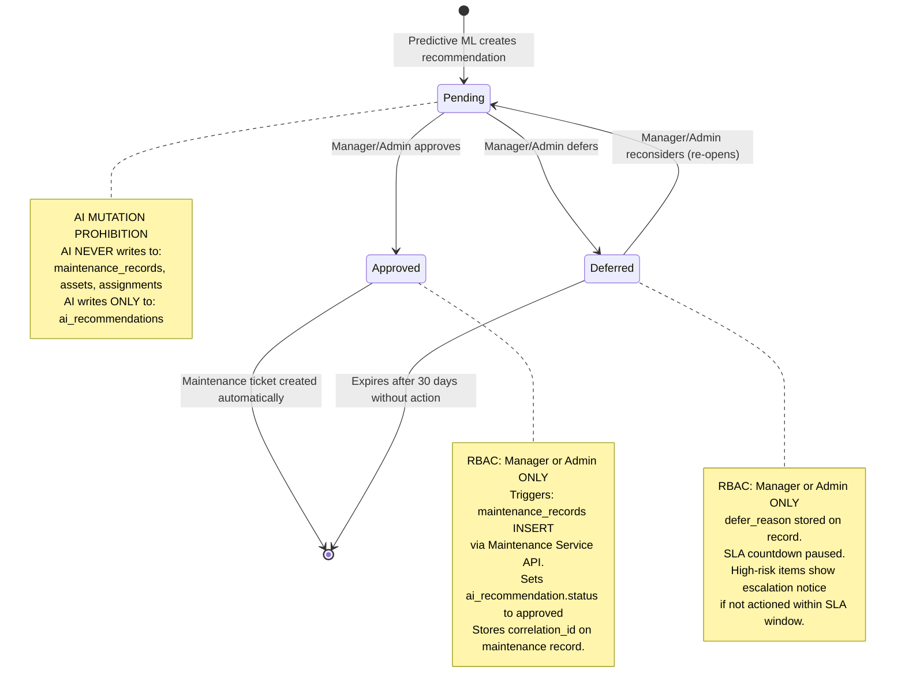

# Smart AI-Powered Asset Management System
## Software Design Document (SDD)

| Field | Value |
|-------|-------|
| Version | 1.2.0 |
| Milestone | v1.2 — IoT System Design |
| Status | Draft |
| Authored | 2026-06-28 |
| Scope | Conceptual design — no implementation code |

> **Note:** All diagrams use Mermaid embedded in Markdown and render natively in GitHub, GitLab, and VS Code. This SDD guides future development of the frontend (React + TypeScript + Material UI), backend (FastAPI + PostgreSQL), IoT layer (Python Simulator + MQTT), and AI/ML pipeline (Scikit-learn / XGBoost).

---

## Table of Contents

1. [System Architecture](#1-system-architecture)
   - [1.1 System Context Diagram](#11-system-context-diagram)
   - [1.2 Module Decomposition](#12-module-decomposition)
   - [1.3 IoT Data Pipeline](#13-iot-data-pipeline)
   - [1.4 AI Predictive Pipeline](#14-ai-predictive-pipeline)
   - [1.5 Notification Pipeline](#15-notification-pipeline)
   - [1.6 Docker Compose Topology](#16-docker-compose-topology)
   - [1.7 MQTT Contract](#17-mqtt-contract)
2. [Business Domain Model](#2-business-domain-model)
   - [2.1 Business Actors & Permissions](#21-business-actors--permissions)
   - [2.2 Asset Lifecycle State Machine](#22-asset-lifecycle-state-machine)
   - [2.3 Maintenance Lifecycle State Machine](#23-maintenance-lifecycle-state-machine)
   - [2.4 AI Recommendation State Machine](#24-ai-recommendation-state-machine)
   - [2.5 Conceptual ER Diagram](#25-conceptual-er-diagram)
   - [2.6 Sensor Category Mapping](#26-sensor-category-mapping)

---

## 1. System Architecture

This section defines the high-level architectural blueprint for the Smart AI-Powered Asset Management System. It covers the external actors and system boundary, module decomposition with integration contracts, the IoT data ingestion pipeline, the AI predictive maintenance pipeline, the notification delivery pipeline, the Docker Compose deployment topology, and the formal MQTT messaging contract.

---

### 1.1 System Context Diagram

The system sits at the intersection of three external domains: human users managing organizational assets, a Python Sensor Simulator acting as a simulated IoT device fleet, and an infrastructure deployment layer managed through Docker Compose. The React frontend communicates with the FastAPI backend over REST and WebSocket. The backend subscribes to sensor telemetry from the Mosquitto MQTT broker and pushes real-time notifications to connected clients via Server-Sent Events (SSE).

**Figure 1.1 — System Context Diagram**



**Scope boundary — what the system does NOT interact with:**
- External cloud IoT platforms (AWS IoT, Azure IoT Hub)
- Real physical hardware sensors — simulated only
- External identity providers (OIDC/SSO) — JWT auth only
- Email/SMS notification channels — in-app only

---

### 1.2 Module Decomposition

The system is organized as a **modular monolith**: a single deployable FastAPI application with clearly defined domain boundaries. Six modules carry forward from v1.0/v1.1; three new modules are added in v1.2 for IoT ingestion, ML prediction, and notification delivery. Each module owns its data, its API routes, and its business logic — cross-module access is only permitted through explicit service interfaces, never via direct table access.

**Figure 1.2 — Module Decomposition**



**Module Responsibility Table:**

| Module | Owned Responsibilities | Integration Boundary | v1.2 Changes |
|--------|----------------------|----------------------|--------------|
| Identity & Access | JWT issuance, token validation, RBAC enforcement, role-based route guards | Public: `/auth/login`, `/auth/refresh`, `get_current_user()` dependency | No change |
| Asset Lifecycle | Asset CRUD, lifecycle state transitions, assignment/return workflow, audit triggers | Public: AssetService, AssignmentService | Add `sensor_device_id` FK linking asset to IoT simulator |
| Maintenance & Warranty | Maintenance scheduling, state transitions, warranty tracking, expiry alerts | Public: MaintenanceService | Add AI-triggered ticket creation path from AIO |
| Reporting & Insights | KPI aggregations, dashboard chart data, role-scoped data filtering | Public: ReportingService | Add IoT health summary widgets |
| AI Orchestration | Recommendation review, Manager approval gate, deferred recommendation handling | Public: RecommendationService | Extend with Predictive ML integration |
| Audit & Compliance | Immutable audit event append, event categorization, correlation ID linking | Public: AuditService (append-only) | Add IoT events, AI recommendation events |
| IoT Ingestion *(new)* | MQTT subscription, message deserialization, deduplication, sensor_readings persistence | Internal: MQTT lifespan task; Public: `/iot/stream` WebSocket endpoint | New in v1.2 |
| Predictive ML *(new)* | Feature engineering from sensor history, model loading, inference, recommendation creation | Internal: background task triggered by scheduler; Public: `/ai/predict` endpoint | New in v1.2 |
| Notification Hub *(new)* | Event trigger consumption, notification creation, SSE broadcast, read/unread management | Internal: event listeners; Public: `/notifications` REST + SSE endpoints | New in v1.2 |

**Forbidden Dependency Rules:**

1. `Predictive ML` → NEVER → `Asset Lifecycle` (AI must not mutate business state directly)
2. `IoT Ingestion` → NEVER → `Predictive ML` (ingestion writes to DB; ML reads from DB independently)
3. `Notification Hub` → NEVER → `Asset Lifecycle` (notifications are read-only consumers of business events)
4. Any external module → NEVER → `Identity & Access` internals (only via public `get_current_user()` dependency)

---

### 1.3 IoT Data Pipeline

The IoT data pipeline connects the Python Sensor Simulator — which mimics an ESP32-class device fleet — to the React dashboard via a sequence of six processing hops. The simulator publishes sensor readings to Mosquitto at a configurable interval (default 10 seconds). The FastAPI backend maintains an async MQTT subscriber that ingests, deduplicates, and persists readings. A WebSocket broadcaster then fans out live updates to connected React clients.

**Figure 1.3 — IoT Data Pipeline (6 hops)**



**MQTT Topic Schema:**

| Pattern | Example | Description |
|---------|---------|-------------|
| `assets/{asset_id}/sensors/{sensor_type}` | `assets/ASSET-001/sensors/temperature` | Per-asset, per-sensor telemetry |
| Subscribe wildcard | `assets/+/sensors/+` | Backend subscribes to all assets, all sensor types |

**JSON Payload Contract:**

```json
{
  "asset_id": "ASSET-001",
  "sensor_type": "temperature",
  "value": 72.4,
  "unit": "°C",
  "timestamp": "2026-06-28T09:00:00Z",
  "message_id": "a1b2c3d4-e5f6-7890-abcd-ef1234567890"
}
```

| Field | Type | Required | Notes |
|-------|------|----------|-------|
| `asset_id` | string (UUID) | ✅ | Maps to `assets.id` |
| `sensor_type` | string (enum) | ✅ | One of 6 defined types |
| `value` | float | ✅ | Raw sensor reading |
| `unit` | string | ✅ | e.g., `°C`, `%`, `W`, `A`, `mm/s`, `hours` |
| `timestamp` | ISO 8601 string | ✅ | Simulator-side timestamp |
| `message_id` | string (UUID) | ✅ | Idempotency key for QoS 1 deduplication |

**WebSocket aggregation note:** The broadcaster batches readings into 5-second windows per asset before pushing to clients. This prevents a MQTT firehose from flooding every connected React client with individual updates.

---

### 1.4 AI Predictive Pipeline

The AI pipeline operates asynchronously from the IoT ingestion path. A FastAPI background scheduler periodically reads historical sensor data from PostgreSQL, engineers features (rolling averages, trend slopes, threshold breach counts), and runs inference through a pre-trained Scikit-learn model. The model outputs a health score and failure risk — these are written **exclusively** to the `ai_recommendations` table. No AI module may write to `maintenance_records`, `assets`, or `assignments`. The Manager approval gate is the only path that crosses the AI boundary into business tables.

**Figure 1.4 — AI Predictive Pipeline**



> **AI Mutation Prohibition (Hard Rule):** The AI module writes ONLY to `ai_recommendations`. Writing to `maintenance_records`, `assets`, or `assignments` is strictly prohibited and enforced at the API middleware layer. Any API endpoint that creates a maintenance record requires a human-authenticated Manager or Admin JWT token — it cannot be called by the AI service directly.

**AI Feature Engineering Inputs (9 features):**

| Feature | Source | Engineering Method |
|---------|--------|--------------------|
| Asset age (days) | `assets.purchase_date` | Days since purchase |
| Temperature trend | `sensor_readings` | Linear slope over 7 days |
| Average temperature | `sensor_readings` | Rolling 24h mean |
| Maximum temperature | `sensor_readings` | Rolling 7d max |
| Current draw trend | `sensor_readings` | Linear slope over 7 days |
| Power consumption avg | `sensor_readings` | Rolling 24h mean |
| Vibration level avg | `sensor_readings` | Rolling 24h mean |
| Previous maintenance count | `maintenance_records` | COUNT of completed records |
| Running hours total | `sensor_readings` | Cumulative sum of running_hours sensor |

**Training data:** Synthetic labeled data generated by the Python Sensor Simulator. Labels are generated by injecting known failure patterns into the simulator output and tagging them as ground truth. A **temporal train/test split** is used — training data is from earlier time windows, test data from more recent windows (never random split, which causes data leakage on time-series data).

---

### 1.5 Notification Pipeline

The Notification Hub aggregates events from four source modules — AI Recommendations, Asset Lifecycle (warranty), Maintenance, and Assignments — and delivers them as in-app notifications via Server-Sent Events (SSE). Notifications are persisted to PostgreSQL for history and read-state tracking. The React frontend subscribes to SSE using the browser-native `EventSource` API, which provides automatic reconnection without custom client code.

**Figure 1.5 — Notification Pipeline**



**Notification Types:**

| Event Type | Trigger Condition | Priority | Target Roles |
|-----------|------------------|----------|--------------|
| `high_failure_risk` | `failure_risk > 80%` from AI recommendation | 🔴 Critical | Manager, Admin |
| `warranty_expiry_warning` | Warranty expires within 30 days | 🟡 Warning | Manager, Admin |
| `upcoming_maintenance` | Scheduled maintenance within 7 days | 🔵 Info | Manager, Staff |
| `overdue_return` | Assignment due date has passed | 🔴 Critical | Manager, Admin |

**Delivery mechanism:** SSE (Server-Sent Events) is used instead of WebSocket for notifications because:
- SSE has built-in browser `EventSource` reconnection — no custom client reconnect logic
- Notifications are unidirectional (server → client) — WebSocket bidirectionality is unnecessary overhead
- HTTP/2 SSE multiplexes efficiently with existing REST connections

---

### 1.6 Docker Compose Topology

The entire system runs as five Docker Compose services on a shared internal network (`asset-net`). The AI/ML worker runs inside the FastAPI backend service (not a separate container), which keeps the deployment topology simple for a university-scale project. The IoT simulator has no exposed external port — it communicates only with the Mosquitto broker on the internal network.

**Figure 1.6 — Docker Compose Topology**



**Service Configuration Table:**

| Service | Image | Ports | Environment Variables | Depends On |
|---------|-------|-------|-----------------------|-----------|
| `frontend` | `node:20-alpine` | `3000:3000` | `VITE_API_URL=http://localhost:8000` | `backend` |
| `backend` | `python:3.11-slim` | `8000:8000` | `DATABASE_URL`, `MQTT_BROKER_HOST`, `SECRET_KEY`, `PUBLISH_INTERVAL_SEC` | `postgres`, `mosquitto` |
| `postgres` | `postgres:16` | `5432:5432` | `POSTGRES_DB`, `POSTGRES_USER`, `POSTGRES_PASSWORD` | — |
| `mosquitto` | `eclipse-mosquitto:2` | `1883:1883`, `9001:9001` | (config file mounted) | — |
| `iot-simulator` | `python:3.11-slim` | none | `MQTT_BROKER_HOST=mosquitto`, `PUBLISH_INTERVAL_SEC=10` | `mosquitto` |

> **Security note:** Port 1883 (MQTT plaintext) is used only in the local Docker development environment. Production deployments must use port 8883 (MQTT over TLS). The Mosquitto configuration should enforce ACL (Access Control List) and password authentication before any shared-network deployment.

---

### 1.7 MQTT Contract

This section defines the formal messaging contract between the Python Sensor Simulator and the FastAPI MQTT consumer. All implementers must adhere to this contract — deviations will break the IoT ingestion pipeline.

**Topic Naming Convention:**

```
assets/{asset_id}/sensors/{sensor_type}
```

| Component | Type | Values | Example |
|-----------|------|--------|---------|
| `asset_id` | UUID string | Any registered asset ID | `ASSET-001` |
| `sensor_type` | enum string | `temperature`, `humidity`, `power_consumption`, `current`, `vibration`, `running_hours` | `temperature` |

**Backend subscription pattern:** `assets/+/sensors/+` (single-level wildcards, NOT `#`)

**QoS Level:** 1 (at-least-once delivery)
- **Rationale:** QoS 0 (fire-and-forget) drops messages on broker restart or subscriber offline. Gaps in sensor telemetry corrupt health score rolling averages and produce incorrect ML predictions. QoS 1 guarantees delivery at the cost of potential duplicates — the `message_id` field handles deduplication on the backend.

**JSON Payload Schema:**

```json
{
  "asset_id": "ASSET-001",
  "sensor_type": "temperature",
  "value": 72.4,
  "unit": "°C",
  "timestamp": "2026-06-28T09:00:00.000Z",
  "message_id": "a1b2c3d4-e5f6-7890-abcd-ef1234567890"
}
```

**Publish interval:** Controlled by `PUBLISH_INTERVAL_SEC` environment variable (default: `10`). The simulator publishes each sensor type separately at this interval. For an asset with 4 active sensor types, the backend receives 4 messages every 10 seconds.

---

#### ⚠️ Critical: paho-mqtt v2 Breaking Change

**This is the most common implementation trap for this project.** The `on_connect` callback signature changed between paho-mqtt v1.x and v2.x. Using the old 4-argument signature with paho-mqtt 2.1.0 will raise a `TypeError` at runtime with no other warning.

```python
# ❌ paho-mqtt v1.x (WRONG — TypeError at runtime with v2.x):
def on_connect(client, userdata, flags, rc):
    if rc == 0:
        client.subscribe("assets/+/sensors/+", qos=1)

# ✅ paho-mqtt v2.1.0+ (CORRECT — 5 arguments required):
def on_connect(client, userdata, flags, reason_code, properties):
    if reason_code == 0:  # ReasonCode object, not int
        client.subscribe("assets/+/sensors/+", qos=1)
```

**Deduplication contract:** The backend ingestion handler must check `message_id` against recently processed IDs before inserting into `sensor_readings`. QoS 1 guarantees at-least-once delivery, so duplicates are expected during broker reconnection events. A 60-second deduplication window (in-memory or Redis SET with TTL) is sufficient for the academic project scope.

---

## 2. Business Domain Model

This section defines the authoritative business rules, role-based access control contracts, lifecycle state machines, entity relationships, and IoT sensor configuration for the Smart AI-Powered Asset Management System. Backend RBAC middleware and frontend visibility rules derive directly from the permission matrix in §2.1. Lifecycle state machines define the only valid transitions — all other transitions must be rejected at the API layer.

---

### 2.1 Business Actors & Permissions

The system has three human roles. **Administrator** has full system authority including user management and system configuration. **Manager** handles day-to-day operations: approving assignments, managing maintenance, and reviewing AI recommendations. **Staff** can view their assigned assets and submit requests.

**Permission Matrix:**

| Module / Action | Administrator | Manager | Staff |
|----------------|:-------------:|:-------:|:-----:|
| **User Management** | | | |
| Create / edit users | Full | — | — |
| Assign roles | Full | — | — |
| Deactivate users (soft-delete) | Full | — | — |
| View user list | Full | — | — |
| **Asset Registry** | | | |
| View asset list | Full | Full | Own assignments only |
| Create asset | Full | Full | — |
| Edit asset details | Full | Full | — |
| Retire asset (Admin-only) | Full | — | — |
| Filter / search assets | Full | Full | Full |
| **Assignment Workflow** | | | |
| Submit assignment request | Full | Full | Full |
| Approve / reject request | Full | Full | — |
| View pending queue | Full | Full | — |
| Initiate return | Full | Full | Full (own) |
| Close return (validate) | Full | Full | — |
| View assignment history | Full | Full | Own only |
| **Maintenance & Warranty** | | | |
| View maintenance schedule | Full | Full | Full |
| Create maintenance record | Full | Full | — |
| Update maintenance state | Full | Full | — |
| View warranty tracker | Full | Full | Full |
| **IoT Monitoring** | | | |
| View IoT dashboard | Full | Full | Own assets only |
| View sensor tile grid | Full | Full | Own assets only |
| View time-series charts | Full | Full | Own assets only |
| Configure sensor thresholds | Full | Full | — |
| **AI Predictive Maintenance** | | | |
| View AI recommendations | Full | Full | — |
| Approve AI recommendation | Full | Full | — |
| Defer AI recommendation | Full | Full | — |
| **Notification Center** | | | |
| View own notifications | Full | Full | Full |
| Mark as read | Full | Full | Full |
| **Reporting** | | | |
| View asset reports | Full | Full | Own only |
| View assignment reports | Full | Full | Own only |
| View maintenance reports | Full | Full | — |
| **Audit Log** | | | |
| View audit log | Full | — | — |
| Filter audit events | Full | — | — |

**RBAC Enforcement Rules:**
1. Role checks are enforced at the FastAPI route layer using `Depends(require_role(...))` — never only on the frontend
2. AI Recommendation approval requires `Manager` or `Admin` role — enforced server-side, not UI-only
3. Asset retirement requires `Admin` role — Manager cannot retire assets
4. Audit log is `Admin`-only — never exposed to Manager or Staff roles
5. Staff users see only their own assigned assets in IoT monitoring, reports, and assignment history

---

### 2.2 Asset Lifecycle State Machine

An asset moves through five lifecycle states from initial registration to retirement. Every transition has exactly one valid set of actors, guards, and side effects. The API layer must reject any transition not defined in this state machine.

**Figure 2.2 — Asset Lifecycle State Machine**



**Asset Lifecycle Transition Table:**

| From State | To State | Actor | Guard / Condition | Side Effects |
|-----------|---------|-------|-------------------|-------------|
| *(new)* | Registered | Admin, Manager | Asset form validated | `AuditEvent: asset.created` |
| Registered | Available | Admin, Manager | All required fields present | `AuditEvent: asset.activated` |
| Available | Assigned | Manager, Admin | Assignment request approved; asset still Available | `assignment.status = active`, `asset.assignee_id = user`, `AuditEvent: asset.assigned` |
| Assigned | Available | Manager, Admin | Return validated and closed | `assignment.status = closed`, `asset.assignee_id = null`, `AuditEvent: asset.returned` |
| Assigned | Maintenance | Manager, Admin | Maintenance record created | `maintenance_record.status = scheduled`, `AuditEvent: asset.sent_to_maintenance` |
| Available | Maintenance | Manager, Admin | Preventive maintenance scheduled | `maintenance_record.status = scheduled`, `AuditEvent: asset.sent_to_maintenance` |
| Maintenance | Available | Manager, Admin | Maintenance record marked Completed | `maintenance_record.status = completed`, `AuditEvent: asset.returned_from_maintenance` |
| Maintenance | Retired | Admin only | Admin decision — unrepairable | `maintenance_record.status = blocked`, `AuditEvent: asset.retired_unrepairable` |
| Available | Retired | Admin only | Admin confirmation dialog passed | `AuditEvent: asset.retired` |
| Assigned | Retired | Admin only | Exceptional — force retire | `assignment.status = closed`, `AuditEvent: asset.force_retired` |

> **Server enforcement:** State transitions are enforced by the Asset Lifecycle Module API. The frontend reflects state only — it cannot transition state without a valid API call with appropriate role authorization.

---

### 2.3 Maintenance Lifecycle State Machine

Maintenance records have their own lifecycle independent of the asset. A record can be created manually by a Manager, or generated automatically when a Manager approves an AI recommendation. The `Blocked` state represents a maintenance attempt that could not be completed (e.g., parts unavailable, asset needs retirement).

**Figure 2.3 — Maintenance Lifecycle State Machine**



**Maintenance Lifecycle Transition Table:**

| From | To | Actor | Guard | Side Effects |
|------|-----|-------|-------|-------------|
| *(new)* | Scheduled | Manager, Admin (manual) | — | `AuditEvent: maintenance.created` |
| *(new)* | Scheduled | System (AI approval path) | `ai_recommendation.status = approved` | `ai_recommendation.status = linked`, `AuditEvent: maintenance.created_from_ai` |
| Scheduled | InProgress | Manager, Admin | Technician assigned | `AuditEvent: maintenance.started` |
| InProgress | Completed | Manager, Admin | Work verified complete | Asset lifecycle: Maintenance → Available, `AuditEvent: maintenance.completed` |
| InProgress | Blocked | Manager, Admin | Blocker documented | `AuditEvent: maintenance.blocked`, `Notification: maintenance_blocked` |
| Blocked | InProgress | Manager, Admin | Blocker resolved | `AuditEvent: maintenance.resumed` |
| Blocked | *(closed)* | Admin | Asset retired | `AuditEvent: maintenance.closed_with_retirement` |

**AI-triggered ticket creation path:** When a Manager approves an AI recommendation via the Predictive Maintenance UI, the system calls the Maintenance Service to create a `Scheduled` record. The AI Orchestration module passes the `ai_recommendation.id` as a `correlation_id` on the new record — this preserves the full audit chain from sensor reading → ML inference → recommendation → manager approval → maintenance record.

---

### 2.4 AI Recommendation State Machine

AI recommendations have a strict lifecycle enforced by the Manager approval gate. A recommendation is created in `Pending` state by the Predictive ML module. Only a Manager or Admin can transition it. No automated process may approve or defer a recommendation — the RBAC check at the approval endpoint enforces this.

**Figure 2.4 — AI Recommendation State Machine**



**AI Recommendation Transition Table:**

| From | To | Actor | Guard | Side Effects |
|------|-----|-------|-------|-------------|
| *(new)* | Pending | Predictive ML (system) | Model inference complete | `AuditEvent: ai_recommendation.created`, notification if `failure_risk > 80%` |
| Pending | Approved | Manager, Admin **ONLY** | RBAC check passes | `MaintenanceService.create(correlation_id=rec.id)`, `AuditEvent: ai_recommendation.approved` |
| Pending | Deferred | Manager, Admin **ONLY** | RBAC check passes; `defer_reason` provided | `AuditEvent: ai_recommendation.deferred` |
| Deferred | Pending | Manager, Admin | Manual re-open action | `AuditEvent: ai_recommendation.reopened` |
| Deferred | *(expired)* | System (scheduler) | `created_at + 30 days < now()` | `AuditEvent: ai_recommendation.expired` |

> **SLA enforcement for High-risk items:** Recommendations with `failure_risk > 80%` have an SLA countdown visible in the UI. If the SLA deadline passes without a Manager action, an escalation notice is displayed and a new notification is generated for all Admin users.

---

### 2.5 Conceptual ER Diagram

The system has nine core entities. `sensor_readings` is the highest-volume table (time-series IoT data) and should be indexed on `(asset_id, sensor_type, timestamp)`. `audit_events` is append-only — no UPDATE or DELETE operations are ever performed on this table. `ai_recommendations` is the strict AI write boundary — only the Predictive ML module writes here; all other modules read only.

**Figure 2.5 — Conceptual Entity Relationship Diagram**

```mermaid
erDiagram
    Users {
        uuid id PK
        string username
        string email
        string hashed_password
        enum role "admin or manager or staff"
        boolean is_active
        datetime created_at
    }

    Categories {
        uuid id PK
        string name
        string description
        json sensor_types "active sensor types for this category"
        datetime created_at
    }

    Assets {
        uuid id PK
        string name
        string serial_number
        uuid category_id FK
        enum lifecycle_state "registered or available or assigned or maintenance or retired"
        date purchase_date
        date warranty_expiry_date
        string sensor_device_id "links to IoT simulator device"
        uuid current_assignee_id FK
        datetime created_at
        datetime updated_at
    }

    Assignments {
        uuid id PK
        uuid asset_id FK
        uuid assignee_id FK
        uuid approved_by FK
        enum status "requested or active or overdue or closed or rejected"
        date expected_return_date
        date actual_return_date
        datetime created_at
        datetime updated_at
    }

    MaintenanceRecords {
        uuid id PK
        uuid asset_id FK
        uuid created_by FK
        enum status "scheduled or in_progress or completed or blocked"
        string description
        string blocked_reason
        uuid correlation_id "links to ai_recommendation if AI-triggered"
        date scheduled_date
        date completed_date
        datetime created_at
        datetime updated_at
    }

    SensorReadings {
        uuid id PK
        uuid asset_id FK
        enum sensor_type "temperature or humidity or power_consumption or current or vibration or running_hours"
        float value
        string unit
        datetime timestamp
        string message_id "MQTT dedup key unique constraint"
    }

    AIRecommendations {
        uuid id PK
        uuid asset_id FK
        float health_score "0-100"
        float failure_risk "0-100"
        float confidence "0-100"
        json top_factors "list of contributing feature names"
        enum status "pending or approved or deferred or expired"
        uuid reviewed_by FK
        string defer_reason
        datetime sla_deadline
        string correlation_id "audit traceability"
        datetime created_at
        datetime reviewed_at
    }

    Notifications {
        uuid id PK
        uuid user_id FK
        enum type "high_failure_risk or warranty_expiry_warning or upcoming_maintenance or overdue_return"
        string title
        string message
        uuid asset_id FK
        boolean is_read
        datetime created_at
        datetime expires_at
    }

    AuditEvents {
        uuid id PK
        uuid actor_id FK
        string action "e.g. asset.assigned or ai_recommendation.approved"
        string entity_type "assets or assignments or maintenance_records or ai_recommendations"
        uuid entity_id
        json before_state
        json after_state
        string correlation_id
        enum category "business or security or ai_assisted"
        datetime timestamp
    }

    Assets ||--o{ Assignments : "has many"
    Assets ||--o{ MaintenanceRecords : "has many"
    Assets ||--o{ SensorReadings : "has many time-series"
    Assets ||--o{ AIRecommendations : "has many"
    Assets ||--o{ Notifications : "referenced by"
    Assets }o--|| Categories : "belongs to"
    Users ||--o{ Assignments : "assigned to"
    Users ||--o{ AuditEvents : "performs"
    Users ||--o{ Notifications : "receives"
    AIRecommendations ||--o| MaintenanceRecords : "may trigger via approval"
```



**Entity Notes:**

| Entity | Volume | Notes |
|--------|--------|-------|
| `Users` | Low (tens) | Soft-delete only — `is_active = false`, never hard-delete |
| `Categories` | Very low (5–10) | Seeded at startup; defines sensor_types per category |
| `Assets` | Medium (hundreds) | `sensor_device_id` links to IoT simulator config |
| `Assignments` | Medium (hundreds/yr) | `overdue` is derived at query time — not stored as a status value |
| `MaintenanceRecords` | Medium (dozens/yr) | `correlation_id` preserves AI recommendation chain |
| `SensorReadings` | **Very high** (millions/yr) | Must be indexed on `(asset_id, sensor_type, timestamp DESC)` |
| `AIRecommendations` | Low (dozens/yr) | Strict write boundary — only Predictive ML service inserts |
| `Notifications` | Medium (thousands/yr) | `expires_at` used for auto-cleanup of old notifications |
| `AuditEvents` | High (thousands/yr) | **Append-only** — no UPDATE or DELETE ever |

---

### 2.6 Sensor Category Mapping

Sensor types are assigned per asset category based on physical relevance. Not all sensor types apply to all asset categories. The `categories.sensor_types` JSON field stores the active sensor type list for each category; the IoT Simulator uses this mapping to determine which sensors to simulate per asset.

**Sensor Category Mapping Table:**

| Asset Category | Temperature | Humidity | Power Consumption | Current | Vibration | Running Hours |
|---------------|:-----------:|:--------:|:-----------------:|:-------:|:---------:|:-------------:|
| **Laptop** | ✅ | ✅ | ✅ | ✅ | — | ✅ |
| **Monitor** | ✅ | — | ✅ | ✅ | — | ✅ |
| **Printer** | ✅ | ✅ | ✅ | ✅ | ✅ | ✅ |
| **Forklift** | ✅ | — | ✅ | ✅ | ✅ | ✅ |
| **Office Equipment** | ✅ | ✅ | ✅ | — | — | ✅ |

**Rationale for sensor exclusions:**

| Category | Excluded Sensor | Reason |
|----------|----------------|--------|
| Laptop | Vibration | Operational vibration not relevant to failure prediction; accelerometer data is noisy |
| Monitor | Humidity | Sealed units — external ambient humidity doesn't predict monitor failure |
| Monitor | Vibration | No moving parts in modern LED monitors |
| Forklift | Humidity | Outdoor operation — internal humidity not a meaningful predictive signal |
| Office Equipment | Current | Low-draw equipment — current draw too variable and low-signal for predictive value |
| Office Equipment | Vibration | Vibration patterns don't correlate with failure in this model |

**AI Feature Engineering Impact:** Sensor types marked `—` produce zero values in the feature vector for that category's assets. The ML model is trained per category — a Laptop model uses 5 features; a Forklift model uses 5 different features. This avoids misleading zero-fill artifacts in cross-category model training.

---

*SDD v1.2.0 — Smart AI-Powered Asset Management System*  
*Milestone: v1.2 IoT System Design | Phase 14: System Architecture & Domain Model*
