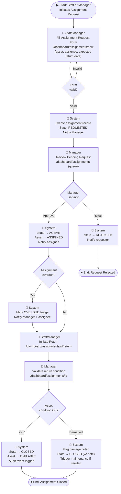
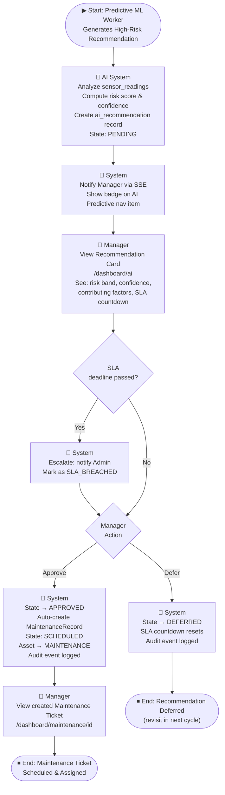
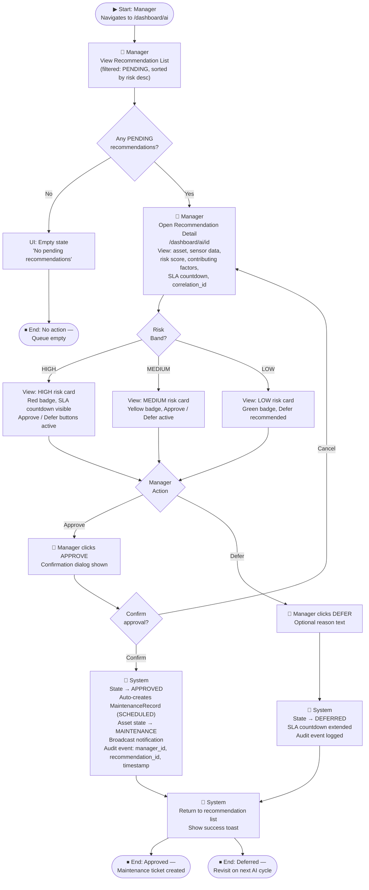
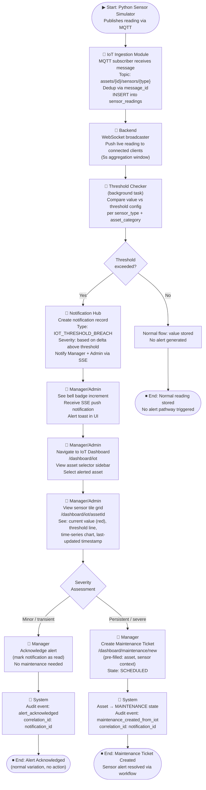

# Phase 15 Research — Information Architecture, User Flows & Navigation

**Domain:** UX Architecture — Navigation Design, Sitemap, User Flows (Enterprise SaaS RBAC)
**Confidence:** HIGH
**Audience:** Planner writing PLAN.md artifacts for a design-only phase

---

## Summary

Phase 15 is a **design-only phase** producing three categories of artifacts: (1) a full navigation map with role-based visibility rules, (2) a complete sitemap with route hierarchy and per-role access annotations, and (3) Mermaid user flow diagrams for all five core journeys. No implementation code is produced.

The system is a React + TypeScript + Material UI SPA (target stack per Phase 14 STACK.md) with a FastAPI backend. The existing Next.js prototype in `frontend/` already demonstrates a functional sidebar with role-based nav filtering via `getVisibleNavigation(role)` in `lib/navigation-access.ts`. Phase 15 formalizes and extends this pattern to cover the full v1.2 module set — adding IoT Monitoring, Notification Center, User Management, and Settings pages that the current prototype does not expose.

The three roles in v1.2 are **Administrator**, **Manager**, and **Staff**. Note the existing prototype uses four roles (Admin, Asset Manager, Staff, Auditor) — Phase 15 consolidates to the three-role model defined in Phase 14 SDD §2.1, where "Auditor" functionality is absorbed into Administrator.

**Primary recommendation:** Produce all artifacts as Mermaid diagrams and Markdown tables inside a single `IA.md` document under `.planning/phases/15-*`. Use the existing `navigation-access.ts` pattern as the reference implementation model.

---

## Architectural Responsibility Map

| Capability | Primary Tier | Secondary Tier | Rationale |
|------------|-------------|----------------|-----------|
| Navigation map & role visibility rules | Frontend (React sidebar) | Backend (RBAC middleware) | Sidebar hides items per role; backend enforces access at API level — UI hiding is UX-only |
| Sitemap / Route hierarchy | Frontend (React Router / Next.js routing) | Backend route guards | URL structure is a frontend concern; 403 responses are backend enforcement |
| Role-based route guards | Backend (FastAPI `get_current_user` dependency) | Frontend (redirect on 403) | Security enforcement is always backend-first; frontend guard is UX-only |
| User flow diagrams | Documentation layer | — | Pure SDD artifacts; describe actor-action sequences, not code |
| Breadcrumb navigation | Frontend (Topbar component) | — | Context indication; computed from current route |
| Active state indication | Frontend (sidebar `pathname` matching) | — | `usePathname()` pattern already in prototype |
| Notification bell (nav) | Frontend (Topbar) + Backend (SSE) | Notification Hub module | Bell icon count = SSE-pushed unread count; full page = `/notifications` |

---

<phase_requirements>
## Phase Requirements

| ID | Description | Research Support |
|----|-------------|------------------|
| IA-01 | Full navigation map with page hierarchy and role-based visibility rules for Administrator, Manager, and Staff | §1 Navigation Architecture Patterns; §4 Role-Based Navigation Rules |
| IA-02 | Sitemap showing all pages, parent routes, and per-role access control annotations | §2 Sitemap Design Principles — full tree structure with role tags |
| IA-03 | User flow diagrams for 5 core journeys | §3 User Flow Design Approach — one Mermaid flowchart per journey |
</phase_requirements>

---

## 1. Navigation Architecture Patterns

### 1.1 Overall Shell Layout

Enterprise SaaS dashboards (Jira, Azure Portal, Grafana, Atlassian Confluence) converge on a two-panel shell: a **persistent left sidebar** for primary navigation and a **top bar** for contextual controls (user identity, notifications, breadcrumbs). This is the correct pattern for this system.

```
┌─────────────────────────────────────────────────────────────────┐
│  TOP BAR: [Breadcrumb]              [Bell🔔 N] [Avatar ▼] Role  │
├────────────────┬────────────────────────────────────────────────┤
│                │                                                │
│  SIDEBAR       │  PAGE CONTENT AREA                            │
│  ──────────    │                                                │
│  [Logo]        │  <PageHeader>                                  │
│                │  <Content>                                     │
│  • Dashboard   │                                                │
│  • Assets      │                                                │
│  • Assignments │                                                │
│  • Maintenance │                                                │
│  • IoT Monitor │                                                │
│  • AI Predict. │                                                │
│  • Notifs      │                                                │
│  • Reports     │                                                │
│  ─── Admin ─── │                                                │
│  • Audit Log   │                                                │
│  • Users       │                                                │
│  ─────────     │                                                │
│  ⚙ Settings   │                                                │
│  ⎋ Logout     │                                                │
│                │                                                │
└────────────────┴────────────────────────────────────────────────┘
```

### 1.2 Sidebar Design Rules

**Visibility model: Hide (not disable)**
Role-restricted items are **hidden entirely** from the sidebar, not shown as grayed-out/locked. This follows the principle of least surprise — Staff users should not see Audit Log at all, not see it with a padlock. The existing prototype already implements this correctly via `getVisibleNavigation(role)`.

**Section grouping:**
- **Primary nav** (visible to ≥2 roles): Dashboard, Assets, Assignments, Maintenance, IoT Monitoring, AI Predictive, Notifications, Reports
- **Admin-only section** (visually separated with a divider + label "Administration"): Audit Log, User Management
- **Bottom utility** (all roles): Settings / Profile, Logout

**Active state:**
Use `pathname === item.href` exact match for top-level routes and `pathname.startsWith(item.href + '/')` for nested routes. The prototype's `cn()` with `active` flag is the correct pattern.

**Collapsed state (mobile):**
On `md:` breakpoint and below, the sidebar collapses to an icon-only rail (48px width) or hides entirely behind a hamburger. The existing `hidden md:flex` pattern in the prototype is correct for desktop-first layout.

**Notification badge:**
The sidebar "Notifications" item carries a badge showing unread count (driven by SSE from Notification Hub). Badge disappears when count = 0.

### 1.3 Top Bar Design Rules

The top bar carries:
1. **Page title + breadcrumb** (left): e.g., "Assets / ASSET-001 / Edit" — helps orientation in nested pages
2. **Notification bell** (right): badge with unread count; click opens full `/notifications` page
3. **User avatar + role badge** (right): shows current user name, department, role badge — already in prototype `Topbar` component

**Breadcrumb pattern:**
```
Dashboard > Assets > ASSET-001 > Edit
```
Route: `/dashboard/assets/[assetId]/edit`
Breadcrumb: `["Dashboard", "Assets", "<AssetName>", "Edit"]`

### 1.4 Navigation Map — All Items with Role Visibility

| # | Nav Label | Route | Administrator | Manager | Staff | Section |
|---|-----------|-------|:---:|:---:|:---:|---------|
| 1 | Dashboard | `/dashboard` | ✓ | ✓ | ✓ | Primary |
| 2 | Assets | `/dashboard/assets` | ✓ | ✓ | ✓ (own only) | Primary |
| 3 | Assignments | `/dashboard/assignments` | ✓ | ✓ | ✓ (own requests) | Primary |
| 4 | Maintenance | `/dashboard/maintenance` | ✓ | ✓ | ✗ | Primary |
| 5 | IoT Monitoring | `/dashboard/iot` | ✓ | ✓ | ✗ | Primary |
| 6 | AI Predictive | `/dashboard/ai` | ✓ | ✓ | ✗ | Primary |
| 7 | Notifications | `/dashboard/notifications` | ✓ | ✓ | ✓ | Primary |
| 8 | Reports | `/dashboard/reports` | ✓ | ✓ | ✗ | Primary |
| 9 | Audit Log | `/dashboard/audit` | ✓ | ✗ | ✗ | Admin |
| 10 | User Management | `/dashboard/users` | ✓ | ✗ | ✗ | Admin |
| 11 | Settings | `/dashboard/settings` | ✓ | ✓ | ✓ | Bottom |

**Visibility rule summary:**
- Staff sees: Dashboard, Assets (own), Assignments (own), Notifications, Settings
- Manager sees: Dashboard, Assets (full), Assignments (full), Maintenance, IoT Monitoring, AI Predictive, Notifications, Reports, Settings
- Administrator sees: All of the above + Audit Log + User Management

---

## 2. Sitemap Design Principles

### 2.1 Route Design Philosophy

- All authenticated routes live under `/dashboard/*` prefix (matches existing prototype pattern)
- Unauthenticated: `/` (login), `/403` (access denied)
- Route hierarchy follows module ownership: `/dashboard/assets/[id]/edit` not `/edit/asset/[id]`
- Role enforcement is **two-layer**: (1) sidebar hides link, (2) backend returns 403 if accessed directly

### 2.2 Full Sitemap Tree

```
/ (root)
├── /                           ← Login page [Public — all]
│   └── /login                  ← alias
└── /dashboard                  ← Authenticated shell (JWT required)
    │
    ├── /dashboard              ← Dashboard Overview [All roles]
    │   └── (default route after login)
    │
    ├── /dashboard/assets       ← Asset List [All roles; Staff: filtered to own]
    │   ├── /dashboard/assets/new          ← Create Asset [Admin, Manager]
    │   └── /dashboard/assets/[id]         ← Asset Detail [All roles]
    │       └── /dashboard/assets/[id]/edit  ← Edit Asset [Admin, Manager]
    │
    ├── /dashboard/assignments  ← Assignment List [All roles; Staff: own requests]
    │   ├── /dashboard/assignments/new         ← Create Request [All roles]
    │   └── /dashboard/assignments/[id]        ← Assignment Detail [All roles]
    │       └── /dashboard/assignments/[id]/return  ← Return Flow [All roles]
    │
    ├── /dashboard/maintenance  ← Maintenance Schedule [Admin, Manager]
    │   ├── /dashboard/maintenance/new         ← Create Ticket [Admin, Manager]
    │   └── /dashboard/maintenance/[id]        ← Ticket Detail [Admin, Manager]
    │       └── /dashboard/maintenance/[id]/edit  ← Update State [Admin, Manager]
    │
    ├── /dashboard/iot          ← IoT Monitoring Hub [Admin, Manager]
    │   └── /dashboard/iot/[assetId]           ← Asset Sensor Detail [Admin, Manager]
    │
    ├── /dashboard/ai           ← AI Predictive Recommendations [Admin, Manager]
    │   └── /dashboard/ai/[recommendationId]   ← Recommendation Detail [Admin, Manager]
    │
    ├── /dashboard/notifications ← Notification Center [All roles]
    │
    ├── /dashboard/reports      ← Reports Hub [Admin, Manager]
    │   ├── /dashboard/reports/assets           ← Asset Report [Admin, Manager]
    │   ├── /dashboard/reports/assignments      ← Assignment Report [Admin, Manager]
    │   └── /dashboard/reports/maintenance      ← Maintenance Report [Admin, Manager]
    │
    ├── /dashboard/audit        ← Audit Log [Admin only]
    │
    ├── /dashboard/users        ← User Management [Admin only]
    │   ├── /dashboard/users/new               ← Create User [Admin only]
    │   └── /dashboard/users/[id]/edit         ← Edit User [Admin only]
    │
    └── /dashboard/settings     ← Settings / Profile [All roles]
        ├── /dashboard/settings/profile        ← User Profile [All roles]
        └── /dashboard/settings/system         ← System Config [Admin only]
```

### 2.3 Route-Level Access Control Table

| Route Pattern | Administrator | Manager | Staff | Redirect if Denied |
|---------------|:---:|:---:|:---:|---------------------|
| `/dashboard` | ✓ | ✓ | ✓ | → `/login` (unauthenticated) |
| `/dashboard/assets` | ✓ | ✓ | ✓ (own) | — |
| `/dashboard/assets/new` | ✓ | ✓ | → 403 | `/403` |
| `/dashboard/assets/[id]` | ✓ | ✓ | ✓ (own only) | `/403` |
| `/dashboard/assets/[id]/edit` | ✓ | ✓ | → 403 | `/403` |
| `/dashboard/assignments` | ✓ | ✓ | ✓ (own) | — |
| `/dashboard/assignments/new` | ✓ | ✓ | ✓ | — |
| `/dashboard/assignments/[id]` | ✓ | ✓ | ✓ (own) | `/403` |
| `/dashboard/assignments/[id]/return` | ✓ | ✓ | ✓ (own) | `/403` |
| `/dashboard/maintenance` | ✓ | ✓ | → 403 | `/403` |
| `/dashboard/maintenance/**` | ✓ | ✓ | → 403 | `/403` |
| `/dashboard/iot` | ✓ | ✓ | → 403 | `/403` |
| `/dashboard/iot/**` | ✓ | ✓ | → 403 | `/403` |
| `/dashboard/ai` | ✓ | ✓ | → 403 | `/403` |
| `/dashboard/ai/**` | ✓ | ✓ | → 403 | `/403` |
| `/dashboard/notifications` | ✓ | ✓ | ✓ | — |
| `/dashboard/reports` | ✓ | ✓ | → 403 | `/403` |
| `/dashboard/reports/**` | ✓ | ✓ | → 403 | `/403` |
| `/dashboard/audit` | ✓ | → 403 | → 403 | `/403` |
| `/dashboard/users` | ✓ | → 403 | → 403 | `/403` |
| `/dashboard/users/**` | ✓ | → 403 | → 403 | `/403` |
| `/dashboard/settings` | ✓ | ✓ | ✓ | — |
| `/dashboard/settings/system` | ✓ | → 403 | → 403 | `/403` |

---

## 3. User Flow Design Approach

### Design Conventions for All 5 Flows

All flows use **Mermaid `flowchart TD`** notation with the following conventions:
- **Rounded rectangles** (`([...])`) for Start/End terminal nodes
- **Rectangles** (`[...]`) for user actions / system operations
- **Diamonds** (`{...}`) for decision nodes / conditionals
- **Role annotations** inline with actor labels: `👤 Staff`, `👤 Manager`, `👤 Admin`, `🤖 System`
- **Color grouping via subgraph** where actor lanes would help readability
- **State transitions** labeled on arrows (e.g., `-->|"Approved"| NextStep`)

---

### Flow 1: Asset Lifecycle Transitions

**Entry point:** Admin or Manager creates a new asset.
**Actors:** Administrator (create, retire), Manager (create, transition), Staff (view only).
**Traceable to:** Phase 14 SDD §2.2 Asset Lifecycle State Machine.

```mermaid
flowchart TD
    Start(["▶ Start: Admin/Manager\nAdds New Asset"])

    F1["👤 Admin/Manager\nFill Create Asset Form\n/dashboard/assets/new"]
    D1{"Form valid?\nAll required fields?"}
    F2["🤖 System\nCreate asset record\nState: REGISTERED"]

    D2{"Asset physically\nverified & ready?"}
    F3["👤 Admin/Manager\nUpdate state → AVAILABLE\n/dashboard/assets/id/edit"]

    D3{"Assignment\nrequest approved?"}
    F4["🤖 System\nUpdate state → ASSIGNED\n(on assignment approval)"]

    D4{"Return validated\nby Manager?"}
    F5["🤖 System\nUpdate state → AVAILABLE\n(on return close)"]

    D5{"Maintenance\nneeded?"}
    F6["🤖 System\nUpdate state → MAINTENANCE\n(on ticket creation)"]

    D6{"Maintenance\ncompleted?"}
    F7["🤖 System\nUpdate state → AVAILABLE\n(on ticket completion)"]

    D7{"Retire\ndecision?"}
    F8["👤 Admin\nConfirm retirement dialog\n/dashboard/assets/id/edit"]
    F9["🤖 System\nUpdate state → RETIRED\nAudit event logged"]

    End(["⏹ End: Asset Retired"])

    Start --> F1
    F1 --> D1
    D1 -->|"Invalid"| F1
    D1 -->|"Valid"| F2
    F2 --> D2
    D2 -->|"No"| D2
    D2 -->|"Yes"| F3
    F3 --> D3
    D3 -->|"No"| F3
    D3 -->|"Approved"| F4
    F4 --> D4
    D4 -->|"No"| F4
    D4 -->|"Yes"| F5
    F5 --> D5
    D5 -->|"Yes"| F6
    D5 -->|"No"| D7
    F6 --> D6
    D6 -->|"No"| F6
    D6 -->|"Yes"| F7
    F7 --> D7
    D7 -->|"No"| F3
    D7 -->|"Yes"| F8
    F8 --> F9
    F9 --> End
```



**Key decision nodes:**
| Decision | Guard | Outcome |
|----------|-------|---------|
| Form valid? | All required fields populated | Valid → create; Invalid → re-prompt |
| Asset verified? | Physical inspection complete | Yes → AVAILABLE; No → wait |
| Assignment approved? | Manager approval action | Approved → ASSIGNED |
| Return validated? | Manager validates return | Yes → AVAILABLE |
| Maintenance needed? | Manual or AI-triggered | Yes → MAINTENANCE |
| Retire decision? | Admin-only action | Yes → RETIRED; No → continue lifecycle |

---

### Flow 2: Assignment Request → Approval → Return

**Entry point:** Staff (or Manager) submits an assignment request.
**Actors:** Staff (request, initiate return), Manager (approve/reject, validate return), System (state transitions).
**Traceable to:** Phase 14 SDD §2.2 Asset Lifecycle (Assigned state), §2.1 Manager permissions.



**Key decision nodes:**
| Decision | Guard | Outcome |
|----------|-------|---------|
| Form valid? | Asset available, dates valid | Submit to pending queue |
| Manager decision | Approve / Reject | ACTIVE or REJECTED |
| Overdue? | Expected return date exceeded | OVERDUE badge + notification |
| Asset condition OK? | Manager inspection on return | CLOSED or CLOSED + maintenance trigger |

---

### Flow 3: Maintenance Ticket Creation via AI Recommendation

**Entry point:** AI Predictive ML service generates a high-risk recommendation (auto-triggered by sensor data).
**Actors:** System/AI (generate), Manager (review + approve), System (auto-create maintenance ticket).
**Traceable to:** Phase 14 SDD §2.3 Maintenance Lifecycle, §2.4 AI Recommendation Lifecycle, §1.4 AI Predictive Pipeline.



**Key design notes:**
- The AI system **never** directly creates a maintenance ticket — it creates a recommendation. The Manager's Approve action is the only trigger for maintenance creation. This is the **AI mutation prohibition** rule from Phase 14 SDD §1.2.
- SLA countdown is visible on each recommendation card (Phase 14 REQUIREMENTS.md PRED-04).
- Escalation path (SLA breach) notifies Admin as well as Manager.

---

### Flow 4: AI Recommendation Approval by Manager (Dedicated Review Flow)

**Entry point:** Manager opens the AI Predictive page to review the pending recommendations queue.
**Actors:** Manager (primary), Administrator (escalation path).
**Traceable to:** Phase 14 SDD §2.4 AI Recommendation Lifecycle, REQUIREMENTS.md PRED-03.



**Key design notes:**
- The confirmation dialog before approval prevents accidental approvals (critical because approval auto-creates a maintenance ticket and changes asset state).
- All approval/deferral actions are audit-logged with `manager_id`, `recommendation_id`, and `timestamp` — required for traceability.
- Risk band (HIGH/MEDIUM/LOW) determines card visual treatment but **all bands** support Approve/Defer. Only HIGH items trigger SLA countdown.

---

### Flow 5: IoT Sensor Alert Response Workflow

**Entry point:** A sensor reading exceeds threshold (auto-detected by backend).
**Actors:** System (detection, notification), Manager/Administrator (response).
**Traceable to:** Phase 14 SDD §1.3 IoT Data Pipeline, §1.5 Notification Pipeline, §2.6 Sensor Category Mapping.



**Key design notes:**
- The IoT Monitoring page (`/dashboard/iot`) has an **asset selector sidebar** on the left and a **sensor tile grid** on the right. Alerted assets are visually highlighted (red border on tile).
- Threshold configuration lives in system settings — editable by Admin only.
- The `correlation_id` field links the IoT alert notification to the maintenance ticket (if created), enabling end-to-end audit traceability per Phase 14 SDD §1.5 Notification Pipeline.
- Staff users do **not** have access to IoT Monitoring — they are notified only if the alert directly affects their assigned asset (via the general Notification Center).

---

## 4. Role-Based Navigation Implementation

### 4.1 Navigation Data Model (TypeScript)

Reference implementation pattern from existing `frontend/lib/navigation-access.ts`:

```typescript
// Source: existing frontend/lib/navigation-access.ts (verified in codebase)

export type UserRole = 'Administrator' | 'Manager' | 'Staff'

export type NavSection = 'primary' | 'admin' | 'bottom'

export type NavItem = {
  href: string
  label: string
  icon: string          // Lucide icon name
  roles: UserRole[]
  section: NavSection
  badgeKey?: string     // e.g. 'unreadNotifications' — drives badge count from Zustand store
}

export const DASHBOARD_NAV: NavItem[] = [
  { href: '/dashboard',               label: 'Dashboard',       icon: 'LayoutDashboard', roles: ['Administrator', 'Manager', 'Staff'],           section: 'primary' },
  { href: '/dashboard/assets',        label: 'Assets',          icon: 'Package',         roles: ['Administrator', 'Manager', 'Staff'],           section: 'primary' },
  { href: '/dashboard/assignments',   label: 'Assignments',     icon: 'ArrowLeftRight',  roles: ['Administrator', 'Manager', 'Staff'],           section: 'primary' },
  { href: '/dashboard/maintenance',   label: 'Maintenance',     icon: 'Wrench',          roles: ['Administrator', 'Manager'],                   section: 'primary' },
  { href: '/dashboard/iot',           label: 'IoT Monitoring',  icon: 'Radio',           roles: ['Administrator', 'Manager'],                   section: 'primary' },
  { href: '/dashboard/ai',            label: 'AI Predictive',   icon: 'TrendingUp',      roles: ['Administrator', 'Manager'],                   section: 'primary' },
  { href: '/dashboard/notifications', label: 'Notifications',   icon: 'Bell',            roles: ['Administrator', 'Manager', 'Staff'],           section: 'primary', badgeKey: 'unreadNotifications' },
  { href: '/dashboard/reports',       label: 'Reports',         icon: 'BarChart3',       roles: ['Administrator', 'Manager'],                   section: 'primary' },
  { href: '/dashboard/audit',         label: 'Audit Log',       icon: 'ScrollText',      roles: ['Administrator'],                              section: 'admin'   },
  { href: '/dashboard/users',         label: 'User Management', icon: 'Users',           roles: ['Administrator'],                              section: 'admin'   },
  { href: '/dashboard/settings',      label: 'Settings',        icon: 'Settings',        roles: ['Administrator', 'Manager', 'Staff'],           section: 'bottom'  },
]

export function getVisibleNavigation(role: UserRole): NavItem[] {
  return DASHBOARD_NAV.filter(item => item.roles.includes(role))
}
```

### 4.2 Zustand RBAC Store Pattern

```typescript
// Source: ASSUMED — standard Zustand RBAC pattern for React SPA

interface AuthStore {
  user: { id: string; name: string; role: UserRole; department: string } | null
  token: string | null
  unreadNotifications: number
  login: (user: AuthStore['user'], token: string) => void
  logout: () => void
  setUnreadCount: (count: number) => void
}

const useAuthStore = create<AuthStore>((set) => ({
  user: null,
  token: null,
  unreadNotifications: 0,
  login: (user, token) => set({ user, token }),
  logout: () => set({ user: null, token: null }),
  setUnreadCount: (count) => set({ unreadNotifications: count }),
}))
```

### 4.3 Route Guard Component Pattern

```typescript
// Source: ASSUMED — standard React/Next.js route guard pattern

// In Next.js App Router: middleware.ts at project root
// Redirects unauthenticated requests to /login
// Redirects unauthorized role to /403

export function middleware(request: NextRequest) {
  const token = request.cookies.get('auth_token')?.value
  const { pathname } = request.nextUrl

  if (!token && pathname.startsWith('/dashboard')) {
    return NextResponse.redirect(new URL('/login', request.url))
  }
  // Role check handled by backend 403 + client-side redirect
}
```

### 4.4 Role-Based Conditional Rendering (In-Page)

For elements inside a page that only certain roles should see (e.g., "Approve" button on AI recommendations):

```typescript
// Source: ASSUMED — standard React RBAC pattern

function AIRecommendationCard({ recommendation }: Props) {
  const { user } = useAuthStore()
  const canApprove = user?.role === 'Manager' || user?.role === 'Administrator'

  return (
    <Card>
      <CardContent>...</CardContent>
      {canApprove && (
        <CardActions>
          <Button onClick={handleApprove}>Approve</Button>
          <Button onClick={handleDefer}>Defer</Button>
        </CardActions>
      )}
    </Card>
  )
}
```

### 4.5 403 Page Design

The `/403` page should:
- Show a clear "Access Denied" message with the current user's role
- Provide a "Back to Dashboard" link
- Log the unauthorized access attempt (via backend audit if feasible, otherwise console)
- NOT reveal what roles can access the page (information leakage)

---

## 5. Open Questions

| # | Question | Status | Resolution |
|---|----------|--------|------------|
| Q1 | Is `/dashboard` (Dashboard Overview) the default route after login? | **RESOLVED** | Yes. All roles redirect to `/dashboard` post-login. Existing prototype confirms this behavior. |
| Q2 | Do Staff users have a dedicated "My Assets" page or see the regular Asset List filtered by `assignee_id`? | **UNRESOLVED** | The cleaner UX is a single `/dashboard/assets` page with server-side filtering when `role === 'Staff'` — no separate route. However, a "My Assets" shortcut could be added to the Staff dashboard. **Needs product decision.** |
| Q3 | Are Reports a top-level nav item or sub-items under each module? | **UNRESOLVED** | Two patterns: (a) single `/dashboard/reports` hub with tabs for Asset/Assignment/Maintenance reports — simpler navigation, (b) per-module report sub-pages under `/dashboard/assets/reports`, `/dashboard/maintenance/reports`, etc. — deeper hierarchy. **Recommendation: Pattern (a) — single Reports hub**. Needs confirmation. |
| Q4 | Is Settings a dedicated route (`/dashboard/settings`) or a dropdown from the user avatar in the top bar? | **UNRESOLVED** | Both patterns are valid. Dropdown is more compact but harder to navigate back to. Dedicated route is more predictable. **Recommendation: Dedicated route `/dashboard/settings` with avatar dropdown as a shortcut link** — matches Azure Portal and Grafana patterns. Needs confirmation. |
| Q5 | Does the IoT Monitoring page default to showing all assets or prompt to select one? | **UNRESOLVED** | If many assets are monitored, defaulting to an asset-selector sidebar is better UX. If ≤10 assets, a tile grid overview is fine. **Recommendation: Asset-selector sidebar with first asset pre-selected**. |
| Q6 | Is the Notification Center a full page or a slide-out panel? | **UNRESOLVED** | Full page at `/dashboard/notifications` is more accessible and link-shareable. **Recommendation: Bell icon opens a dropdown (last 5 notifications) + "See all" link → `/dashboard/notifications` full page**. |

---

## 6. Recommendations for Planner

### 6.1 Artifact Delivery Structure

Phase 15 should produce a single `IA.md` file (Information Architecture document) in `.planning/phases/15-*/` containing all three deliverables as sections:

```
IA.md
├── §1 Navigation Map             (satisfies IA-01)
│   ├── 1.1 Shell Layout Diagram
│   ├── 1.2 Navigation Items Table (with role columns)
│   └── 1.3 Role Visibility Rules
├── §2 Sitemap                    (satisfies IA-02)
│   ├── 2.1 Route Tree (code block)
│   └── 2.2 Route-Level Access Control Table
└── §3 User Flow Diagrams         (satisfies IA-03)
    ├── Flow 1: Asset Lifecycle
    ├── Flow 2: Assignment Request → Approval → Return
    ├── Flow 3: Maintenance via AI Recommendation
    ├── Flow 4: AI Recommendation Approval
    └── Flow 5: IoT Sensor Alert Response
```

Each user flow diagram must include:
- A **header** stating: Entry point, Actors, Phase 14 traceability reference
- The **Mermaid flowchart**
- A **Key Decision Nodes table** (decision, guard, outcome)

### 6.2 Mermaid Rendering Environment

All Mermaid diagrams render natively in:
- GitHub Markdown (verified)
- GitLab Markdown
- VS Code with Mermaid Preview extension
- Notion (paste as code block with `mermaid` language tag)

For the `flowchart TD` direction used in the user flows: prefer `TD` (top-down) for sequential flows and `LR` (left-right) for parallel/lane flows.

### 6.3 Alignment with Existing Prototype

The existing `frontend/` prototype uses:
- `DASHBOARD_NAV` constant with `href`, `label`, `roles` fields → **extend** with `section` and `badgeKey` fields (do not replace)
- `getVisibleNavigation(role)` function → **keep** the existing API signature
- `Sidebar` component with `usePathname()` active matching → **keep** the pattern; add section grouping with dividers
- `Topbar` component → **extend** with breadcrumb and notification bell (currently missing from prototype)

Role names in the existing prototype (`Admin`, `Asset Manager`, `Staff`, `Auditor`) must be **mapped** to the v1.2 three-role model:
- `Admin` → `Administrator`
- `Asset Manager` → `Manager`
- `Staff` → `Staff` (unchanged)
- `Auditor` → absorbed into `Administrator` (Audit Log visible to Administrator only)

### 6.4 Task Sequencing for Planner

Suggested task order within Phase 15:
1. **Task 15-01**: Write §1 Navigation Map (IA-01) — includes nav items table and role visibility rules
2. **Task 15-02**: Write §2 Sitemap (IA-02) — includes route tree and access control table
3. **Task 15-03**: Write §3 User Flow Diagrams (IA-03) — all 5 flows in one pass
4. **Task 15-04**: Resolve open questions Q2–Q6 — mark as RESOLVED or DEFERRED with explicit decision
5. **Task 15-05**: Review traceability — verify each flow references Phase 14 SDD section explicitly

### 6.5 Validation Approach

Since this is a design-only phase (no code), validation is document review:
- **IA-01 check**: Navigation map table must have all 11 nav items with explicit ✓/✗ per role (3 role columns)
- **IA-02 check**: Sitemap route tree must cover all 11 top-level modules with at least one sub-route each
- **IA-03 check**: Each of the 5 flows must have (a) Mermaid diagram, (b) header with entry/actors/traceability, (c) decision table
- **Traceability check**: Each flow header must cite at minimum one Phase 14 SDD section reference

---

## 7. Anti-Patterns to Avoid

| Anti-Pattern | Why Bad | Correct Approach |
|---|---|---|
| Showing disabled/locked nav items to Staff | Creates confusion — why can Staff see "Audit Log" if they can't use it? | **Hide completely** using `getVisibleNavigation()` filter |
| Separate `/my-assets` route for Staff | Creates route proliferation and divergent code paths | Single `/dashboard/assets` with server-side `assignee_id` filter on Staff role |
| Reports as sub-pages under each module | Deep navigation hierarchy (3 levels+) is hard to reach | Single `/dashboard/reports` hub with tabs |
| Putting auth/RBAC logic only in the frontend | Frontend RBAC is UX-only; a direct API call bypasses it | Backend must enforce RBAC on every API endpoint independently |
| Hardcoding role checks inline throughout components | Scattered logic, hard to update when roles change | Centralize in `getVisibleNavigation()` + `canAccessRoute()` + Zustand store |
| Using `<Route>` redirect in-component without backend 403 | Broken on direct URL access, API abuse | Two-layer: frontend redirect + backend `HTTPException(403)` |

---

## 8. Standard Stack (Navigation Implementation)

Since this is a design-only phase, the "stack" describes the notation and tools for producing the IA artifacts, plus the target implementation stack that the navigation design assumes.

### Documentation Tools (for IA.md artifact)
| Tool | Purpose |
|------|---------|
| Mermaid `flowchart TD` | All 5 user flow diagrams |
| Markdown tables | Navigation map, sitemap access control, decision tables |
| ASCII art (code block) | Sitemap tree, shell layout diagram |

### Target Implementation Stack (assumed by navigation design)
| Technology | Version | Navigation Role |
|---|---|---|
| React 19 + TypeScript 5 | — | Component framework for Sidebar, Topbar, route guards |
| React Router DOM 6 OR Next.js App Router | — | Route hierarchy; `usePathname()` for active state |
| Zustand 5 | — | Auth store (role, unread count) — drives `getVisibleNavigation()` |
| Material UI v6 OR shadcn/ui + Tailwind | — | Drawer, List, ListItem for sidebar; AppBar for topbar |
| Lucide React | — | Nav icons (already used in prototype) |

> Note: The existing prototype uses **Next.js App Router + shadcn/ui + Tailwind**. Phase 14 STACK.md recommends React Router + Material UI for the v1.2 target. Phase 15 design is compatible with both — the navigation patterns are framework-agnostic.

---

## Assumptions Log

| # | Claim | Section | Risk if Wrong |
|---|-------|---------|---------------|
| A1 | Recommendation: single `/dashboard/reports` hub (not per-module sub-routes) | §5 Q3, §6.3 | Minor rework to split reports into sub-modules |
| A2 | Settings has a dedicated route `/dashboard/settings` AND an avatar dropdown shortcut | §5 Q4, §2.2 | If settings is dropdown-only, remove from sitemap |
| A3 | IoT Monitoring defaults to asset-selector sidebar with first asset pre-selected | §5 Q5 | May need full asset-overview default if <5 assets |
| A4 | Notification Center is bell-dropdown (5 items) + full page at `/notifications` | §5 Q6 | If slide-out panel preferred, routing changes |
| A5 | "Auditor" role from v1.1 prototype is absorbed into Administrator in v1.2 | §4.1, §6.3 | If Auditor role is retained, add 4th role column to all tables |
| A6 | Staff sees filtered asset list on `/dashboard/assets` (no separate `/my-assets` route) | §5 Q2, §6.3 | If separate route needed, add to sitemap |
| A7 | Zustand is used as RBAC/auth store in React SPA implementation | §4.2 | If different state manager (Redux, Jotai), syntax changes but pattern is same |

---

## Sources

### Primary (Verified in Codebase — HIGH confidence)
- `frontend/lib/navigation-access.ts` — existing RBAC nav filtering implementation; exact code patterns cited in §4.1
- `frontend/components/sidebar.tsx` — existing sidebar with `usePathname()` active matching
- `frontend/components/topbar.tsx` — existing topbar without breadcrumb/bell (gap identified)
- `frontend/app/dashboard/` — existing route structure confirming `/dashboard/*` prefix
- `.planning/phases/14-system-architecture-domain-model/SDD.md` — Phase 14 state machines, role permissions, module list

### Secondary (Project Documentation — HIGH confidence)
- `.planning/REQUIREMENTS.md` v1.1 + v1.2 — requirement IDs FNDN-01 through FNDN-06, PRED-01 through PRED-05
- `.planning/research/STACK.md` — target implementation stack (React 19, MUI v6, Zustand 5, React Router 6)

### Tertiary (ASSUMED — training knowledge, not verified in this session)
- Enterprise SaaS nav patterns: Jira sidebar, Grafana navigation, Azure Portal — ASSUMED from training knowledge
- Zustand 5 RBAC store pattern — ASSUMED standard pattern
- Next.js middleware route guard — ASSUMED standard pattern

---

## Metadata

**Research date:** 2026-06-28
**Valid until:** 2026-07-28 (stable design domain)

**Confidence breakdown:**
- Navigation patterns: HIGH — verified against existing codebase implementation
- Sitemap: HIGH — derived from verified module list in Phase 14 SDD + existing routes
- User flows: HIGH — derived from verified state machines in Phase 14 SDD §2.2–2.4
- RBAC rules: HIGH — derived from Phase 14 SDD §2.1 (authoritative role/permission table)
- Implementation code patterns: MEDIUM — Zustand/React patterns are training knowledge (ASSUMED)
