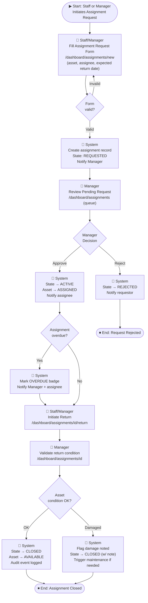
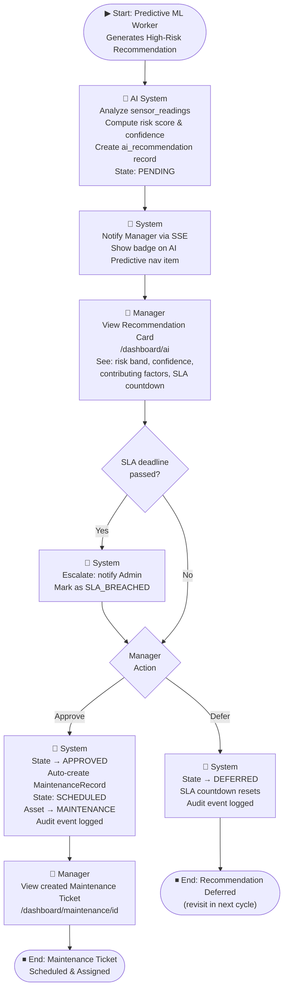
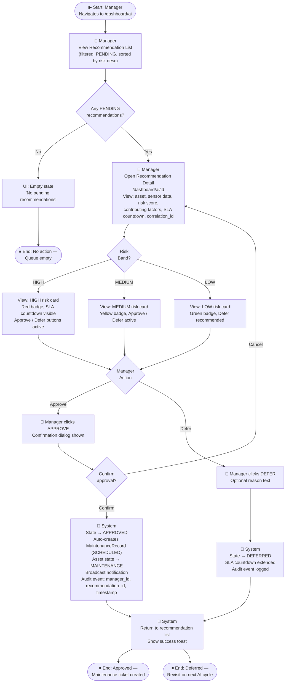
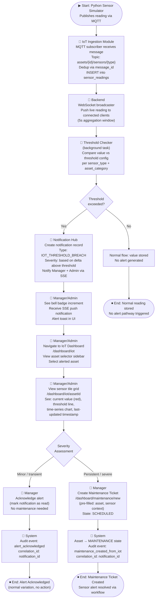

# Smart AI-Powered Asset Management System
## Information Architecture (IA)

> **Scope:** Navigation map, sitemap, and user flow diagrams for all 5 core journeys. All role rules derive from Phase 14 SDD §2.1. All state machine references trace to Phase 14 SDD §2.2–2.4. No implementation code is produced in this document.

---

## Table of Contents

1. [Navigation Map](#1-navigation-map)
   - [1.1 Shell Layout Diagram](#11-shell-layout-diagram)
   - [1.2 Navigation Items Table](#12-navigation-items-table)
   - [1.3 Role Visibility Summary](#13-role-visibility-summary)
   - [1.4 Sidebar & Top Bar Behaviour](#14-sidebar--top-bar-behaviour)
   - [1.5 Sub-Navigation](#15-sub-navigation-in-page-tabs-and-nested-routes)
2. [Sitemap](#2-sitemap)
   - [2.1 Route Hierarchy Tree](#21-route-hierarchy-tree)
   - [2.2 Mermaid Route Graph](#22-mermaid-route-graph)
   - [2.3 Route-Level Access Control Table](#23-route-level-access-control-table)
3. [User Flows](#3-user-flows)
   - [Flow 1: Asset Lifecycle Transitions](#flow-1--asset-lifecycle-transitions)
   - [Flow 2: Assignment Request → Approval → Return](#flow-2--assignment-request--approval--return)
   - [Flow 3: Maintenance Ticket Creation via AI Recommendation](#flow-3--maintenance-ticket-creation-via-ai-recommendation)
   - [Flow 4: AI Recommendation Approval by Manager](#flow-4--ai-recommendation-approval-by-manager)
   - [Flow 5: IoT Sensor Alert Response Workflow](#flow-5--iot-sensor-alert-response-workflow)
   - [Flow Traceability Summary](#flow-traceability-summary)

---

## 1. Navigation Map

### 1.1 Shell Layout Diagram

The application uses a two-panel enterprise SaaS shell — a persistent left sidebar for primary navigation and a fixed top bar for contextual controls. This matches the patterns established in Grafana, Azure Portal, and Atlassian Jira.

```text
┌─────────────────────────────────────────────────────────────────────┐
│  TOP BAR                                                            │
│  [Breadcrumb: e.g. Dashboard > Assets > ASSET-001]   [🔔 3] [👤 ▼] │
│                                                    Manager Role     │
├──────────────────┬──────────────────────────────────────────────────┤
│  SIDEBAR         │                                                  │
│  ┌────────────┐  │                                                  │
│  │   [Logo]   │  │                                                  │
│  └────────────┘  │                                                  │
│  ─────────────   │                                                  │
│  🏠 Dashboard    │                                                  │
│  📦 Assets       │           PAGE CONTENT AREA                     │
│  🔄 Assignments  │                                                  │
│  🔧 Maintenance  │                                                  │
│  📡 IoT Monitor  │                                                  │
│  🤖 AI Predictive│                                                  │
│  🔔 Notifs  [3]  │                                                  │
│  📊 Reports      │                                                  │
│  ── Admin ──────  │                                                  │
│  📋 Audit Log    │                                                  │
│  👥 Users        │                                                  │
│  ─────────────   │                                                  │
│  ⚙️  Settings     │                                                  │
│  🚪 Logout       │                                                  │
└──────────────────┴──────────────────────────────────────────────────┘
```

> **Note:** Items below `── Administration ──` divider are only rendered for Administrator role. All other roles see a sidebar ending at Reports + Settings/Logout.

---

### 1.2 Navigation Items Table

| # | Nav Label | Route | Administrator | Manager | Staff | Section | Notes |
|---|-----------|-------|:-------------:|:-------:|:-----:|---------|-------|
| 1 | Dashboard | /dashboard | ✅ | ✅ | ✅ | Primary | Default route after login for all roles |
| 2 | Assets | /dashboard/assets | ✅ | ✅ | 👁️ | Primary | Staff: filtered server-side by `assignee_id` — no dedicated My Assets route |
| 3 | Assignments | /dashboard/assignments | ✅ | ✅ | 👁️ | Primary | Staff: own requests only (submitted by self or assigned to self) |
| 4 | Maintenance | /dashboard/maintenance | ✅ | ✅ | 🔒 | Primary | Staff has no sidebar access; maintenance data surfaced read-only via asset detail |
| 5 | IoT Monitoring | /dashboard/iot | ✅ | ✅ | 🔒 | Primary | Staff has no sidebar access to IoT dashboard — Admin/Manager only |
| 6 | AI Predictive | /dashboard/ai | ✅ | ✅ | 🔒 | Primary | Approve/Defer actions are Manager and Administrator only |
| 7 | Notifications | /dashboard/notifications | ✅ | ✅ | ✅ | Primary | Bell badge driven by SSE unread count; dropdown shows last 5 + "See all" link |
| 8 | Reports | /dashboard/reports | ✅ | ✅ | 🔒 | Primary | Single hub with Asset / Assignment / Maintenance tabs |
| 9 | Audit Log | /dashboard/audit | ✅ | 🔒 | 🔒 | Administration | Administrator only; Auditor role from v1.1 consolidated into Administrator |
| 10 | User Management | /dashboard/users | ✅ | 🔒 | 🔒 | Administration | Administrator only — create, edit, deactivate users |
| 11 | Settings | /dashboard/settings | ✅ | ✅ | ✅ | Bottom | All roles access profile settings; System Config tab visible to Administrator only |

**Legend:** ✅ = full access · 👁️ = filtered/read-only access · 🔒 = hidden (never rendered in sidebar)

---

### 1.3 Role Visibility Summary

**Staff sees:**
- Dashboard, Assets (own only), Assignments (own only), Notifications, Settings/Profile

**Manager sees:**
- Dashboard, Assets, Assignments, Maintenance, IoT Monitoring, AI Predictive, Notifications, Reports, Settings

**Administrator sees:**
- Dashboard, Assets, Assignments, Maintenance, IoT Monitoring, AI Predictive, Notifications, Reports, **Audit Log**, **User Management**, Settings (with System Config tab)

> **Hide-not-disable rule:** Role-restricted items are **hidden entirely** from the sidebar using `getVisibleNavigation(role)`. Staff must never see a locked/greyed Audit Log entry. Disabled states create accessibility and security concerns — hidden is the correct pattern for role-based navigation.

---

### 1.4 Sidebar & Top Bar Behaviour

**Sidebar behaviour rules:**

1. **Expanded state:** Icon + label, active item highlighted with background colour (primary light tint), width ~240 px. MUI `Drawer` variant `permanent` on `md+` breakpoints.
2. **Collapsed state (mobile, `< md` breakpoint):** Icon-only rail ~48 px wide using `hidden md:flex` pattern consistent with the existing prototype in `frontend/lib/navigation-access.ts`.
3. **Active state matching:** Exact match `pathname === item.href` for top-level routes (e.g., `/dashboard`); prefix match `pathname.startsWith(item.href + '/')` for modules with nested routes (e.g., `/dashboard/assets/ASSET-001` activates the Assets item).
4. **Notification badge:** The Notifications sidebar item shows an unread count badge (MUI `Badge`) driven by `unreadNotifications` in the Zustand store, updated via SSE push from `/api/notifications/stream`. Badge disappears when count = 0.

**Top bar items:**

1. **Left — Breadcrumb:** Page title + breadcrumb trail (e.g., `Dashboard > Assets > ASSET-001 > Edit`), computed from current route segments using `usePathname()`. Max 3 levels shown; root Dashboard level is omitted on the Dashboard page itself.
2. **Right — Notification bell:** Bell icon (🔔) with unread count badge. Click navigates to `/dashboard/notifications` (full page). Does NOT open a modal — full page navigation for accessibility and link-shareability.
3. **Right — User avatar:** Shows user initials or avatar with name + role badge. Click opens a dropdown with two items: **Settings** (→ `/dashboard/settings`) and **Logout** (clears JWT, redirects to `/login`).

---

### 1.5 Sub-Navigation (In-Page Tabs and Nested Routes)

| Module | Sub-Page / Tab | Route | Available To |
|--------|---------------|-------|-------------|
| Assets | Asset List | /dashboard/assets | All roles (Staff: filtered) |
| Assets | Asset Detail | /dashboard/assets/[id] | All roles (Staff: own only) |
| Assets | Create Asset | /dashboard/assets/new | Administrator, Manager |
| Assets | Edit Asset | /dashboard/assets/[id]/edit | Administrator, Manager |
| Assignments | All Assignments | /dashboard/assignments | All roles (Staff: own) |
| Assignments | Pending Queue | /dashboard/assignments (queue tab) | Administrator, Manager |
| Assignments | Create Request | /dashboard/assignments/new | All roles |
| Assignments | Assignment Detail | /dashboard/assignments/[id] | All roles (Staff: own) |
| Assignments | Return Flow | /dashboard/assignments/[id]/return | All roles (Staff: own) |
| Maintenance | Schedule View | /dashboard/maintenance | Administrator, Manager |
| Maintenance | Create Ticket | /dashboard/maintenance/new | Administrator, Manager |
| Maintenance | Ticket Detail | /dashboard/maintenance/[id] | Administrator, Manager |
| Maintenance | Update State | /dashboard/maintenance/[id]/edit | Administrator, Manager |
| IoT Monitoring | Hub (asset selector) | /dashboard/iot | Administrator, Manager |
| IoT Monitoring | Asset Sensor Detail | /dashboard/iot/[assetId] | Administrator, Manager |
| AI Predictive | Recommendations List | /dashboard/ai | Administrator, Manager |
| AI Predictive | Recommendation Detail | /dashboard/ai/[recommendationId] | Administrator, Manager |
| Reports | Asset Report tab | /dashboard/reports (tab) | Administrator, Manager |
| Reports | Assignment Report tab | /dashboard/reports (tab) | Administrator, Manager |
| Reports | Maintenance Report tab | /dashboard/reports (tab) | Administrator, Manager |
| Settings | User Profile | /dashboard/settings/profile | All roles |
| Settings | System Config | /dashboard/settings/system | Administrator only |
| User Management | User List | /dashboard/users | Administrator |
| User Management | Create User | /dashboard/users/new | Administrator |
| User Management | Edit User | /dashboard/users/[id]/edit | Administrator |

---

## 2. Sitemap

### 2.1 Route Hierarchy Tree

```text
/ (root)
├── /login                                          [Public — all]
│   └── / ← redirects unauthenticated → /login
│
└── /dashboard                                      [Authenticated shell — JWT required]
    ├── /dashboard                                  [All roles — Dashboard Overview]
    │
    ├── /dashboard/assets                           [All roles; Staff: filtered to own]
    │   ├── /dashboard/assets/new                  [Administrator, Manager]
    │   └── /dashboard/assets/[id]                 [All roles; Staff: own only]
    │       └── /dashboard/assets/[id]/edit        [Administrator, Manager]
    │
    ├── /dashboard/assignments                      [All roles; Staff: own requests]
    │   ├── /dashboard/assignments/new             [All roles]
    │   └── /dashboard/assignments/[id]            [All roles; Staff: own]
    │       └── /dashboard/assignments/[id]/return [All roles; Staff: own]
    │
    ├── /dashboard/maintenance                      [Administrator, Manager]
    │   ├── /dashboard/maintenance/new             [Administrator, Manager]
    │   └── /dashboard/maintenance/[id]            [Administrator, Manager]
    │       └── /dashboard/maintenance/[id]/edit   [Administrator, Manager]
    │
    ├── /dashboard/iot                              [Administrator, Manager]
    │   └── /dashboard/iot/[assetId]               [Administrator, Manager]
    │
    ├── /dashboard/ai                               [Administrator, Manager]
    │   └── /dashboard/ai/[recommendationId]       [Administrator, Manager]
    │
    ├── /dashboard/notifications                    [All roles]
    │
    ├── /dashboard/reports                          [Administrator, Manager]
    │   ├── /dashboard/reports/assets              [Administrator, Manager]
    │   ├── /dashboard/reports/assignments         [Administrator, Manager]
    │   └── /dashboard/reports/maintenance         [Administrator, Manager]
    │
    ├── /dashboard/audit                            [Administrator only 🔐]
    │
    ├── /dashboard/users                            [Administrator only 🔐]
    │   ├── /dashboard/users/new                   [Administrator only]
    │   └── /dashboard/users/[id]/edit             [Administrator only]
    │
    └── /dashboard/settings                         [All roles]
        ├── /dashboard/settings/profile             [All roles]
        └── /dashboard/settings/system             [Administrator only 🔐]

/403                                                [Public error page — shown on role denial]
```

---

### 2.2 Mermaid Route Graph

```mermaid
graph TD
    subgraph AUTH ["Public / Auth"]
        Root["/"]
        Login["/login"]
        Err403["/403 🚫"]
    end

    subgraph DASH ["Dashboard Shell (JWT required)"]
        Dashboard["/dashboard\n[All roles]"]
        Assets["/assets\n[All roles]"]
        AssetsNew["assets/new\n[Admin, Manager]"]
        AssetDetail["assets/[id]\n[All roles, Staff: own]"]
        AssetEdit["assets/[id]/edit\n[Admin, Manager]"]
        Assignments["/assignments\n[All roles]"]
        AssignNew["assignments/new\n[All roles]"]
        AssignDetail["assignments/[id]\n[All roles, Staff: own]"]
        AssignReturn["assignments/[id]/return\n[All roles, Staff: own]"]
        Maintenance["/maintenance\n[Admin, Manager]"]
        MaintNew["maintenance/new\n[Admin, Manager]"]
        MaintDetail["maintenance/[id]\n[Admin, Manager]"]
        MaintEdit["maintenance/[id]/edit\n[Admin, Manager]"]
        IoT["/iot\n[Admin, Manager]"]
        IoTAsset["iot/[assetId]\n[Admin, Manager]"]
        AI["/ai\n[Admin, Manager]"]
        AIDetail["ai/[recId]\n[Admin, Manager]"]
        Notifications["/notifications\n[All roles]"]
        Reports["/reports\n[Admin, Manager]"]
        ReportsAssets["reports/assets"]
        ReportsAssign["reports/assignments"]
        ReportsMaint["reports/maintenance"]
        Settings["/settings\n[All roles]"]
        SettingsProfile["settings/profile\n[All roles]"]
        SettingsSystem["settings/system\n[Admin 🔐]"]
    end

    subgraph ADMIN ["Administration (Administrator only 🔐)"]
        Audit["/audit\n[Admin 🔐]"]
        Users["/users\n[Admin 🔐]"]
        UsersNew["users/new\n[Admin 🔐]"]
        UsersEdit["users/[id]/edit\n[Admin 🔐]"]
    end

    Root --> Login
    Root --> Dashboard
    Root --> Err403
    Dashboard --> Assets
    Dashboard --> Assignments
    Dashboard --> Maintenance
    Dashboard --> IoT
    Dashboard --> AI
    Dashboard --> Notifications
    Dashboard --> Reports
    Dashboard --> Settings
    Dashboard --> Audit
    Dashboard --> Users
    Assets --> AssetsNew
    Assets --> AssetDetail
    AssetDetail --> AssetEdit
    Assignments --> AssignNew
    Assignments --> AssignDetail
    AssignDetail --> AssignReturn
    Maintenance --> MaintNew
    Maintenance --> MaintDetail
    MaintDetail --> MaintEdit
    IoT --> IoTAsset
    AI --> AIDetail
    Reports --> ReportsAssets
    Reports --> ReportsAssign
    Reports --> ReportsMaint
    Users --> UsersNew
    Users --> UsersEdit
    Settings --> SettingsProfile
    Settings --> SettingsSystem
```



---

### 2.3 Route-Level Access Control Table

| Route Pattern | Administrator | Manager | Staff | Redirect if Denied |
|--------------|:-------------:|:-------:|:-----:|-------------------|
| /login | ✅ (→ /dashboard) | ✅ (→ /dashboard) | ✅ (→ /dashboard) | — |
| /dashboard | ✅ | ✅ | ✅ | → /login (unauthenticated) |
| /dashboard/assets | ✅ | ✅ | ✅ (own) | → /login |
| /dashboard/assets/new | ✅ | ✅ | → /403 | /403 |
| /dashboard/assets/[id] | ✅ | ✅ | ✅ (own only) | /403 |
| /dashboard/assets/[id]/edit | ✅ | ✅ | → /403 | /403 |
| /dashboard/assignments | ✅ | ✅ | ✅ (own) | → /login |
| /dashboard/assignments/new | ✅ | ✅ | ✅ | — |
| /dashboard/assignments/[id] | ✅ | ✅ | ✅ (own) | /403 |
| /dashboard/assignments/[id]/return | ✅ | ✅ | ✅ (own) | /403 |
| /dashboard/maintenance | ✅ | ✅ | → /403 | /403 |
| /dashboard/maintenance/new | ✅ | ✅ | → /403 | /403 |
| /dashboard/maintenance/[id] | ✅ | ✅ | → /403 | /403 |
| /dashboard/maintenance/[id]/edit | ✅ | ✅ | → /403 | /403 |
| /dashboard/iot | ✅ | ✅ | → /403 | /403 |
| /dashboard/iot/[assetId] | ✅ | ✅ | → /403 | /403 |
| /dashboard/ai | ✅ | ✅ | → /403 | /403 |
| /dashboard/ai/[recommendationId] | ✅ | ✅ | → /403 | /403 |
| /dashboard/notifications | ✅ | ✅ | ✅ | → /login |
| /dashboard/reports | ✅ | ✅ | → /403 | /403 |
| /dashboard/reports/assets | ✅ | ✅ | → /403 | /403 |
| /dashboard/reports/assignments | ✅ | ✅ | → /403 | /403 |
| /dashboard/reports/maintenance | ✅ | ✅ | → /403 | /403 |
| /dashboard/audit | ✅ | → /403 | → /403 | /403 |
| /dashboard/users | ✅ | → /403 | → /403 | /403 |
| /dashboard/users/new | ✅ | → /403 | → /403 | /403 |
| /dashboard/users/[id]/edit | ✅ | → /403 | → /403 | /403 |
| /dashboard/settings | ✅ | ✅ | ✅ | → /login |
| /dashboard/settings/profile | ✅ | ✅ | ✅ | → /login |
| /dashboard/settings/system | ✅ | → /403 | → /403 | /403 |
| /403 | ✅ | ✅ | ✅ | — (public error page) |

> **Two-layer RBAC enforcement:**
>
> **Layer 1 (UX):** The sidebar hides links for inaccessible routes via `getVisibleNavigation(role)`. Role-restricted items never appear in the sidebar — Staff never sees Audit Log, IoT, or AI nav items.
>
> **Layer 2 (Security):** The FastAPI backend returns HTTP 403 on every protected endpoint regardless of UI state. Direct URL access or API calls are enforced server-side. Frontend-only RBAC is **never** the sole guard — it is UX convenience only, not a security boundary.

---

## 3. User Flows

> **Mermaid flowchart TD conventions used in this section:**
> - `([text])` — Start/End terminal nodes (rounded stadium shape)
> - `[text]` — User actions or system operations (rectangle)
> - `{text}` — Decision nodes (diamond)
> - Role annotations inline: 👤 Staff, 👤 Manager, 👤 Admin, 🤖 System
> - Arrow labels: `-->|"Label"|` for named transitions
> - All flows derive their state machines, role guards, and business rules from Phase 14 SDD. Where a flow conflicts with SDD §2.x, the SDD takes precedence.

---

### Flow 1 — Asset Lifecycle Transitions

**Entry Point:** Administrator or Manager creates a new asset at `/dashboard/assets/new`
**Actors:** Administrator (create, retire), Manager (create, transition), System (state machine enforcement)
**Phase 14 SDD Traceability:** §2.2 Asset Lifecycle State Machine

```mermaid
flowchart TD
    Start(["▶ Start: Admin/Manager\nAdds New Asset"])
    F1["👤 Admin/Manager\nFill Create Asset Form\n/dashboard/assets/new"]
    D1{"Form valid?\nAll required fields?"}
    F2["🤖 System\nCreate asset record\nState: REGISTERED"]
    D2{"Asset physically\nverified & ready?"}
    F3["👤 Admin/Manager\nUpdate state → AVAILABLE\n/dashboard/assets/id/edit"]
    D3{"Assignment request\napproved?"}
    F4["🤖 System\nUpdate state → ASSIGNED\n(on assignment approval)"]
    D4{"Return validated\nby Manager?"}
    F5["🤖 System\nUpdate state → AVAILABLE\n(on return close)"]
    D5{"Maintenance\nneeded?"}
    F6["🤖 System\nUpdate state → MAINTENANCE\n(on ticket creation)"]
    D6{"Maintenance\ncompleted?"}
    F7["🤖 System\nUpdate state → AVAILABLE\n(on ticket completion)"]
    D7{"Retire\ndecision?"}
    F8["👤 Admin\nConfirm retirement dialog\n/dashboard/assets/id/edit"]
    F9["🤖 System\nUpdate state → RETIRED\nAudit event logged"]
    End(["⏹ End: Asset Retired"])

    Start --> F1
    F1 --> D1
    D1 -->|"Invalid"| F1
    D1 -->|"Valid"| F2
    F2 --> D2
    D2 -->|"No"| D2
    D2 -->|"Yes"| F3
    F3 --> D3
    D3 -->|"No"| F3
    D3 -->|"Approved"| F4
    F4 --> D4
    D4 -->|"No"| F4
    D4 -->|"Yes"| F5
    F5 --> D5
    D5 -->|"Yes"| F6
    D5 -->|"No"| D7
    F6 --> D6
    D6 -->|"No"| F6
    D6 -->|"Yes"| F7
    F7 --> D7
    D7 -->|"No"| F3
    D7 -->|"Yes"| F8
    F8 --> F9
    F9 --> End
```



**Key Decision Nodes:**

| Decision | Guard Condition | Outcome |
|----------|----------------|---------|
| Form valid? | All required fields populated | Valid → REGISTERED; Invalid → re-prompt |
| Asset verified? | Physical inspection complete | Yes → AVAILABLE; No → wait |
| Assignment approved? | Manager/Admin approval action | Approved → ASSIGNED |
| Return validated? | Manager validates return condition | Yes → AVAILABLE |
| Maintenance needed? | Manual or AI-triggered decision | Yes → MAINTENANCE |
| Retire decision? | Administrator-only (confirmation dialog required) | Yes → RETIRED; No → continue lifecycle |

// Traces: SDD §2.2 Asset Lifecycle State Machine (Registered → Available → Assigned → Maintenance → Retired)

---

### Flow 2 — Assignment Request → Approval → Return

**Entry Point:** Staff (or Manager) submits an assignment request at `/dashboard/assignments/new`
**Actors:** Staff (submit, initiate return), Manager (approve/reject, validate return), System (state transitions, notifications)
**Phase 14 SDD Traceability:** §2.2 Asset Lifecycle (Assigned state) + §2.1 Manager permissions



**Key Decision Nodes:**

| Decision | Guard Condition | Outcome |
|----------|----------------|---------|
| Form valid? | Asset available + dates valid | Valid → REQUESTED queue entry |
| Manager decision | Approve / Reject | ACTIVE (asset → ASSIGNED) or REJECTED |
| Overdue? | Expected return date has passed | Yes → OVERDUE badge + notification to Manager |
| Asset condition OK? | Manager inspection on return | OK → CLOSED; Damaged → CLOSED with damage note + optional maintenance trigger |

// Traces: SDD §2.2 Assignment Lifecycle (Requested → Active → Overdue / Closed / Rejected) + §2.1 Manager role permissions

---

### Flow 3 — Maintenance Ticket Creation via AI Recommendation

**Entry Point:** AI Predictive ML worker generates a high-risk recommendation (auto-triggered by sensor data analysis)
**Actors:** AI/System (generate recommendation), Manager (review and approve or defer), System (auto-create maintenance ticket on approval only)
**Phase 14 SDD Traceability:** §2.3 Maintenance Lifecycle + §2.4 AI Recommendation Lifecycle + §1.4 AI Predictive Pipeline

> ⚠️ **CRITICAL — AI MUTATION PROHIBITION:** The AI system **NEVER** creates a maintenance ticket directly. The Manager's Approve action is the **sole trigger** for maintenance creation. This is not a UI constraint — it is enforced at the FastAPI middleware layer (RBAC check on the `/maintenance` POST endpoint). This enforces the AI mutation prohibition from Phase 14 SDD §1.2 Forbidden Dependency Rules.



**Key Decision Nodes:**

| Decision | Guard Condition | Outcome |
|----------|----------------|---------|
| SLA deadline passed? | Current timestamp > `recommendation.sla_deadline` | Yes → escalate to Admin (SLA_BREACHED); No → Manager decides |
| Manager action | Approve / Defer | Approve → System auto-creates `MaintenanceRecord` (SCHEDULED); Defer → DEFERRED state, SLA resets |

// Traces: SDD §2.3 Maintenance Lifecycle (Scheduled state creation) + §2.4 AI Recommendation Lifecycle (Pending → Approved → triggers maintenance / Deferred → Expired) + §1.4 AI Predictive Pipeline

---

### Flow 4 — AI Recommendation Approval by Manager

**Entry Point:** Manager navigates to `/dashboard/ai` to review pending recommendations queue
**Actors:** Manager (primary reviewer), Administrator (escalation path for SLA breach)
**Phase 14 SDD Traceability:** §2.4 AI Recommendation Lifecycle



**Key Decision Nodes:**

| Decision | Guard Condition | Outcome |
|----------|----------------|---------|
| Any PENDING recommendations? | Queue count > 0 | Yes → open detail; No → empty state |
| Risk band? | HIGH (>80%) / MEDIUM (40–80%) / LOW (<40%) | Determines card visual (red/yellow/green badge); all bands support Approve/Defer |
| Confirm approval? | Manager confirms in dialog | Confirm → maintenance auto-created; Cancel → returns to detail view (prevents accidental approval) |

> **Design note:** Confirmation dialog is mandatory before approval because the action is irreversible — it auto-creates a maintenance ticket and changes asset state. All approval and deferral actions are audit-logged with `manager_id`, `recommendation_id`, and `timestamp` per Phase 14 SDD §1.4 audit requirements.

// Traces: SDD §2.4 AI Recommendation Lifecycle (Pending → Approved / Deferred → Expired) + §2.1 Manager role permissions

---

### Flow 5 — IoT Sensor Alert Response Workflow

**Entry Point:** A sensor reading published by the Python Simulator via MQTT exceeds the configured threshold
**Actors:** IoT Ingestion Module/System (detection, notification creation), Manager/Administrator (review and response)
**Phase 14 SDD Traceability:** §1.3 IoT Data Pipeline + §1.5 Notification Pipeline + §2.6 Sensor Category Mapping



**Key Decision Nodes:**

| Decision | Guard Condition | Outcome |
|----------|----------------|---------|
| Threshold exceeded? | Sensor value > threshold config for that `sensor_type` + `asset_category` | Yes → IOT_THRESHOLD_BREACH notification; No → normal storage, no alert |
| Severity assessment | Manager/Admin judgment based on time-series chart and recurrence | Minor/transient → acknowledge; Persistent/severe → create maintenance ticket |

> **Design note:** The IoT Monitoring page uses an asset-selector sidebar on the left (default: first asset pre-selected) and a sensor tile grid on the right. Alerted assets are highlighted with a red border on the selector. The `correlation_id` field links the notification to the maintenance ticket (if created), enabling full end-to-end audit traceability per SDD §1.5. Staff users do **NOT** have access to the IoT dashboard — they are notified only via the Notification Center if the alert affects their assigned asset.

// Traces: SDD §1.3 IoT Data Pipeline (MQTT → FastAPI → PostgreSQL → WebSocket → React) + §1.5 Notification Pipeline + §2.6 Sensor Category Mapping

---

### Flow Traceability Summary

| Flow # | Flow Name | Entry Point | Roles Involved | Phase 14 SDD Reference | Decision Nodes |
|--------|-----------|------------|----------------|----------------------|:--------------:|
| 1 | Asset Lifecycle Transitions | Admin/Manager at `/dashboard/assets/new` | Administrator, Manager | §2.2 Asset Lifecycle State Machine | 6 |
| 2 | Assignment Request → Approval → Return | Staff/Manager at `/dashboard/assignments/new` | Staff, Manager, Administrator | §2.2 Assignment Lifecycle + §2.1 Role Permissions | 4 |
| 3 | Maintenance via AI Recommendation | AI ML worker (background) | Manager, Administrator, AI System | §2.3 Maintenance Lifecycle + §2.4 AI Recommendation + §1.4 AI Pipeline | 2 |
| 4 | AI Recommendation Approval | Manager at `/dashboard/ai` | Manager, Administrator | §2.4 AI Recommendation Lifecycle + §2.1 Role Permissions | 3 |
| 5 | IoT Sensor Alert Response | MQTT sensor reading exceeds threshold | Manager, Administrator, IoT System | §1.3 IoT Data Pipeline + §1.5 Notification Pipeline + §2.6 Sensor Categories | 2 |

All flows in this document derive their state machines, role permissions, and system boundaries from Phase 14 SDD. The SDD is the authoritative source of truth — if a state transition in this IA document conflicts with SDD §2.x, the SDD takes precedence.

---

*IA v1.2.0 — Smart AI-Powered Asset Management System*
*Milestone: v1.2 IoT System Design | Phase 15: Information Architecture, User Flows & Navigation*
