# DATA_ARCH.md — Data Design, API Overview & Folder Architecture

> Companion document to SDD v1.2.0. Provides the conceptual ER diagram, API module catalogue,
> and project folder structure definitions that complete the SDD artifact set.
>
> **Constraints honoured throughout:**
> - No SQL DDL, no schema definition language, no PostgreSQL-specific type names
> - No endpoint paths, no HTTP verbs in the API module overview
> - `SensorReadings` is the canonical entity name (alias: IoTReadings — see §1 entity notes)

---

## §1 Conceptual ER Diagram

<!-- REQ:DATA-01 -->

> Source: SDD §2.5. Field types use conceptual notation only (`uuid`, `string`, `enum`, `float`,
> `json`, `datetime`, `date`, `boolean`). No PostgreSQL-specific types.

### Figure 1 — Entity Relationship Diagram

```mermaid
erDiagram
    Users {
        uuid id PK
        string username
        string email
        string hashed_password
        enum role "admin or manager or staff"
        boolean is_active
        datetime created_at
    }

    Categories {
        uuid id PK
        string name
        string description
        json sensor_types "active sensor types for this category"
        datetime created_at
    }

    Assets {
        uuid id PK
        string name
        string serial_number
        uuid category_id FK
        enum lifecycle_state "registered or available or assigned or maintenance or retired"
        date purchase_date
        date warranty_expiry_date
        string sensor_device_id "links to IoT simulator device"
        uuid current_assignee_id FK
        datetime created_at
        datetime updated_at
    }

    Assignments {
        uuid id PK
        uuid asset_id FK
        uuid assignee_id FK
        uuid approved_by FK
        enum status "requested or active or overdue or closed or rejected"
        date expected_return_date
        date actual_return_date
        datetime created_at
        datetime updated_at
    }

    MaintenanceRecords {
        uuid id PK
        uuid asset_id FK
        uuid created_by FK
        enum status "scheduled or in_progress or completed or blocked"
        string description
        string blocked_reason
        uuid correlation_id "links to ai_recommendation if AI-triggered"
        date scheduled_date
        date completed_date
        datetime created_at
        datetime updated_at
    }

    SensorReadings {
        uuid id PK
        uuid asset_id FK
        enum sensor_type "temperature or humidity or power_consumption or current or vibration or running_hours"
        float value
        string unit
        datetime timestamp
        string message_id "MQTT dedup key unique constraint"
    }

    AIRecommendations {
        uuid id PK
        uuid asset_id FK
        float health_score "0-100"
        float failure_risk "0-100"
        float confidence "0-100"
        json top_factors "list of contributing feature names"
        enum status "pending or approved or deferred or expired"
        uuid reviewed_by FK
        string defer_reason
        datetime sla_deadline
        string correlation_id "audit traceability"
        datetime created_at
        datetime reviewed_at
    }

    Notifications {
        uuid id PK
        uuid user_id FK
        enum type "high_failure_risk or warranty_expiry_warning or upcoming_maintenance or overdue_return"
        string title
        string message
        uuid asset_id FK
        boolean is_read
        datetime created_at
        datetime expires_at
    }

    AuditEvents {
        uuid id PK
        uuid actor_id FK
        string action "e.g. asset.assigned or ai_recommendation.approved"
        string entity_type "assets or assignments or maintenance_records or ai_recommendations"
        uuid entity_id
        json before_state
        json after_state
        string correlation_id
        enum category "business or security or ai_assisted"
        datetime timestamp
    }

    Assets ||--o{ Assignments : "has many"
    Assets ||--o{ MaintenanceRecords : "has many"
    Assets ||--o{ SensorReadings : "has many time-series"
    Assets ||--o{ AIRecommendations : "has many"
    Assets ||--o{ Notifications : "referenced by"
    Assets }o--|| Categories : "belongs to"
    Users ||--o{ Assignments : "assigned to"
    Users ||--o{ AuditEvents : "performs"
    Users ||--o{ Notifications : "receives"
    AIRecommendations ||--o| MaintenanceRecords : "may trigger via approval"
```



### §1.1 Entity Notes — Non-Obvious Design Decisions

| Entity | Field | Design Decision | Why Non-Obvious |
|--------|-------|-----------------|-----------------|
| Users | is_active | Soft-delete only — set `is_active = false`; never hard-delete a User record | Hard deletion would break `AuditEvents.actor_id` FK references for every historical audit event performed by that user |
| Users | hashed_password | bcrypt hash stored; plaintext password NEVER stored | Security requirement — field name signals intent but value must always be the bcrypt output, never the raw input |
| Categories | sensor_types (JSON) | JSON array of active sensor type strings; not a separate join table | Categories are seeded at startup (5–10 rows, rarely changed) — JSON denormalization is acceptable and simpler; IoT Simulator reads this field to configure which sensors to activate per asset category |
| Assets | sensor_device_id | Plain string (not a UUID FK) — maps to the IoT Simulator's device alias | Looks like a missing FK to a Devices table; it is intentionally a string because the simulator uses an alias format (e.g. `ASSET-001`) that may not match the PostgreSQL UUID. Nullable — assets without IoT monitoring leave this blank |
| Assignments | status enum | The `overdue` value is derived at query time; it is NOT stored persistently | Frontend type system includes `overdue` as an `AssignmentStatus` enum value, creating the illusion it is stored. Backend computes: `status = active AND expected_return_date < CURRENT_DATE`. The database never contains a stored `overdue` value |
| MaintenanceRecords | correlation_id | String field carrying the `AIRecommendations.id` that triggered this record (when AI-triggered); NOT a hard UUID FK to `AIRecommendations` | Looks like a missing FK — deliberately avoided to prevent coupling the Maintenance module to the AI module at the database FK level. Traceability is preserved via string equality, not a constraint |
| SensorReadings | message_id | Carries a UNIQUE constraint — serves as the MQTT deduplication key | MQTT QoS 1 guarantees at-least-once delivery; the same message can arrive twice on broker reconnect. Without this constraint, duplicate readings corrupt the rolling averages used by AI feature engineering |
| AIRecommendations | (whole entity) | Only the Predictive ML service (`app/ai/`) may INSERT rows; all other modules are read-only consumers. Enforced at API middleware, not at DB constraint level | Nothing on the schema itself signals this write restriction |
| AIRecommendations | sla_deadline | Deadline datetime for Manager action on high-risk items; displayed as a countdown in the Manager UI; an escalation notification fires on breach | Unusual to have an SLA field on a business data table |
| AuditEvents | (whole entity) | Append-only — no UPDATE or DELETE operations ever. Corrections must be modelled as new events. `AuditService` exposes only an `append()` method | Standard tables allow full CRUD; this table behaves like an immutable ledger |

### §1.2 ER Relationship Notes

| Relationship | Cardinality | Label | Notes |
|---|---|---|---|
| Assets → Assignments | one-to-many (`\|\|--o{`) | "has many" | Asset has many assignment records over its lifetime |
| Assets → MaintenanceRecords | one-to-many (`\|\|--o{`) | "has many" | Asset has many maintenance records |
| Assets → SensorReadings | one-to-many (`\|\|--o{`) | "has many time-series" | Highest-cardinality relationship; millions of rows/year; composite index required on `(asset_id, sensor_type, timestamp DESC)` |
| Assets → AIRecommendations | one-to-many (`\|\|--o{`) | "has many" | Asset receives multiple recommendations over time |
| Assets → Notifications | one-to-many (`\|\|--o{`) | "referenced by" | Asset appears in many notification messages |
| Assets → Categories | many-to-one (`}o--\|\|`) | "belongs to" | Many assets share one category |
| Users → Assignments | one-to-many (`\|\|--o{`) | "assigned to" | User can be assignee on many records; note `Assignments` also carries `approved_by` FK → Users for the approving Manager/Admin |
| Users → AuditEvents | one-to-many (`\|\|--o{`) | "performs" | Every audit event has an `actor_id` FK; Users must be soft-deleted (not hard-deleted) to preserve FK integrity |
| Users → Notifications | one-to-many (`\|\|--o{`) | "receives" | User receives many notifications |
| AIRecommendations → MaintenanceRecords | one-to-zero-or-one (`\|\|--o\|`) | "may trigger via approval" | Link is via `correlation_id` string match, not a hard FK constraint — see §1.1 `MaintenanceRecords.correlation_id` note |

---

## §2 API Module Overview

<!-- REQ:DATA-02 -->

> Nine API modules. Each entry: module name + one-line responsibility statement only.
> No endpoint paths, no HTTP verbs, no request/response details.

### Table 1 — API Module Catalogue

| # | Module | Responsibility |
|---|--------|----------------|
| 1 | Auth | Issues JWT access tokens on credential verification, validates tokens on every inbound request, and enforces role-based route guards for all nine API modules via FastAPI `Depends()` injection. |
| 2 | Assets | Manages the full asset lifecycle — creation, field editing, category association, and state transitions through the five-state machine (registered → available → assigned → maintenance → retired) including IoT device linkage via `sensor_device_id`. |
| 3 | Assignments | Orchestrates the request-approve-return workflow for asset loans, enforcing the five-state lifecycle (requested → active → overdue [derived] → closed → rejected) and recording the approving Manager/Admin on each approval event. |
| 4 | Maintenance | Manages maintenance record creation and state transitions (scheduled → in_progress → completed / blocked), including the AI-triggered ticket creation path invoked when a Manager approves an AI recommendation. |
| 5 | IoT Telemetry | Subscribes to the Mosquitto MQTT broker on the `assets/+/sensors/+` topic, deserializes and deduplicates sensor payloads via `message_id` unique constraint, persists readings to `sensor_readings`, and broadcasts live updates to connected WebSocket clients. |
| 6 | AI Predictions | Reads historical sensor data from PostgreSQL, engineers the 9-feature vector per asset, runs inference through the pre-trained Scikit-learn/XGBoost model, and writes `health_score`, `failure_risk`, `confidence`, and `top_factors` exclusively to `ai_recommendations` (write-boundary enforced — no other table is written by this module). |
| 7 | Notifications | Aggregates trigger events from four source modules (AI Predictions, Assets, Maintenance, Assignments), creates per-user notification records for the four event types (`high_failure_risk`, `warranty_expiry_warning`, `upcoming_maintenance`, `overdue_return`), and delivers them to connected clients via Server-Sent Events (SSE). |
| 8 | Audit | Provides an append-only service that records every business, security, and AI-assisted event to `audit_events` with before/after state snapshots and correlation IDs — no UPDATE or DELETE capability is exposed by this module under any circumstances. |
| 9 | Users | Handles user account management — creation, role assignment (admin / manager / staff), profile updates, and soft-deactivation (`is_active = false`) — accessible only to users holding the Administrator role. |

### §2.1 Module Boundary Rules

Sourced from SDD §1.2 Forbidden Dependency Rules:

1. **AI Predictions module → NEVER → Asset Lifecycle tables direct write** (AI must not mutate business state; the Manager approval gate is the only crossing point)
2. **IoT Telemetry module → NEVER → AI Predictions module direct call** (ingestion writes to DB; ML reads from DB independently on its own scheduler cycle)
3. **Notifications module → NEVER → Assets table write** (notifications are read-only consumers of business events)
4. **Any module → NEVER → Auth/core internals** (only via the public `get_current_user()` FastAPI dependency)

---

## §3 React Frontend Folder Structure (src/)

<!-- REQ:FOLD-01 -->

> Target architecture for the backend-connected frontend rebuild. The current frontend uses an
> `app/`-rooted Next.js App Router layout (`app/`, `components/`, `lib/`). The `src/` structure below is
> the canonical design that separates presentation, state, data access, and cross-cutting
> concerns cleanly in preparation for backend integration.
>
> Note: `src/` here refers to the logical directory design, not a literal filesystem migration
> instruction. The Next.js App Router continues to own routing under `app/`.

### Figure 2 — React src/ Directory Tree

```
src/
├── components/    # Reusable UI components — domain components (AssetCard, AssignmentRow,
│                  #   MaintenanceBadge) and shadcn/ui primitives (Button, Dialog, Table).
│                  #   Stateless where possible; receive props, emit events.
│                  #   Subdirectory components/ui/ holds shadcn/ui generated primitives.
├── pages/         # Next.js App Router page components — one file per route segment
│                  #   (app/dashboard/assets/page.tsx, app/dashboard/assignments/page.tsx,
│                  #   etc.). Pages are thin: they compose components and call hooks/services.
│                  #   No business logic belongs in page files.
├── hooks/         # Custom React hooks for data fetching, real-time streams, and auth state.
│                  #   Key hooks: useAuth (JWT session), useAssets (paginated asset list),
│                  #   useAssignments, useWebSocket (IoT live telemetry via WS), and
│                  #   useNotifications (SSE stream from Notification Hub).
│                  #   Not yet created — added in backend integration phase.
├── services/      # API client functions that communicate with the FastAPI backend over HTTP.
│                  #   One file per API module (authService.ts, assetService.ts,
│                  #   assignmentService.ts, maintenanceService.ts, etc.).
│                  #   Currently implemented as lib/*.ts mock-data functions; migrated to real
│                  #   fetch/axios calls in the backend integration phase.
├── store/         # Global client-side state management via React Context or Zustand.
│                  #   Currently: frontend/lib/store.tsx (React Context provider + consumer
│                  #   hook). Manages authenticated user, notification badge count, and any
│                  #   cross-page UI state. Server-rendered pages do NOT use this store.
├── types/         # Shared TypeScript type and interface definitions — one file per domain
│                  #   (asset.ts, assignment.ts, maintenance.ts, sensor.ts, user.ts, audit.ts,
│                  #   notification.ts, ai.ts). Currently bundled in frontend/lib/data.ts;
│                  #   split into domain files in the backend integration phase.
├── utils/         # Pure utility functions with no React or API dependencies.
│                  #   Key utilities: formatCurrency, formatDate, calculateDepreciation,
│                  #   deriveFailureRiskLabel, computeAssignmentOverdue (derives the overdue
│                  #   boolean from status + expected_return_date — never reads from DB).
│                  #   Currently: frontend/lib/utils.ts.
└── theme/         # Tailwind CSS v4 design tokens and CSS variable configuration.
                   #   Contains globals.css (CSS custom properties for colour palette, spacing,
                   #   radius), postcss.config.mjs, and any component-level CSS modules.
                   #   Currently: frontend/app/globals.css + frontend/postcss.config.mjs.
```

### §3.1 Mapping: Existing Layout → Canonical src/ Layout

| # | Existing Path | Maps To | Migration Note |
|---|---------------|---------|----------------|
| 1 | `frontend/components/` | `src/components/` | Direct mapping; `components/ui/` subdirectory preserved |
| 2 | `frontend/app/dashboard/*/page.tsx` | `src/pages/` | App Router keeps files under `app/`; `src/pages/` documents logical grouping for the design |
| 3 | `frontend/lib/store.tsx` | `src/store/` | React Context provider promoted to a dedicated directory |
| 4 | `frontend/lib/data.ts` (type exports) | `src/types/` | Split into per-domain type files (`asset.ts`, `assignment.ts`, etc.) at backend integration |
| 5 | `frontend/lib/utils.ts` | `src/utils/` | Pure utilities extracted; `computeAssignmentOverdue` handles the derived-overdue logic |
| 6 | `frontend/lib/*.ts` (logic files) | `src/services/` | Mock-data functions replaced by real API client calls in backend integration phase |
| 7 | `frontend/app/globals.css`, `postcss.config.mjs` | `src/theme/` | Tailwind v4 config and CSS variable definitions |
| 8 | *(not yet created)* | `src/hooks/` | New directory added in backend integration phase for `useAuth`, `useAssets`, `useWebSocket`, `useNotifications` |

---

## §4 FastAPI Backend Folder Structure (app/)

<!-- REQ:FOLD-02 -->

> The `backend/` directory is currently empty — no Python files exist yet. The `app/` layout below
> is designed from the SDD §1.2 module decomposition, §1.3 IoT ingestion pipeline, and §1.4 AI
> prediction pipeline. All nine API modules map to files in `routers/` and `services/`.

### Figure 3 — FastAPI app/ Directory Tree

```
app/
├── routers/       # FastAPI APIRouter definitions — one .py file per API module.
│                  #   Files: auth.py, assets.py, assignments.py, maintenance.py, iot.py,
│                  #   predictions.py, notifications.py, audit.py, users.py.
│                  #   Routers declare URL prefixes and attach Depends() guards for RBAC.
│                  #   No business logic — routers call service layer functions only.
├── models/        # SQLAlchemy 2.x declarative ORM class definitions for all 9 entities.
│                  #   Files: user.py, category.py, asset.py, assignment.py,
│                  #   maintenance_record.py, sensor_reading.py, ai_recommendation.py,
│                  #   notification.py, audit_event.py.
│                  #   sensor_reading.py includes the composite index hint:
│                  #   (asset_id, sensor_type, timestamp DESC).
│                  #   audit_event.py has no update/delete ORM methods — append-only by design.
├── schemas/       # Pydantic v2 request/response schema classes (model_config = ConfigDict).
│                  #   Separate from ORM models to enforce the API contract boundary.
│                  #   hashed_password appears in the ORM User model but NEVER in any
│                  #   response schema. One schema file per domain, with Create/Update/Response
│                  #   variants per entity.
├── services/      # Business logic layer — one service class per module.
│                  #   Key classes: AssetService (lifecycle state guards), AssignmentService
│                  #   (request-approve-return workflow), MaintenanceService (state transitions
│                  #   + AI-triggered ticket creation), RecommendationService (approval gate),
│                  #   AuditService (append() only — no update() or delete() methods exposed).
│                  #   Cross-module calls happen here (MaintenanceService → AuditService),
│                  #   never in routers.
├── core/          # Cross-cutting infrastructure shared by all modules.
│                  #   config.py: Application configuration loaded from environment variables
│                  #   via Pydantic Settings (DATABASE_URL, MQTT_BROKER_HOST, SECRET_KEY, etc.).
│                  #   security.py: JWT issuance (python-jose) and token validation utilities.
│                  #   deps.py: get_current_user() FastAPI dependency and require_role() RBAC
│                  #   dependency factory. Every router imports from core/ — no module
│                  #   implements its own auth logic.
├── db/            # Database connectivity and migration support.
│                  #   engine.py: SQLAlchemy async engine factory (asyncpg driver).
│                  #   session.py: AsyncSession factory and get_db() async generator dependency.
│                  #   base.py: Declarative Base class imported by all ORM models.
│                  #   Alembic migration configuration lives here (alembic.ini, versions/).
├── mqtt/          # Async MQTT subscriber running as a FastAPI lifespan task.
│                  #   subscriber.py: aiomqtt client connecting to Mosquitto, subscribing to
│                  #   assets/+/sensors/+ with QoS 1, and invoking the message handler.
│                  #   handler.py: Deserializes JSON payload, checks message_id against the
│                  #   in-memory deduplication window (set with TTL), inserts valid readings
│                  #   via SensorReading INSERT, triggers WebSocket broadcast.
│                  #   Critical: uses paho-mqtt v2 on_connect signature with reason_code
│                  #   parameter (not the deprecated rc parameter from v1).
└── ai/            # Predictive maintenance inference pipeline.
                   #   features.py: Feature engineering — queries sensor_readings and
                   #   maintenance_records, produces 9-element feature vector per asset.
                   #   model.py: joblib model loader — reads pre-trained .pkl files for each
                   #   asset category (Laptop, Monitor, Printer, Forklift, Office Equipment).
                   #   inference.py: Runs predict_proba(), extracts health_score, failure_risk,
                   #   confidence, top_factors, and writes result to ai_recommendations.
                   #   scheduler.py: Periodic background task that runs inference for all
                   #   active assets on a configurable interval.
                   #   Write boundary: this module's only database write target is the
                   #   ai_recommendations table — never assets, assignments, or maintenance.
```

### §4.1 Module Isolation Rules

Sourced from SDD §1.2 Forbidden Dependency Rules:

1. `app/ai/` → **NEVER** writes to any table except `ai_recommendations`
2. `app/mqtt/` → **NEVER** calls `app/ai/` directly (MQTT writes `sensor_readings`; AI reads independently on scheduler cycle)
3. `app/routers/notifications.py` → **NEVER** writes to `assets`, `assignments`, or `maintenance_records`
4. All routers → **ONLY** access auth via `app/core/deps.py` `get_current_user()` and `require_role()` — **NEVER** implement token parsing or role checking inline

**Cross-layer dependency direction** (allowed top-down only):

`app/routers/` → `app/services/` → `app/models/` → `app/db/`

`app/schemas/` is consumed by `app/routers/` (request parsing) and `app/services/` (response shaping) — no dependency on `app/models/` at the Pydantic layer.

---

*Document complete. Four requirements satisfied: DATA-01 (§1), DATA-02 (§2), FOLD-01 (§3), FOLD-02 (§4).*
*SDD reference: SDD v1.2.0 §1.2 (modules), §2.5 (entities), §1.3 (MQTT), §1.4 (AI pipeline).*
