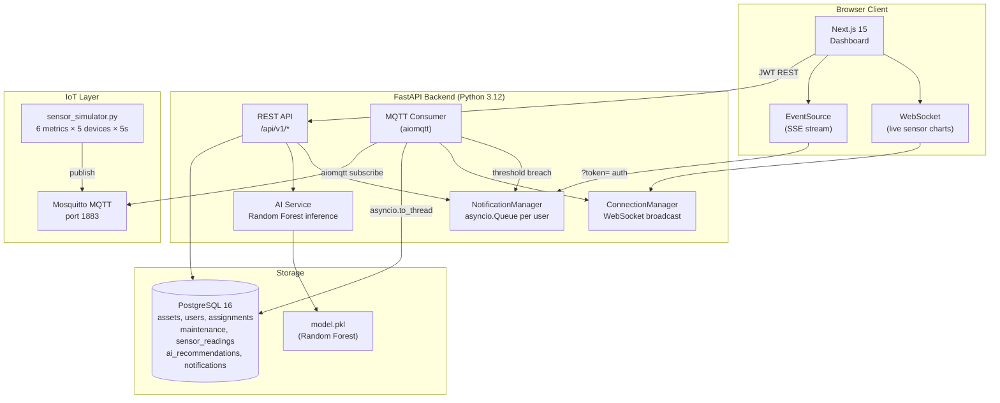
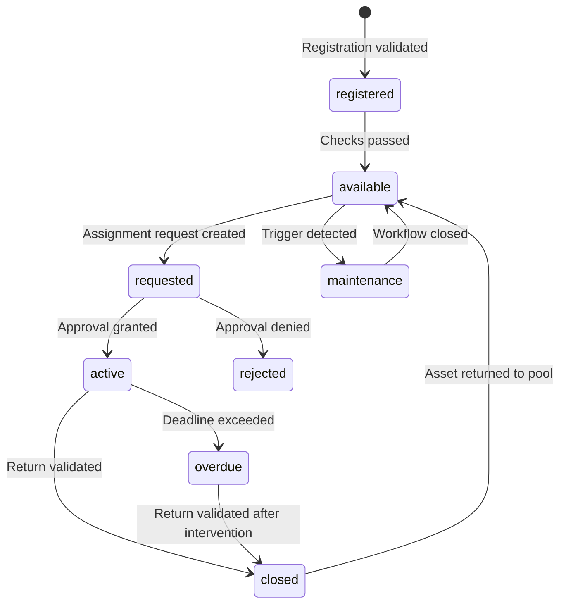
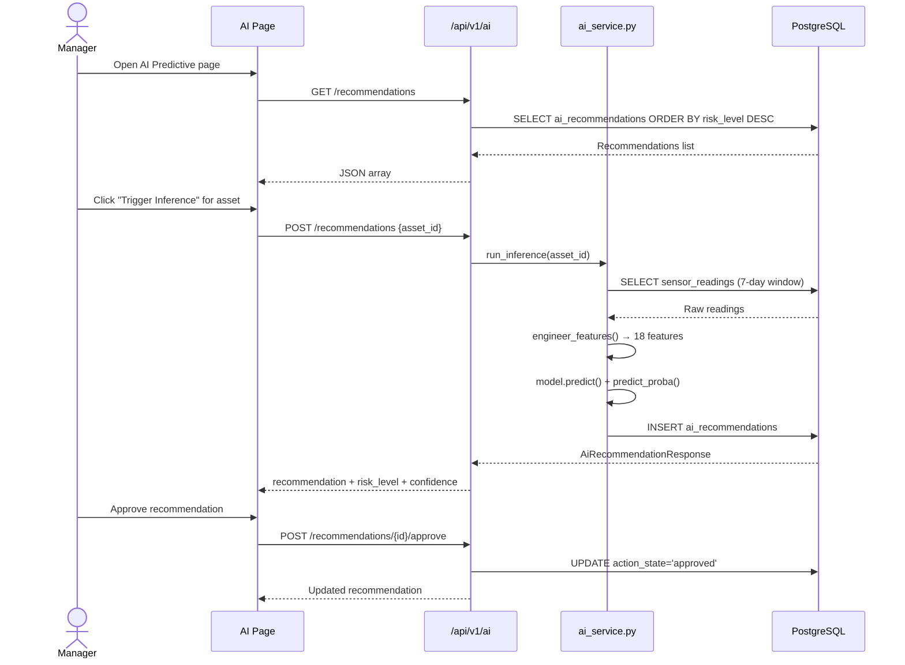
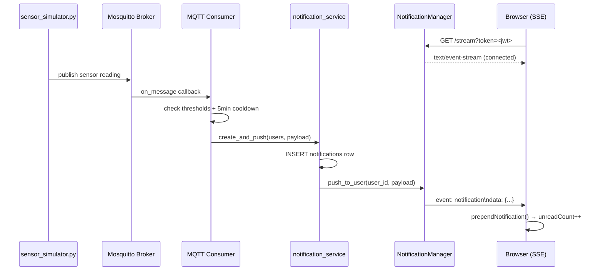

# AI-Powered Asset Management System

Enterprise asset lifecycle management platform with IoT sensor monitoring, AI-driven predictive maintenance, and real-time SSE notifications. Built with **Next.js 15 + FastAPI + PostgreSQL + MQTT + Scikit-learn**.

**Current version:** `v2.2` — AI Predictive Maintenance & Notifications

---

## Quick Start

### Prerequisites

- [Docker Desktop](https://www.docker.com/products/docker-desktop/) (includes Docker Compose)
- [Node.js 20+](https://nodejs.org/) (for frontend)
- Python 3.11+ (for ML training script, if running outside Docker)

### 1 — Clone & configure

```bash
git clone https://github.com/khaclbit/v0-ai-asset-management.git
cd v0-ai-asset-management

# Copy and edit backend environment
cp backend/.env.example backend/.env
# Edit backend/.env — set SECRET_KEY to a strong random value:
#   openssl rand -hex 32
```

### 2 — Start all services

```bash
docker compose up -d
```

This starts:
| Service | Port | Description |
|---------|------|-------------|
| `db` | 5432 | PostgreSQL 16 |
| `mosquitto` | 1883 | MQTT broker (Eclipse Mosquitto 2.0) |
| `api` | 8000 | FastAPI backend (auto-reload) |

### 3 — Run database migrations & seed

```bash
# Apply all Alembic migrations (creates all tables)
docker compose exec api alembic upgrade head

# Seed initial data (admin user, sample assets)
docker compose exec api python scripts/seed.py
```

### 4 — Train the AI model

```bash
# Train Random Forest on sensor_readings (uses synthetic data if DB is empty)
docker compose exec api python scripts/train_model.py
```

Output: `backend/model/model.pkl` — loaded by the inference endpoint on first request.

### 5 — Start the frontend

```bash
cd frontend
npm install
npm run dev
```

Open [http://localhost:3000](http://localhost:3000) — log in with `admin@company.com` / `admin123!`

### 6 — (Optional) Start the IoT sensor simulator

```bash
docker compose exec api python scripts/sensor_simulator.py
```

Publishes 6 sensor metrics (cpu_usage, temperature, vibration, memory_usage, humidity, power_consumption) for 5 virtual devices every 5 seconds.

---

## API Reference

| Base URL | Docs |
|----------|------|
| `http://localhost:8000` | [http://localhost:8000/docs](http://localhost:8000/docs) (Swagger UI) |

Key endpoint groups:
- `POST /api/v1/auth/login` — JWT login
- `GET /api/v1/assets` — paginated asset list
- `POST /api/v1/ai/recommendations` — trigger AI inference for an asset
- `GET /api/v1/notifications/stream?token=<jwt>` — SSE notification stream
- `GET /api/v1/iot/ws/{device_id}` — WebSocket live sensor data

---

## Deployment

### Environment variables (production)

| Variable | Description |
|----------|-------------|
| `DATABASE_URL` | PostgreSQL connection string |
| `SECRET_KEY` | JWT signing key (`openssl rand -hex 32`) |
| `MQTT_BROKER_HOST` | MQTT broker hostname |
| `CORS_ORIGINS` | Comma-separated allowed origins |
| `ACCESS_TOKEN_EXPIRE_MINUTES` | JWT access token TTL (default: 30) |

### Production checklist

- [ ] Set `SECRET_KEY` to a strong random value
- [ ] Set `CORS_ORIGINS` to your production domain only
- [ ] Run `alembic upgrade head` on first deploy and after each release
- [ ] Run `python scripts/train_model.py` after sufficient sensor data is collected
- [ ] Use a managed PostgreSQL instance (RDS, Cloud SQL, Supabase)
- [ ] Put the API behind a reverse proxy (nginx/Caddy) for TLS + SSE keepalive

---

## Project Status

| Milestone | Status | Highlights |
|-----------|--------|------------|
| v1.0 | ✅ Shipped | Architecture blueprint, module contracts, AI governance flows |
| v1.1–v1.3 | ✅ Shipped | Full Next.js 15 frontend with shadcn/ui, 10 dashboard sections |
| v2.0 | ✅ Shipped | FastAPI + PostgreSQL backend, JWT/RBAC, all domain APIs |
| v2.1 | ✅ Shipped | MQTT IoT pipeline, WebSocket live sensor charts |
| **v2.2** | ✅ **Latest** | AI predictive maintenance (Random Forest), SSE notifications |

---

## Architecture

### System Overview (v2.2)



### Repository Layout

```text
├── backend/
│   ├── alembic/versions/       # DB migrations (0001→0004)
│   ├── app/
│   │   ├── models/             # SQLAlchemy ORM (Asset, User, Assignment, ...)
│   │   ├── routers/            # FastAPI routers (assets, ai, notifications, ...)
│   │   ├── schemas/            # Pydantic request/response models
│   │   ├── services/           # Business logic (ai_service, notification_service, ...)
│   │   └── mqtt/               # MQTT consumer + threshold alerting
│   ├── scripts/
│   │   ├── seed.py             # Initial data seeder
│   │   ├── train_model.py      # Random Forest training script
│   │   └── sensor_simulator.py # IoT sensor data publisher
│   └── model/                  # model.pkl (git-ignored, generated by train_model.py)
├── frontend/
│   ├── app/dashboard/          # Next.js App Router pages (10 sections)
│   ├── components/             # shadcn/ui + custom components
│   ├── hooks/                  # useNotifications (SSE), useIotWebSocket
│   ├── lib/                    # api.ts, store.tsx, predictive.ts, data.ts
│   └── public/
├── config/mosquitto/           # Mosquitto broker config
├── docker-compose.yml
└── README.md
```

### Tech Stack

| Layer | Technology |
|-------|-----------|
| Frontend | Next.js 15, TypeScript, Tailwind CSS v4, shadcn/ui, Recharts |
| Backend | FastAPI 0.115, Python 3.12, Uvicorn |
| Database | PostgreSQL 16, SQLAlchemy (sync), Alembic |
| Auth | JWT (python-jose), bcrypt, RBAC (4 roles) |
| IoT | Eclipse Mosquitto 2.0, aiomqtt, WebSocket |
| AI/ML | Scikit-learn 1.5 (RandomForest), joblib |
| Realtime | SSE (Server-Sent Events), WebSocket |
| Dev | Docker Compose, hot-reload (uvicorn + next dev) |

### Role Model

| Role | Permissions |
|------|-------------|
| **Admin** | Full access — user management, all approvals |
| **Asset Manager** | Asset CRUD, assignment approval, AI recommendation approval/defer |
| **Staff** | Create assignment requests, submit maintenance requests, view own assignments |
| **Auditor** | Read-only access to audit log and reports |

1. **High-Level UML (Component):** `docs/uml/high-level-component.puml`
2. **Workflow UML (Activity):** `docs/uml/asset-lifecycle-workflow.puml`
3. **AI Governance UML (Sequence):** `docs/uml/ai-governance-sequence.puml`

Render commands (after installing PlantUML):

```bash
plantuml -utxt docs/uml/high-level-component.puml
plantuml -utxt docs/uml/asset-lifecycle-workflow.puml
plantuml -utxt docs/uml/ai-governance-sequence.puml
```

---

## Detailed Diagrams

### Asset State Machine



### AI Recommendation Flow



### SSE Notification Flow



---

## Feature Inventory

### Core

| # | Feature | Description |
|---|---------|-------------|
| 1 | **Asset Registry & Lifecycle** | Centralized inventory with validated state transitions (registered → available → active → closed → maintenance) |
| 2 | **Assignment & Return Workflow** | Request → approval → active → return lifecycle with deadline tracking and overdue detection |
| 3 | **Maintenance & Warranty Tracking** | Scheduled, risk-based, and warranty-threshold triggers with status notifications |
| 4 | **Role-Based Access Control** | Backend-enforced RBAC (Admin / Asset Manager / Staff / Auditor) |
| 5 | **Audit Trail** | Append-only immutable event ledger with correlation IDs |
| 6 | **Reporting & Insights** | Read-only aggregated views scoped by role |
| 7 | **Real-Time Notifications** | SSE delivery pipeline — bell badge, mark-as-read, notification history |

### AI & IoT

| # | Feature | Description |
|---|---------|-------------|
| 8 | **IoT Sensor Monitoring** | Live telemetry (6 metrics, 5 devices) via MQTT → WebSocket → real-time charts |
| 9 | **AI Predictive Maintenance** | Random Forest risk scoring on sensor history → ranked recommendations with approve/defer gate |
| 10 | **Threshold Alerting** | MQTT consumer detects threshold breaches → SSE notification to all Managers/Admins |
| 11 | **AI Assistant (UI)** | Natural-language queries over asset data — grounded, read-only |
| 12 | **OCR Invoice Intake (UI)** | Confidence-banded extraction with mandatory human-confirmation |

---

*Last updated: 2026-07-06 — v2.2 shipped*
