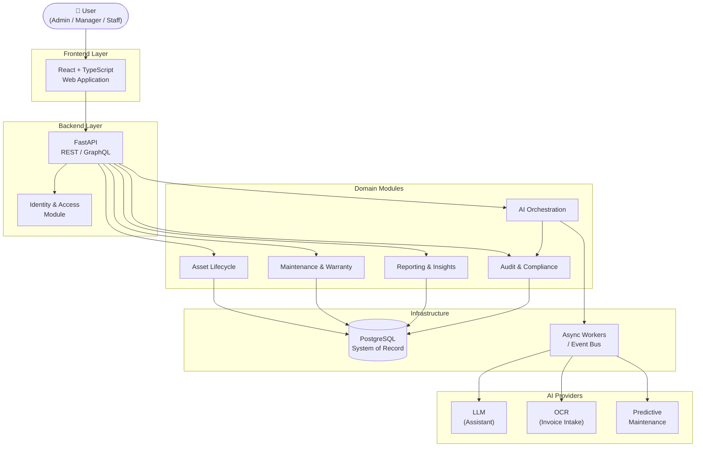
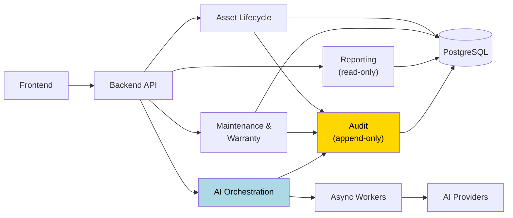
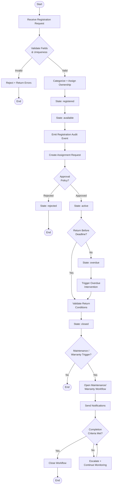
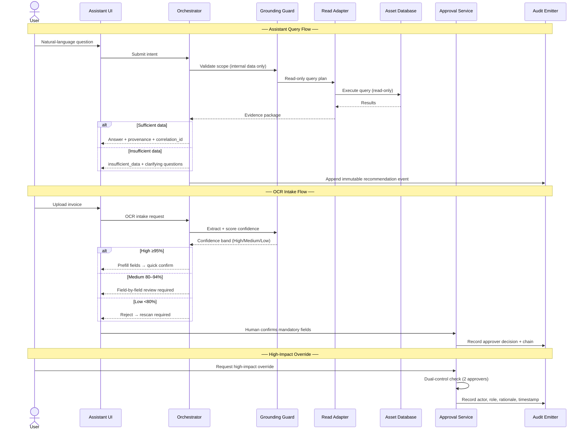
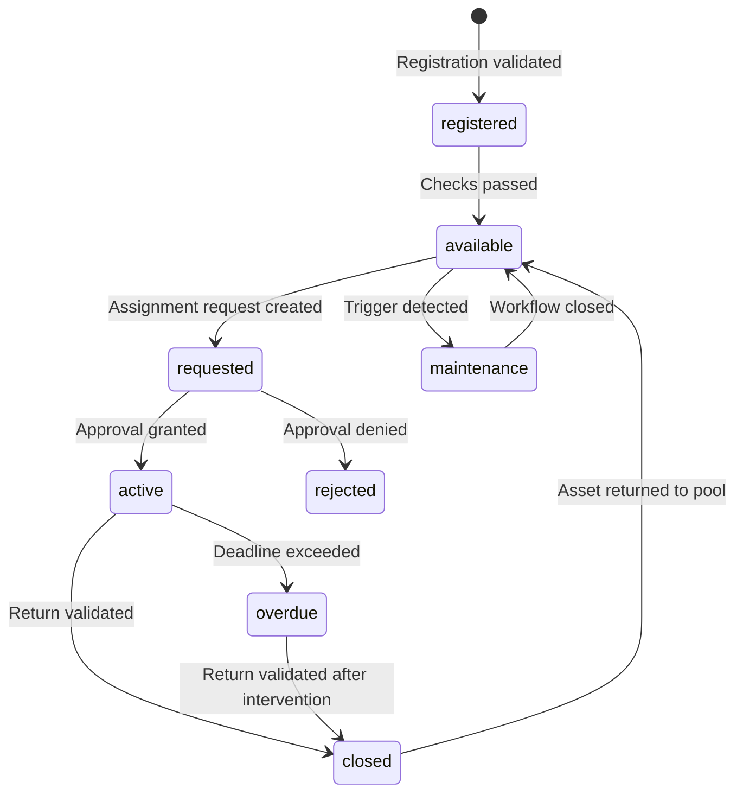

# AI-Powered Asset Management System

Professional architecture-first project for enterprise asset lifecycle management with governed AI integration (assistant, OCR intake, predictive maintenance).

## Project Status

- **Milestone:** `v1.0` archived and tagged
- **Scope delivered:** Architecture + workflows (no production implementation code in this milestone)
- **Archive:** `.planning/milestones/v1.0-ROADMAP.md`, `.planning/milestones/v1.0-REQUIREMENTS.md`

## UML Diagrams (PlantUML)

The project now includes formal UML sources under `docs/uml/`:

1. **High-Level UML (Component):** `docs/uml/high-level-component.puml`
2. **Workflow UML (Activity):** `docs/uml/asset-lifecycle-workflow.puml`
3. **AI Governance UML (Sequence):** `docs/uml/ai-governance-sequence.puml`

Render commands (after installing PlantUML):

```bash
plantuml -utxt docs/uml/high-level-component.puml
plantuml -utxt docs/uml/asset-lifecycle-workflow.puml
plantuml -utxt docs/uml/ai-governance-sequence.puml
```

## Architecture Diagrams (Mermaid)

### 1) High-Level System Architecture



### 2) Module Interaction Model



### 3) Asset Lifecycle Workflow



### 4) AI Governance Sequence



### 5) Asset State Machine



## Complete Architecture Inventory (v1.0)

| Area | Artifact |
|---|---|
| System context and containers | `.planning/milestones/v1.0-phases/01-architecture-foundation-module-contracts/01-system-context-container.md` |
| Module boundaries and sequences | `.planning/milestones/v1.0-phases/01-architecture-foundation-module-contracts/01-module-boundaries-component-sequences.md` |
| Interface contracts catalog | `.planning/milestones/v1.0-phases/01-architecture-foundation-module-contracts/01-interface-contract-catalog.md` |
| Domain model lifecycle spec | `.planning/milestones/v1.0-phases/02-data-model-security-boundaries-audit-design/02-domain-model-lifecycle-spec.md` |
| RBAC enforcement matrix | `.planning/milestones/v1.0-phases/02-data-model-security-boundaries-audit-design/02-rbac-enforcement-boundary-matrix.md` |
| Audit and traceability event model | `.planning/milestones/v1.0-phases/02-data-model-security-boundaries-audit-design/02-audit-traceability-event-model.md` |
| Registration/categorization workflow | `.planning/milestones/v1.0-phases/03-core-asset-lifecycle-workflow-design/03-registration-categorization-workflow.md` |
| Assignment/return workflow | `.planning/milestones/v1.0-phases/03-core-asset-lifecycle-workflow-design/03-assignment-return-workflow.md` |
| Maintenance/warranty workflow | `.planning/milestones/v1.0-phases/03-core-asset-lifecycle-workflow-design/03-maintenance-warranty-workflow.md` |
| Assistant grounded query workflow | `.planning/milestones/v1.0-phases/04-ai-integration-flows-human-governed-decision-paths/04-assistant-grounded-query-workflow.md` |
| OCR confidence human-gate workflow | `.planning/milestones/v1.0-phases/04-ai-integration-flows-human-governed-decision-paths/04-ocr-confidence-human-gate-workflow.md` |
| Predictive maintenance escalation workflow | `.planning/milestones/v1.0-phases/04-ai-integration-flows-human-governed-decision-paths/04-predictive-maintenance-escalation-workflow.md` |
| AI approval/audit control model | `.planning/milestones/v1.0-phases/04-ai-integration-flows-human-governed-decision-paths/04-ai-approval-audit-control-model.md` |

## Feature Inventory

> 📄 **Full feature descriptions with workflows, business rules, and API contracts:** [`docs/FEATURES.md`](docs/FEATURES.md)

### Core (Table-Stakes)

| # | Feature | Description |
|---|---------|-------------|
| 1 | **Asset Registry & Lifecycle** | Centralized inventory with validated state transitions from registration to retirement |
| 2 | **Assignment & Return Workflow** | Request → approval → active → return lifecycle with deadline tracking |
| 3 | **Maintenance & Warranty Tracking** | Scheduled, risk-based, and warranty-threshold triggers with notifications |
| 4 | **Role-Based Access Control** | Backend-enforced two-layer RBAC across all mutation and read paths |
| 5 | **Audit Trail & Traceability** | Append-only immutable event ledger with before/after state and correlation IDs |
| 6 | **Reporting & Insights** | Read-only aggregated views scoped by role (assets, assignments, maintenance, audit) |
| 7 | **Notification Architecture** | Async event-driven alerts at key lifecycle transitions |

### AI-Driven Differentiators

| # | Feature | Description |
|---|---------|-------------|
| 8 | **AI Assistant** | Natural-language queries over asset data — grounded, read-only, with provenance trace |
| 9 | **OCR Invoice Intake** | Confidence-banded extraction with mandatory human-confirmation before asset creation |
| 10 | **Predictive Maintenance** | Risk-classified recommendations with explainability, SLA escalation, and approval gates |
| 11 | **Human-Governed AI Approvals** | Dual-control overrides, role-restricted approvals, and immutable AI decision audit chain |

## Tech Direction

- **Target stack:** React + TypeScript, FastAPI, PostgreSQL, async workers/events
- **Architecture style:** Modular monolith with strict domain ownership boundaries
- **Governance:** Backend-first enforcement, append-only audit model, AI as advisory layer unless approved

## Repository Layout

```text
AI_Management_System/
├── docs/uml/                           # UML sources (component, activity, sequence)
├── .planning/                          # Architecture, milestone archives, roadmap/state
├── v0-ai-asset-management/             # Existing Next.js prototype (brownfield baseline)
├── copilot-instructions.md
└── README.md
```

## Run Prototype Baseline

```bash
cd v0-ai-asset-management
npm install
npm run dev
```
