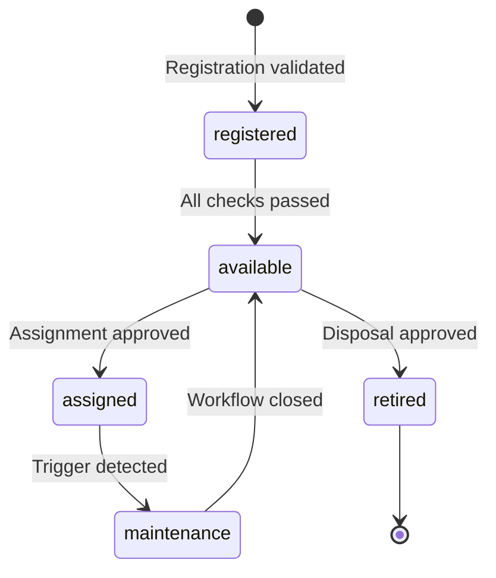
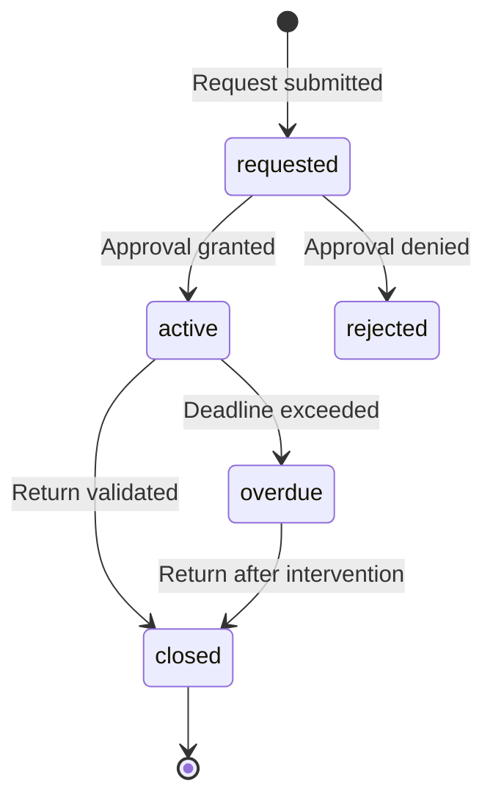
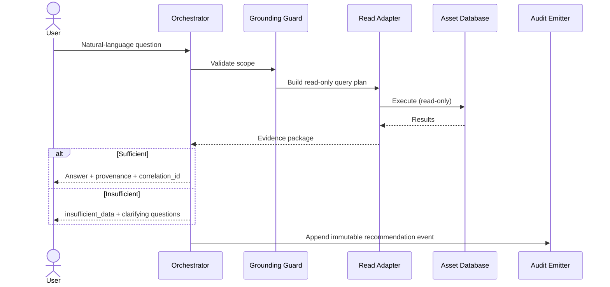
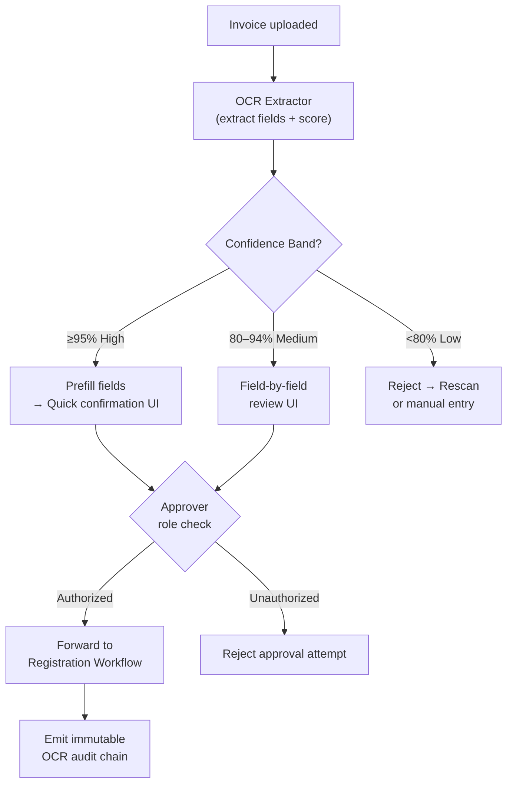
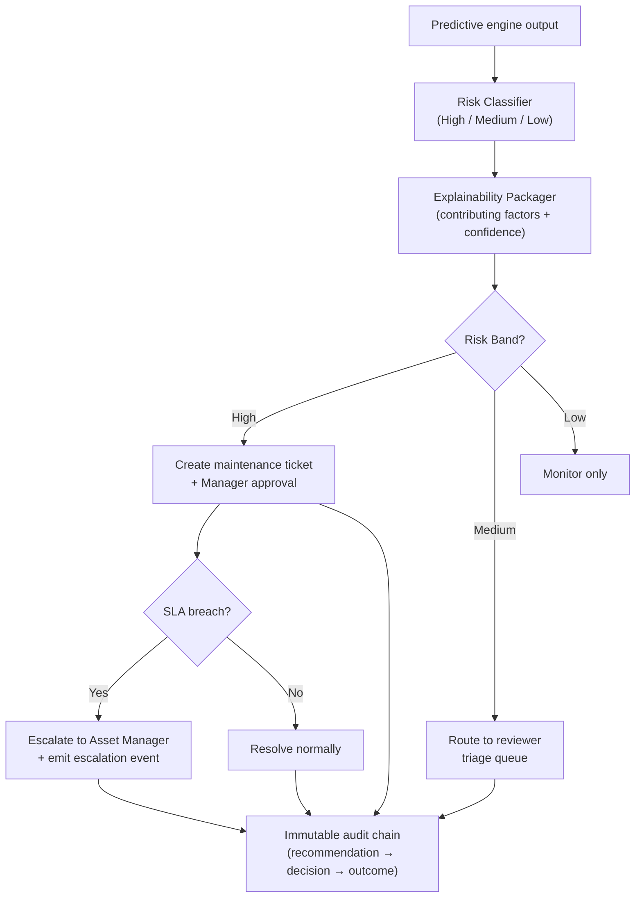

# Feature Descriptions — AI-Powered Asset Management System

This document provides detailed descriptions of every feature in the system, organized by domain. Each section covers purpose, key behaviors, user roles, workflow steps, business rules, and technical constraints.

---

## Table of Contents

1. [Asset Registry & Lifecycle Management](#1-asset-registry--lifecycle-management)
2. [Assignment & Return Workflow](#2-assignment--return-workflow)
3. [Maintenance & Warranty Tracking](#3-maintenance--warranty-tracking)
4. [Role-Based Access Control (RBAC)](#4-role-based-access-control-rbac)
5. [Audit Trail & Traceability](#5-audit-trail--traceability)
6. [Reporting & Insights](#6-reporting--insights)
7. [Notification Architecture](#7-notification-architecture)
8. [AI Assistant — Grounded Natural-Language Queries](#8-ai-assistant--grounded-natural-language-queries)
9. [OCR-Assisted Invoice Intake](#9-ocr-assisted-invoice-intake)
10. [Predictive Maintenance Recommendations](#10-predictive-maintenance-recommendations)
11. [Human-Governed AI Approval & Override Controls](#11-human-governed-ai-approval--override-controls)

---

## 1. Asset Registry & Lifecycle Management

**Module:** Asset Lifecycle  
**Requirement traceability:** ARCH-01, ARCH-02, FLOW-01

### Purpose

Provide a centralized, authoritative inventory of all organizational assets, from the moment of registration through retirement, with clear lifecycle states and validated transitions at each step.

### Lifecycle States



| State | Meaning |
|---|---|
| `registered` | Asset created, awaiting final checks |
| `available` | Ready for assignment |
| `assigned` | Actively allocated to a user or department |
| `maintenance` | Under maintenance or warranty servicing |
| `retired` | Decommissioned; no further transitions |

### Key Behaviors

- **Uniqueness enforcement:** Each asset must have a unique identifier; duplicate registrations are rejected at the validation gate.
- **Categorization policy:** Assets are categorized (e.g., IT Equipment, Furniture, Vehicle) during registration; category is immutable after registration unless a manager override is approved.
- **Ownership attribution:** Asset is linked to an owning department and an accountable contact at registration time.
- **Audit on every transition:** Every state change emits an immutable audit event with before/after states, actor, and timestamp.

### Business Rules

- A state transition must satisfy all preconditions defined in the lifecycle transition constraint matrix before the backend allows it.
- No frontend component may write directly to the data store; all mutations flow through the API and domain layer.
- Category and ownership data is validated against the categorization policy before persistence.

### API Contracts

| Action | Endpoint | Required Permission |
|---|---|---|
| Register asset | `POST /assets` | `asset:create` |
| View asset | `GET /assets/{id}` | `asset:read` |
| Update asset | `PATCH /assets/{id}` | `asset:update` |
| Retire asset | `POST /assets/{id}/retire` | `asset:retire` |

---

## 2. Assignment & Return Workflow

**Module:** Asset Lifecycle  
**Requirement traceability:** FLOW-02

### Purpose

Govern the full lifecycle of an asset being allocated to a user or department and its subsequent return, with clear approval gates, deadline tracking, and closure rules.

### Assignment State Machine



### Workflow Steps

1. **Request creation:** A staff member or manager creates an assignment request referencing a specific asset and user.
2. **Approval gate:** System evaluates approval policy (role eligibility, asset availability, request completeness). Manager approves or rejects.
3. **Activation:** On approval, assignment state transitions to `active` and asset state transitions to `assigned`.
4. **Deadline monitoring:** System tracks the expected return date. On breach, state transitions to `overdue` and intervention notifications are triggered.
5. **Return initiation:** User or manager initiates return. Return conditions are validated (condition check, accessories present, etc.).
6. **Closure:** On successful return validation, assignment is set to `closed` and the asset returns to `available`.

### Business Rules

- A user may not hold more than the configured maximum number of concurrent active assignments (configurable per role).
- Self-approval is forbidden: the assignment requester cannot be the sole approver.
- All approval and closure events are persisted as immutable audit records.

### API Contracts

| Action | Endpoint | Required Permission |
|---|---|---|
| Create assignment request | `POST /assignments` | `assignment:create` |
| Approve assignment | `POST /assignments/{id}/approve` | `assignment:approve` |
| Initiate return | `POST /returns` | `return:create` |

---

## 3. Maintenance & Warranty Tracking

**Module:** Maintenance & Warranty  
**Requirement traceability:** FLOW-03

### Purpose

Monitor, schedule, and track maintenance activities and warranty coverage for all registered assets, with automated trigger detection and proactive notification at key thresholds.

### Trigger Conditions

| Trigger Type | Source | Example |
|---|---|---|
| Scheduled | Calendar/interval rule | Annual inspection due |
| Risk-based | Predictive AI score | High-risk flag from predictive engine |
| Warranty threshold | Expiry date proximity | Warranty expiring in 30 days |

### Maintenance Workflow

1. Trigger is detected (scheduled, risk-based, or warranty threshold).
2. System routes by priority (High / Medium / Low) and risk category.
3. Maintenance or warranty workflow record is opened.
4. Notifications are sent at: trigger acknowledgement, approaching deadline, overdue threshold, and closure.
5. Maintenance is marked completed when all completion criteria are satisfied and a responsible actor confirms closure.

### Warranty State Vocabulary

| State | Meaning |
|---|---|
| `active` | Within warranty coverage window |
| `expiring_soon` | Within the configured expiry warning threshold |
| `expired` | Past warranty coverage end date |
| `void` | Warranty invalidated (damage, misuse, etc.) |

### Maintenance State Vocabulary

| State | Meaning |
|---|---|
| `scheduled` | Upcoming maintenance logged |
| `in_progress` | Maintenance actively underway |
| `completed` | All completion criteria satisfied |
| `blocked` | Waiting on parts, vendor, or approval |

### Business Rules

- Warranty records must track: provider, coverage window, contact, and exclusions.
- Predictive risk scores from the AI engine can open a maintenance workflow automatically, but a human must confirm the work order before the asset is transitioned to `maintenance` state.

### API Contracts

| Action | Endpoint | Required Permission |
|---|---|---|
| Log maintenance record | `POST /maintenance` | `maintenance:update` |
| Update warranty record | `PATCH /warranty/{id}` | `warranty:update` |

---

## 4. Role-Based Access Control (RBAC)

**Module:** Identity & Access  
**Requirement traceability:** ARCH-02

### Purpose

Enforce backend-first authorization across every mutation and read path, ensuring no action can be performed without the correct role regardless of frontend state.

### Roles

| Role | Description |
|---|---|
| **Admin** | Full system access including configuration, user management, and all overrides |
| **Asset Manager** | Approve assignments, manage lifecycle, access all reporting |
| **Staff** | Create assignment requests, view own assets, initiate returns |
| **Auditor** | Read-only access to audit logs and reporting |

### Enforcement Model

Authorization is enforced at **two layers** for every mutation:

1. **Endpoint-level policy check** — verifies the actor's role permits the requested action before any business logic runs.
2. **Domain-operation check** — validates context-specific state invariants and ownership permissions within the business logic layer.

Neither layer may be bypassed by the other.

### Permission Matrix

| Resource | Action | Admin | Asset Manager | Staff | Auditor |
|---|---|---|---|---|---|
| assets | create | ✅ | ✅ | ❌ | ❌ |
| assets | read | ✅ | ✅ | ✅ | ✅ |
| assets | retire | ✅ | ✅ | ❌ | ❌ |
| assignments | create | ✅ | ✅ | ✅ | ❌ |
| assignments | approve | ✅ | ✅ | ❌ | ❌ |
| returns | create | ✅ | ✅ | ✅ | ❌ |
| maintenance | update | ✅ | ✅ | ❌ | ❌ |
| reports | read | ✅ | ✅ | Limited | ✅ |
| assistant | query | ✅ | ✅ | ✅ | ✅ |
| audit logs | read | ✅ | ❌ | ❌ | ✅ |

### Business Rules

- UI components may render conditionally based on roles but **must not** rely on UI-only guards as a security boundary.
- Every permission denial is recorded as a security audit event (`permission.denied`).
- Role changes are audit-recorded with actor, before/after role, and timestamp.

---

## 5. Audit Trail & Traceability

**Module:** Audit & Compliance  
**Requirement traceability:** ARCH-03

### Purpose

Maintain a tamper-proof, append-only record of every state-changing action in the system, providing full traceability from user action through domain transition to AI-assisted decision.

### Append-Only Policy

- Audit events are **never updated or deleted** after creation.
- All events are linked to a `correlation_id` that threads the request, domain transition, and downstream effects together.

### Mandatory Fields Per Event

| Field | Description |
|---|---|
| `actor` | Identity of the user or system agent taking the action |
| `action` | Verb describing the action (e.g., `assignment.approve`) |
| `entity` | Affected entity type and ID |
| `before_state` | State before the transition |
| `after_state` | State after the transition |
| `timestamp` | ISO 8601 timestamp |
| `correlation_id` | Unique trace key linking related events |

### Event Categories

| Category | Example Events |
|---|---|
| Business state changes | `asset.create`, `assignment.approve`, `return.close` |
| Security actions | `permission.denied`, `role.change` |
| AI-assisted actions | `assistant.recommendation`, `ocr.suggestion`, `risk.score.generated` |

### Causality Tracing for AI Events

AI-assisted events carry additional fields:
- **Recommendation context:** the AI output that influenced the action
- **Human decision linkage:** the approver identity and decision that followed the recommendation

This means every AI-influenced change can be traced from model output → human decision → system outcome.

---

## 6. Reporting & Insights

**Module:** Reporting & Insights  
**Requirement traceability:** ARCH-02

### Purpose

Provide read-only aggregated views of asset health, assignment status, maintenance schedules, and compliance metrics to support decision-making.

### Key Report Types

| Report | Description | Audience |
|---|---|---|
| Asset Overview | Current state distribution across all assets | Managers, Admins |
| Assignment Report | Active and historical assignments per user/department | Managers |
| Maintenance Schedule | Upcoming and overdue maintenance items | Managers, Asset Admins |
| Warranty Expiry | Assets with expiring or expired warranty | Asset Admins |
| Audit Summary | Count of events by category and actor over time | Auditors, Admins |

### Design Constraints

- Reporting module is **read-only**; it cannot mutate transactional state.
- Reporting queries are scoped by the requesting user's role (staff see only their own data).
- Derived projection data is computed from the core domain model managed by Asset Lifecycle and Maintenance & Warranty modules.

### API Contracts

| Action | Endpoint | Required Permission |
|---|---|---|
| Asset overview report | `GET /reports/overview` | `report:read` |

---

## 7. Notification Architecture

**Module:** Cross-cutting (triggers from Asset Lifecycle, Maintenance & Warranty, AI Orchestration)  
**Requirement traceability:** ARCH-04

### Purpose

Deliver timely alerts to relevant actors at critical workflow transition points — assignments, return deadlines, maintenance thresholds, warranty expiry, and AI escalations.

### Notification Trigger Points

| Trigger | Recipient | Channel |
|---|---|---|
| Assignment approved | Assignee | Email + In-app |
| Assignment overdue | Assignee + Manager | Email + In-app |
| Maintenance deadline approaching | Asset Manager | In-app |
| Maintenance overdue | Asset Manager | Email + In-app |
| Warranty expiring soon | Asset Admin | Email |
| AI escalation (high-risk SLA breach) | Asset Manager | Email + In-app |
| OCR intake awaiting confirmation | Approver | In-app |

### Design Constraints

- Notification delivery is **async** (event-driven); it does not block the primary workflow transaction.
- Channel routing (email vs. in-app) is configurable per notification type and user preference.
- Notification failures do not roll back the triggering business event.

---

## 8. AI Assistant — Grounded Natural-Language Queries

**Module:** AI Orchestration  
**Requirement traceability:** AINT-01

### Purpose

Allow authorized users to ask natural-language questions about asset data and receive traceable, provenance-backed answers — without any AI-initiated write operations.

### Sequence Flow



### Response Contract

Every response includes:

```yaml
answer: <text answer>
trace:
  source: internal-asset-data
  query: <generated query expression>
  filters: <effective constraints>
  correlation_id: <trace link key>
  generated_at: <iso timestamp>
confidence:
  sufficient_data: true | false
clarifying_questions: []   # populated when sufficient_data=false
```

### Read-Only Enforcement

- The assistant path **cannot invoke any mutation interface**.
- If the user's intent implies a mutation (e.g., "reassign this asset"), the assistant returns an instruction to initiate the appropriate human-driven workflow.
- Backend authorization layer enforces mutation denial for the assistant actor context at the domain-operation boundary.

### Business Rules

- Insufficient data responses must not include speculative assertions.
- All recommendation events are append-only and correlation-linked to any human decisions that follow.

---

## 9. OCR-Assisted Invoice Intake

**Module:** AI Orchestration → Asset Lifecycle  
**Requirement traceability:** AINT-02

### Purpose

Reduce manual data entry during asset registration by extracting fields from invoice documents using OCR, while ensuring all extracted data is human-confirmed before an asset is created.

### Confidence Routing Policy

| Band | Threshold | Required Action |
|---|---|---|
| **High** | ≥ 95% | Prefill all fields; require quick human confirmation |
| **Medium** | 80–94% | Require field-by-field human review before submission |
| **Low** | < 80% | Reject extraction; require rescan or manual entry |

### Mandatory Human-Confirmed Fields

Asset creation is **blocked** until a permitted approver explicitly confirms all of the following:

- Asset name
- Category
- Serial number
- Purchase date
- Vendor
- Price

### Intake Sequence



### Evidence Retention

For every OCR intake attempt, the system retains:

- Invoice file reference ID
- Extraction snapshot payload
- Confidence score and band
- Approver identity and role
- Decision rationale and timestamp
- Correlation ID for downstream lifecycle linkage

### Error Handling

| Condition | Action |
|---|---|
| Low confidence | Hard stop; rescan required |
| Missing mandatory field confirmation | Hard stop; review incomplete |
| Unauthorized approver | Hard stop; reject attempt |

---

## 10. Predictive Maintenance Recommendations

**Module:** AI Orchestration → Maintenance & Warranty  
**Requirement traceability:** AINT-03

### Purpose

Surface AI-generated maintenance risk recommendations with explainability, route them through risk-appropriate approval gates, and escalate unresolved high-risk items before SLA breach.

### Risk and Confidence Routing

| Band | Condition | Required Path |
|---|---|---|
| **High risk + high confidence** | Urgent failure risk indicated | Create maintenance ticket + manager approval checkpoint |
| **Medium risk / uncertain** | Needs human review | Route to reviewer triage queue |
| **Low risk** | Non-urgent signal | Monitor-only; no immediate ticket |

### Escalation Flow



### Explainability Contract

Each recommendation must include:

- Risk band
- Confidence score (0–100%)
- Top contributing factors (e.g., age, usage frequency, failure history)
- Correlation ID

### SLA Escalation Rule

High-risk recommendations not acted upon before the configured SLA deadline automatically trigger an escalation event containing:
- Target actor (asset manager)
- Breach timestamp
- Linked recommendation correlation ID

### Business Rules

- Predictive recommendations are advisory only; a human must confirm any maintenance work order.
- Dual-control approval is required for high-impact overrides (see Section 11).
- All recommendations, approvals, overrides, and escalations are linked through `correlation_id` in the audit chain.

---

## 11. Human-Governed AI Approval & Override Controls

**Module:** AI Orchestration + Audit & Compliance  
**Requirement traceability:** AINT-01, AINT-02, AINT-03

### Purpose

Provide a shared, consistent governance layer for all AI-influenced decisions — ensuring every approval and override is role-restricted, dual-controlled where required, and permanently recorded.

### Governance Constraints

| Constraint | Rule |
|---|---|
| Human-governed | All approvals and overrides are performed by authorized human actors |
| Role-restricted | Only Managers or Asset Admins may approve AI-influenced actions |
| Self-approval forbidden | Request initiator cannot be the sole approver |
| High-impact dual-control | High-impact overrides require two separate approvers |
| Immutable record | Every approval/override event is append-only |

### High-Impact Override Definition

An override is classified as high-impact when **any** of these conditions apply:

1. It affects a **critical asset class** (e.g., server infrastructure, medical equipment)
2. It overrides a **high-risk predictive recommendation**
3. It materially changes **compliance or audit posture**

### Mandatory Approval Payload

Every approval or override event must record:

| Field | Description |
|---|---|
| `actor` | Approver identity |
| `role` | Approver's role at time of decision |
| `decision` | `approved` or `rejected` |
| `rationale` | Free-text justification |
| `timestamp` | ISO 8601 |
| `affected_entity` | Entity type and ID |
| `correlation_id` | Links to originating AI recommendation |

### Control Interactions by AI Flow

| AI Flow | Approval Control | Audit Requirements |
|---|---|---|
| **Assistant** | Read-only; no mutation approval needed | Recommendation + provenance + correlation_id |
| **OCR Intake** | Human confirmation before asset create; role check | File ref, extraction snapshot, approver decision chain |
| **Predictive Maintenance** | Risk-band-driven approvals; escalation on SLA breach | Recommendation, approval, override, escalation events linked |

---

*Source artifact traceability: `.planning/milestones/v1.0-phases/` — all architecture and workflow artifacts from Phases 1–4.*
