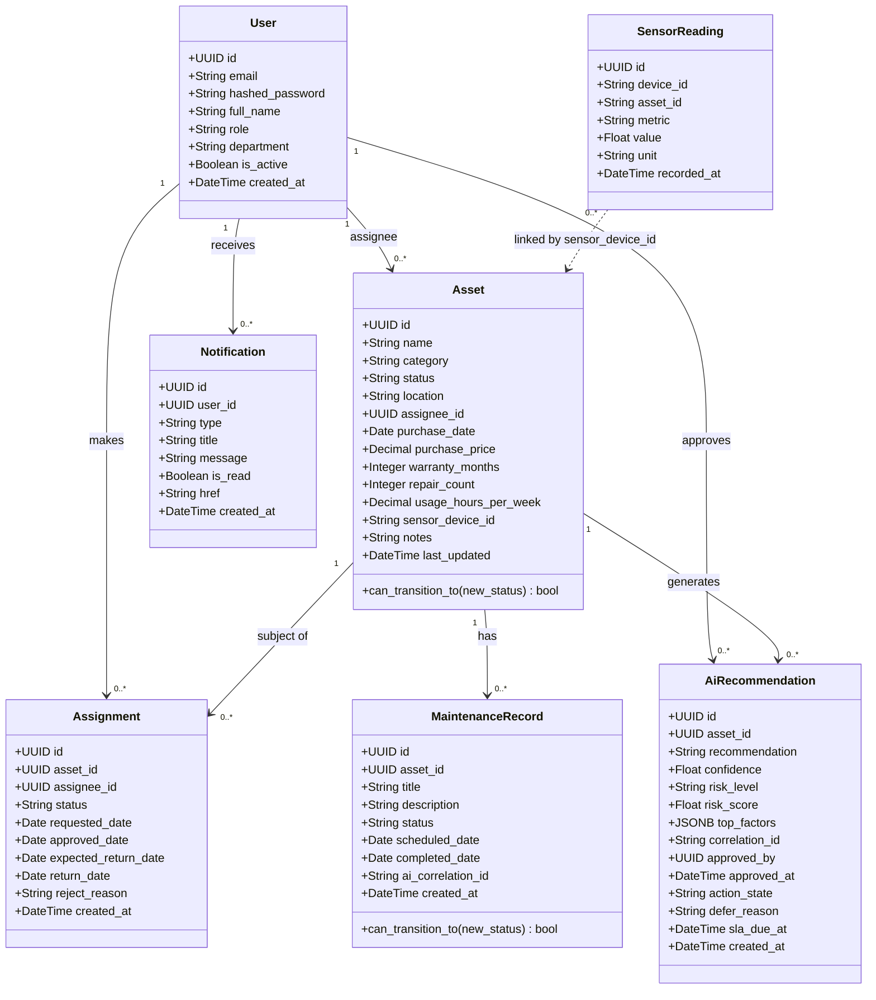

# Project Report — AI-Powered Asset Management System

> **Note:** This document was generated with AI assistance from the project's source code and planning artifacts. The author has reviewed and confirmed that all content accurately reflects the implemented system.

---

## Table of Contents

1. [Problem Statement](#1-problem-statement)
2. [Use Case Model](#2-use-case-model)
3. [Glossary](#3-glossary)
4. [Supplementary Specification](#4-supplementary-specification)
5. [Class Diagram](#5-class-diagram)
6. [Software Architecture](#6-software-architecture)
7. [Advanced Features](#7-advanced-features)
8. [UI Screenshots](#8-ui-screenshots)

---

## 1. Problem Statement

### 1.1 Context & Background

Large organizations manage hundreds to thousands of physical assets — laptops, monitors, printers, servers, industrial equipment — across multiple departments and locations. Without a centralized, digitized system, asset management relies on spreadsheets, email chains, and manual inspection schedules. This creates critical operational gaps:

- **No lifecycle visibility:** The organization cannot track where each asset is, who has it, and what its current condition is in real time.
- **Reactive maintenance:** Failures are discovered only after breakdown, leading to unplanned downtime and costly emergency repairs.
- **Security and compliance risk:** There is no audit trail for asset custody transfers or access decisions, making compliance reporting difficult.
- **Missed IoT opportunity:** Modern assets (servers, industrial equipment) emit telemetry continuously; without a pipeline to ingest and analyze this data, the organization cannot act on early warning signals.

### 1.2 Problem Statement

> **How can an organization manage the full lifecycle of physical assets — from registration to retirement — with real-time IoT sensor monitoring, AI-driven predictive maintenance recommendations, role-based access control, and a complete audit trail, all through a single web platform?**

### 1.3 Proposed Solution

The **AI-Powered Asset Management System** is a full-stack enterprise web application that provides:

- A **centralized asset registry** with enforced lifecycle state transitions (Registered → Available → Assigned → Maintenance → Retired).
- A **role-based access control (RBAC)** system with four roles: Admin, Asset Manager, Staff, and Auditor.
- An **IoT sensor monitoring pipeline** that ingests real-time telemetry via MQTT and streams it to the dashboard via WebSocket.
- An **AI predictive maintenance engine** using a trained Random Forest model that scores asset risk from sensor history and surfaces ranked recommendations for manager approval.
- A **real-time notification system** (Server-Sent Events) that alerts relevant users when sensor thresholds are breached, assignments change status, or maintenance events occur.
- A **complete audit log** providing an immutable event ledger for compliance purposes.

### 1.4 Feature Summary

| # | Feature | Description |
|---|---------|-------------|
| 1 | Asset Registry & Lifecycle | Centralized inventory with enforced state machine transitions |
| 2 | Assignment & Return Workflow | Request → approval → active → return lifecycle with deadline tracking |
| 3 | Maintenance & Warranty Tracking | Scheduled and risk-triggered maintenance with status tracking |
| 4 | Role-Based Access Control | Backend-enforced RBAC with 4 roles |
| 5 | Audit Trail | Append-only, immutable event ledger |
| 6 | Reporting & Insights | Role-scoped analytics and aggregated views |
| 7 | Real-Time Notifications | SSE-based push notifications with history and read/unread state |
| 8 | IoT Sensor Monitoring | Live telemetry ingestion via MQTT → WebSocket → dashboard charts |
| 9 | AI Predictive Maintenance | Random Forest risk scoring with manager approval gate |
| 10 | Threshold Alerting | MQTT consumer auto-fires alerts on sensor threshold breaches |
| 11 | AI Assistant (UI) | Natural-language query interface over asset data |
| 12 | OCR Invoice Intake (UI) | Confidence-banded extraction with mandatory human confirmation |

---

## 2. Use Case Model

### 2.1 Use Case Diagram

```
+-----------------------------------------------------------------------+
|                  AI Asset Management System                           |
|                                                                       |
|  +------------+    +-------------------------------------------+     |
|  |   Admin    |----| UC-01: Manage Users                       |     |
|  +------------+    +-------------------------------------------+     |
|        |           +-------------------------------------------+     |
|        +-----------| UC-02: Configure System Settings          |     |
|        |           +-------------------------------------------+     |
|        |                                                             |
|  +-------------------+   +-------------------------------------------+|
|  | Asset Manager     |---| UC-03: Manage Assets (CRUD + Lifecycle)  ||
|  +-------------------+   +-------------------------------------------+|
|        |               +-------------------------------------------+  |
|        +---------------| UC-04: Approve / Reject Assignments       |  |
|        |               +-------------------------------------------+  |
|        |               +-------------------------------------------+  |
|        +---------------| UC-05: Manage Maintenance Records         |  |
|        |               +-------------------------------------------+  |
|        |               +-------------------------------------------+  |
|        +---------------| UC-06: Trigger AI Inference               |  |
|        |               +-------------------------------------------+  |
|        |               +-------------------------------------------+  |
|        +---------------| UC-07: Approve / Defer AI Recommendation  |  |
|        |               +-------------------------------------------+  |
|        |               +-------------------------------------------+  |
|        +---------------| UC-08: View IoT Dashboard & Alerts        |  |
|        |               +-------------------------------------------+  |
|                                                                       |
|  +------------+    +-------------------------------------------+      |
|  |   Staff    |----| UC-09: Request Asset Assignment            |      |
|  +------------+    +-------------------------------------------+      |
|        |           +-------------------------------------------+      |
|        +-----------| UC-10: Return Asset                        |      |
|        |           +-------------------------------------------+      |
|        |           +-------------------------------------------+      |
|        +-----------| UC-11: Submit Maintenance Request          |      |
|        |           +-------------------------------------------+      |
|        |           +-------------------------------------------+      |
|        +-----------| UC-12: View Notifications                  |      |
|        |           +-------------------------------------------+      |
|                                                                       |
|  +------------+    +-------------------------------------------+      |
|  |  Auditor   |----| UC-13: View Audit Log                      |      |
|  +------------+    +-------------------------------------------+      |
|        |           +-------------------------------------------+      |
|        +-----------| UC-14: View Reports & Analytics            |      |
|        |           +-------------------------------------------+      |
|                                                                       |
|  +------------+    +-------------------------------------------+      |
|  | IoT Sensor |----| UC-15: Publish Sensor Readings (MQTT)      |      |
|  | (System)   |    +-------------------------------------------+      |
|  +------------+    +-------------------------------------------+      |
|                +---| UC-16: Auto-trigger Threshold Alert        |      |
|                    +-------------------------------------------+      |
+-----------------------------------------------------------------------+
```

### 2.2 Use Case Descriptions

#### UC-01: Manage Users
- **Actor:** Admin
- **Description:** Create, update, deactivate, and assign roles to system users. Set department, email, and initial password.
- **Precondition:** Actor is authenticated with Admin role.
- **Main Flow:** Admin navigates to User Management → creates or edits user → assigns role → saves.
- **Postcondition:** User record persisted; new user can log in with assigned role.

#### UC-02: Configure System Settings
- **Actor:** Admin
- **Description:** Configure OpenAI API key, anomaly detection model selection, and batch interval for AI services.
- **Precondition:** Actor is authenticated with Admin role.

#### UC-03: Manage Assets (CRUD + Lifecycle)
- **Actor:** Asset Manager
- **Description:** Create new assets, edit their properties, transition lifecycle state (Registered → Available → Assigned → Maintenance → Retired), and link sensor device IDs.
- **Precondition:** Actor is authenticated with Asset Manager or Admin role.
- **Main Flow:** Actor opens Asset Registry → creates/selects asset → edits fields or changes status → system validates transition via state machine → saves.
- **Alternative Flow:** If transition is invalid (e.g., Retired → Available), system returns HTTP 409 with error message.
- **Postcondition:** Asset state persisted; audit event logged.

#### UC-04: Approve / Reject Assignments
- **Actor:** Asset Manager
- **Description:** Review pending assignment requests submitted by Staff; approve (asset status → Assigned) or reject with reason.
- **Precondition:** One or more assignments in `requested` status exist.
- **Postcondition:** Assignment status updated; asset status synced; SSE notification dispatched to requestor.

#### UC-05: Manage Maintenance Records
- **Actor:** Asset Manager, Admin
- **Description:** Create, update, and close maintenance records for assets. Track scheduled, in-progress, blocked, and completed maintenance.
- **Postcondition:** Maintenance record persisted; asset status transitions to `maintenance` when record is created if applicable.

#### UC-06: Trigger AI Inference
- **Actor:** Asset Manager
- **Description:** Trigger the AI predictive maintenance engine for a specific asset. The system retrieves the last 7 days of sensor readings, engineers 18 features, and runs a trained Random Forest model to produce a risk score and recommendation.
- **Precondition:** Asset has a linked `sensor_device_id` and sufficient sensor history.
- **Postcondition:** `ai_recommendations` record created with risk level (Low/Medium/High/Critical), confidence score, and action recommendation.

#### UC-07: Approve / Defer AI Recommendation
- **Actor:** Asset Manager
- **Description:** Review AI-generated recommendations; approve (triggers maintenance workflow) or defer with a stated reason.
- **Precondition:** Recommendation exists with `action_state = pending`.
- **Postcondition:** Recommendation state updated; maintenance record created if approved.

#### UC-08: View IoT Dashboard & Alerts
- **Actor:** Asset Manager, Admin
- **Description:** View live sensor charts (temperature, CPU, vibration, memory, humidity, power) streamed via WebSocket. View threshold alert history.
- **Precondition:** At least one IoT device is publishing sensor data.

#### UC-09: Request Asset Assignment
- **Actor:** Staff
- **Description:** Submit a request to borrow an available asset. Provide expected return date and notes.
- **Precondition:** Asset is in `available` status.
- **Postcondition:** Assignment record created in `requested` state; Asset Manager notified via SSE.

#### UC-10: Return Asset
- **Actor:** Staff
- **Description:** Mark an active assignment as returned. Asset status transitions back to `available`.
- **Precondition:** Assignment in `active` status.
- **Postcondition:** Assignment closed; asset available for new requests.

#### UC-11: Submit Maintenance Request
- **Actor:** Staff
- **Description:** Submit a maintenance request for an asset (e.g., hardware fault, damage report).
- **Postcondition:** Maintenance record created in `scheduled` state.

#### UC-12: View Notifications
- **Actor:** All authenticated users
- **Description:** View real-time notification bell (SSE stream). Mark individual or all notifications as read. See notification history.

#### UC-13: View Audit Log
- **Actor:** Auditor, Admin
- **Description:** Browse the immutable, append-only event ledger. Filter by event type, user, asset, and date range.

#### UC-14: View Reports & Analytics
- **Actor:** Auditor, Admin, Asset Manager
- **Description:** View aggregated reports: asset utilization, maintenance cost trends, assignment history, AI recommendation outcomes.

#### UC-15: Publish Sensor Readings (MQTT)
- **Actor:** IoT Sensor Device (System Actor)
- **Description:** Physical or simulated IoT devices publish telemetry (6 metrics × 5 devices every 5 seconds) to the Mosquitto MQTT broker on topic `sensors/{device_id}/{metric}`.

#### UC-16: Auto-trigger Threshold Alert
- **Actor:** System (MQTT Consumer)
- **Description:** The backend MQTT consumer evaluates each incoming reading against configured thresholds. If a threshold is breached (with a 5-minute cooldown), the system creates a `notifications` record and pushes it via SSE to all Manager and Admin users.

---

## 3. Glossary

| Term | Definition |
|------|-----------|
| **Asset** | A physical item owned by the organization (laptop, monitor, printer, server, industrial equipment) tracked through its lifecycle. |
| **Asset Lifecycle** | The sequence of states an asset passes through: Registered → Available → Assigned → Maintenance → Retired. Transitions are enforced by a state machine. |
| **Assignment** | A record of an asset being borrowed by a Staff member. Progresses through: Requested → Active → Closed (or Rejected). |
| **Maintenance Record** | A work order for repairing or servicing an asset. States: Scheduled → In Progress → Completed (or Blocked). |
| **RBAC** | Role-Based Access Control. Every API endpoint enforces the minimum required role. Four roles exist: Admin, Asset Manager, Staff, Auditor. |
| **Admin** | Highest-privilege role. Full access including user management and system configuration. |
| **Asset Manager** | Role with authority to approve assignments, manage maintenance, and act on AI recommendations. |
| **Staff** | End-user role. Can request asset assignments, submit maintenance requests, and view own assignments. |
| **Auditor** | Read-only role scoped to audit log and reports. Cannot modify any records. |
| **IoT Sensor** | A hardware or simulated device that publishes telemetry metrics (CPU usage, temperature, vibration, memory, humidity, power consumption) via MQTT. |
| **MQTT** | Message Queuing Telemetry Transport. Lightweight publish-subscribe protocol used for IoT sensor data ingestion. |
| **SSE** | Server-Sent Events. HTTP-based unidirectional push mechanism used to stream real-time notifications from the backend to the browser. |
| **WebSocket** | Full-duplex communication protocol used to stream live sensor chart data to the IoT Monitoring dashboard. |
| **AI Recommendation** | An output from the predictive maintenance model: includes risk level (Low/Medium/High/Critical), confidence score (0–1), and action recommendation text. |
| **Random Forest** | The machine learning algorithm (scikit-learn `RandomForestClassifier`) used for predictive maintenance inference. Trained on 7-day windowed sensor features (18 engineered features). |
| **Risk Level** | Classification output of the AI model: Low, Medium, High, or Critical. Drives prioritization of maintenance actions. |
| **Threshold Alert** | An automated notification fired by the MQTT consumer when a sensor metric exceeds a configured threshold value. Subject to a 5-minute cooldown to prevent alert flooding. |
| **Audit Log** | An append-only, immutable log of all significant system events. Used for compliance and traceability. |
| **Correlation ID** | A unique identifier linking an AI recommendation to a maintenance record created from that recommendation. Enables end-to-end traceability. |
| **sensor_device_id** | A string identifier that links an Asset record to IoT sensor readings. Stored on the Asset and matched at query time (no FK constraint to preserve ingestion throughput). |
| **model.pkl** | The serialized (joblib) Random Forest model artifact stored on disk. Loaded lazily on first AI inference request. |

---

## 4. Supplementary Specification

This section documents non-functional requirements observed and validated in the implemented system.

### 4.1 Performance

| Requirement | Approach |
|-------------|----------|
| IoT ingestion latency < 1 second end-to-end | Async MQTT consumer (`aiomqtt`) with `asyncio.to_thread` for DB writes |
| SSE notification delivery < 500ms after event | In-process `asyncio.Queue` per user; no polling |
| API response time < 200ms for standard reads | PostgreSQL composite indexes on frequent query patterns |
| Sensor chart refresh: live 5-second cadence | WebSocket push directly from MQTT consumer |

### 4.2 Security

| Requirement | Approach |
|-------------|----------|
| Authentication | JWT (python-jose) with configurable expiry |
| Password hashing | bcrypt (direct API, no passlib dependency) |
| Authorization | Per-endpoint `require_role` FastAPI dependency; enforced server-side |
| SSE stream auth | JWT token passed as query parameter (`?token=<jwt>`) |
| Secret management | `SECRET_KEY` and `OPENAI_API_KEY` in `.env`, never committed |

### 4.3 Reliability

| Requirement | Approach |
|-------------|----------|
| 24/7 uptime readiness | Docker Compose with restart policies; stateless API layer |
| Graceful degradation | Frontend falls back to demo mode when backend is unavailable |
| Database integrity | SQLAlchemy ORM with RESTRICT/CASCADE FK constraints; Alembic migrations |
| MQTT reconnect | `aiomqtt` handles reconnection on broker restart |

### 4.4 Maintainability

| Requirement | Approach |
|-------------|----------|
| Schema versioning | Alembic migration chain (0001 → 0004) |
| Code organization | Clear separation: routers / services / models / schemas |
| Containerization | Full Docker Compose stack; reproducible local environment |

---

## 5. Class Diagram

The following diagram reflects the core domain entities and their relationships as implemented in `backend/app/models/`.



### Entity Relationships Summary

| Relationship | Type | Note |
|-------------|------|------|
| User → Asset | 1-to-many (assignee) | `SET NULL` on user delete |
| User → Assignment | 1-to-many | `RESTRICT` on user delete |
| User → Notification | 1-to-many | `CASCADE` on user delete |
| Asset → Assignment | 1-to-many | `RESTRICT` on asset delete |
| Asset → MaintenanceRecord | 1-to-many | `RESTRICT` on asset delete |
| Asset → AiRecommendation | 1-to-many | `CASCADE` on asset delete |
| SensorReading → Asset | soft link | Matched by `sensor_device_id` string (no FK) |

---

## 6. Software Architecture

### 6.1 High-Level Architecture

The system follows a **3-tier architecture** with a dedicated IoT pipeline and AI inference layer:

```
┌──────────────────────────────────────────────────────────────────┐
│                        Browser (Client)                          │
│  ┌─────────────────┐  ┌──────────────┐  ┌────────────────────┐  │
│  │   Next.js 15    │  │ EventSource  │  │    WebSocket       │  │
│  │  App Router UI  │  │ (SSE stream) │  │ (live sensor feed) │  │
│  └────────┬────────┘  └──────┬───────┘  └─────────┬──────────┘  │
└───────────┼──────────────────┼─────────────────────┼────────────┘
            │ JWT REST         │ SSE                 │ WS
┌───────────▼──────────────────▼─────────────────────▼────────────┐
│                   FastAPI Backend (Python 3.12)                  │
│  ┌──────────┐  ┌──────────────┐  ┌──────────────────────────┐  │
│  │ REST API │  │Notification  │  │  ConnectionManager        │  │
│  │ Routers  │  │Manager       │  │  (WebSocket broadcast)    │  │
│  │ /api/v1/ │  │(asyncio.Queue│  │                          │  │
│  │          │  │ per user)    │  │                          │  │
│  └────┬─────┘  └──────┬───────┘  └────────────┬─────────────┘  │
│       │               │                        │                │
│  ┌────▼──────────────────────────────────────────────────────┐  │
│  │  MQTT Consumer (aiomqtt)                                  │  │
│  │  • Subscribes: sensors/+/+                               │  │
│  │  • Writes sensor_readings (asyncio.to_thread)            │  │
│  │  • Evaluates thresholds → fires SSE notifications        │  │
│  │  • Broadcasts to WebSocket ConnectionManager             │  │
│  └───────────────────────────────────────────────────────────┘  │
│       │                                                          │
│  ┌────▼────────────┐    ┌─────────────────────────────────────┐  │
│  │ AI Service      │    │ PostgreSQL 16                       │  │
│  │ RandomForest    │    │ assets, users, assignments          │  │
│  │ inference +     │    │ maintenance_records, sensor_readings│  │
│  │ feature eng.    │    │ ai_recommendations, notifications   │  │
│  └─────────────────┘    └─────────────────────────────────────┘  │
└──────────────────────────────────────────────────────────────────┘
            ▲ MQTT publish
┌───────────┴──────────────────────────────────────────────────────┐
│                       IoT Layer                                  │
│  ┌──────────────────────┐    ┌───────────────────────────────┐  │
│  │ Eclipse Mosquitto 2.0│    │ sensor_simulator.py           │  │
│  │ (MQTT Broker)        │◄───│ 6 metrics × 5 devices × 5s   │  │
│  │ Port 1883            │    │ (or real IoT hardware)        │  │
│  └──────────────────────┘    └───────────────────────────────┘  │
└──────────────────────────────────────────────────────────────────┘
```

### 6.2 Technology Stack

| Layer | Technology | Version |
|-------|-----------|---------|
| **Frontend** | Next.js (App Router) | 15 |
| **UI Library** | shadcn/ui + Tailwind CSS | v4 |
| **Charts** | Recharts | latest |
| **Backend** | FastAPI + Uvicorn | 0.115 |
| **Language** | Python | 3.12 |
| **Database** | PostgreSQL | 16 |
| **ORM** | SQLAlchemy (sync) | 2.x |
| **Migrations** | Alembic | latest |
| **Auth** | JWT (python-jose) + bcrypt | - |
| **IoT Broker** | Eclipse Mosquitto | 2.0 |
| **IoT Client** | aiomqtt | latest |
| **AI / ML** | scikit-learn RandomForest | 1.5 |
| **Realtime (notify)** | Server-Sent Events (SSE) | HTTP/1.1 |
| **Realtime (sensor)** | WebSocket | native |
| **Containerization** | Docker Compose | v3 |

### 6.3 Backend Module Structure

```
backend/
├── alembic/versions/         # Migration chain: 0001→0004
├── app/
│   ├── models/               # SQLAlchemy ORM entities
│   │   ├── user.py           # User + UserRole enum
│   │   ├── asset.py          # Asset + lifecycle state machine
│   │   ├── assignment.py     # Assignment workflow
│   │   ├── maintenance.py    # MaintenanceRecord + transitions
│   │   ├── sensor_reading.py # IoT telemetry
│   │   ├── ai_recommendation.py  # ML inference outputs
│   │   └── notification.py   # SSE notification records
│   ├── routers/              # FastAPI route handlers
│   │   ├── auth.py           # Login, /me, token refresh
│   │   ├── assets.py         # CRUD + lifecycle transitions
│   │   ├── assignments.py    # Borrow/return workflow
│   │   ├── maintenance.py    # Work order management
│   │   ├── ai.py             # Inference trigger + approval
│   │   ├── iot.py            # WebSocket endpoint
│   │   └── notifications.py  # SSE stream endpoint
│   ├── schemas/              # Pydantic request/response models
│   ├── services/             # Business logic layer
│   │   ├── ai_service.py     # Feature engineering + inference
│   │   └── notification_service.py  # SSE push + DB write
│   └── mqtt/
│       └── consumer.py       # MQTT subscriber + evaluator
├── scripts/
│   ├── seed.py               # Initial data seeder
│   ├── train_model.py        # Random Forest training script
│   └── sensor_simulator.py   # IoT data publisher (dev/demo)
└── model/
    └── model.pkl             # Serialized Random Forest (git-ignored)
```

### 6.4 Asset Lifecycle State Machine

```
          ┌─────────────────┐
          │   REGISTERED    │◄─── New asset entered
          └────────┬────────┘
                   │ validation passed
                   ▼
          ┌─────────────────┐
    ┌────►│    AVAILABLE    │◄──── returned / maintenance done
    │     └────────┬────────┘
    │              │ assignment approved
    │              ▼
    │     ┌─────────────────┐
    │     │    ASSIGNED     │
    │     └────────┬────────┘
    │              │ returned
    └──────────────┘
              │ fault detected / AI risk
              ▼
    ┌─────────────────────────┐
    │      MAINTENANCE        │──── completed ──► AVAILABLE
    └─────────────────────────┘
    
    Any state → RETIRED (terminal, no further transitions)
```

---

## 7. Advanced Features

### 7.1 AI Predictive Maintenance (Machine Learning)

**Technology:** scikit-learn `RandomForestClassifier` (v1.5)

**Architecture:**
- Sensor readings for the past 7 days are retrieved from PostgreSQL for the target asset's `sensor_device_id`.
- `ai_service.engineer_features()` computes **18 statistical features** per asset window: mean, standard deviation, min, max, percentile (P25, P75, P95), trend slope, and cross-metric interaction ratios for each of the 6 sensor metrics.
- The trained model outputs a **risk probability** (0.0–1.0) mapped to a risk level: Low (<0.3), Medium (0.3–0.6), High (0.6–0.8), Critical (>0.8).
- Results include top contributing features (feature importance ranking), a natural-language recommendation, and a confidence score.
- The model artifact (`model.pkl`) is serialized via `joblib` and loaded lazily on first inference.

**Governance:** All AI recommendations require explicit **human approval** by an Asset Manager before any maintenance action is taken. The approval gate prevents fully autonomous actuation.

**Training script:** `backend/scripts/train_model.py` — uses historical or synthetic sensor data. Can be re-run after collecting production telemetry.

### 7.2 Real-Time IoT Pipeline (MQTT → WebSocket)

**Architecture:**
1. IoT devices (or `sensor_simulator.py`) publish to Mosquitto MQTT broker on topic `sensors/{device_id}/{metric}`.
2. The FastAPI MQTT consumer (`aiomqtt`) subscribes to `sensors/+/+` (wildcard for all devices and metrics).
3. Each incoming message is:
   - Written to `sensor_readings` table (via `asyncio.to_thread` to avoid blocking the async loop).
   - Broadcast to all connected WebSocket clients monitoring the relevant device.
   - Evaluated against thresholds (with 5-minute cooldown); if breached, creates a `Notification` record and pushes it via SSE to all Manager/Admin users.
4. The dashboard renders live charts (Recharts) updated every 5 seconds.

**Metrics monitored:** CPU Usage (%), Temperature (°C), Vibration (mm/s), Memory Usage (%), Humidity (%), Power Consumption (W).

### 7.3 Server-Sent Events (SSE) Notification System

**Architecture:**
- `NotificationManager` maintains an `asyncio.Queue` per authenticated user (keyed by `user_id`).
- The SSE endpoint (`GET /api/v1/notifications/stream?token=<jwt>`) holds the connection open and yields events as they arrive.
- Multi-tab safe: each browser tab registers a separate queue consumer; all receive the same event.
- Notification triggers: MQTT threshold breaches, assignment status changes, maintenance status changes.
- Frontend: `useNotifications` React hook manages SSE lifecycle, reconnection, and unread count badge.

### 7.4 OpenAI Anomaly Detection (v2.3 — In Progress)

**Technology:** OpenAI API (`gpt-4o-mini` default, configurable)

**Architecture:**
- A scheduled background job (configurable interval, default 5 min) sends a window of recent sensor readings to the OpenAI Chat Completions API.
- The LLM analyzes statistical patterns and returns a structured JSON response identifying anomalous readings with a plain-language explanation (e.g., "temperature is 3× above 7-day baseline").
- Results stored in `anomaly_detections` table; surfaced in IoT Monitoring and AI Predictive dashboards.
- Model and interval are configurable per-instance via the Admin Settings UI.

**Key design decision:** The LLM is used for **explanation and anomaly flagging only** — no autonomous actuation. This is consistent with the human-in-the-loop governance model applied to the Random Forest recommendations.

### 7.5 Advanced Alert Rules Engine (v2.3 — In Progress)

A flexible, multi-category rule system evaluated against every incoming MQTT sensor reading:

- **Value rules:** threshold comparisons, range checks, enum/state matching.
- **Temporal rules:** rate-of-change detection, flatline detection, windowed aggregates (avg/min/max over N minutes).
- **Composite rules:** AND / OR / NOT / SEQ (sequence within time window) — unlimited nesting depth.
- **Delivery channels:** in-app SSE, email (configurable recipients), webhook (POST to external URL).
- Rules are evaluated synchronously in the MQTT consumer loop; temporal/composite results cached (LRU, TTL=30s) for efficiency.

---

## 8. UI Screenshots

> Screenshots are located in `docs/report/screenshots/`. The list below documents the captured screens.

| # | Screen | Route | Description |
|---|--------|-------|-------------|
| 1 | Login Page | `/` | JWT login with email/password |
| 2 | Dashboard | `/dashboard` | KPI cards, asset summary, recent activity |
| 3 | Asset Registry | `/dashboard/assets` | Paginated table with lifecycle status badges, search/filter |
| 4 | Asset Detail | `/dashboard/assets/{id}` | Full asset view with sensor history and AI recommendations |
| 5 | Assignment Workflow | `/dashboard/assignments` | Request list with approve/reject actions for managers |
| 6 | Maintenance Records | `/dashboard/maintenance` | Work orders with status progression |
| 7 | IoT Monitoring | `/dashboard/iot` | Live WebSocket sensor charts (6 metrics, 5 devices) |
| 8 | AI Predictive | `/dashboard/ai` | Risk-ranked AI recommendations with approve/defer controls |
| 9 | Notifications | `/dashboard/notifications` | Real-time SSE notification history with read/unread state |
| 10 | Audit Log | `/dashboard/audit` | Immutable event ledger with time-range filters |
| 11 | User Management | `/dashboard/users` | Admin-only user CRUD with role assignment |
| 12 | Reports | `/dashboard/reports` | Analytics and aggregated views |

> **To capture screenshots:** Start the full stack with `docker compose up -d && cd frontend && npm run dev`, log in as `admin@company.com` / `admin123!`, and navigate to each route above.
